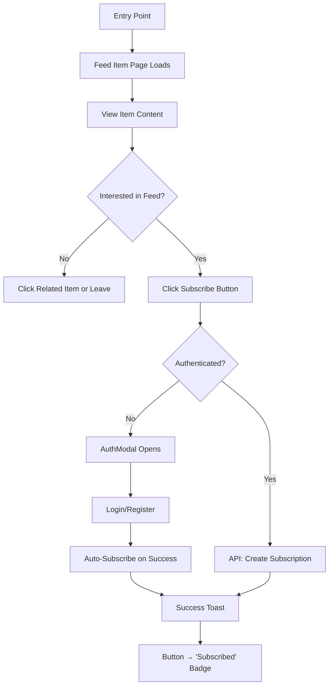
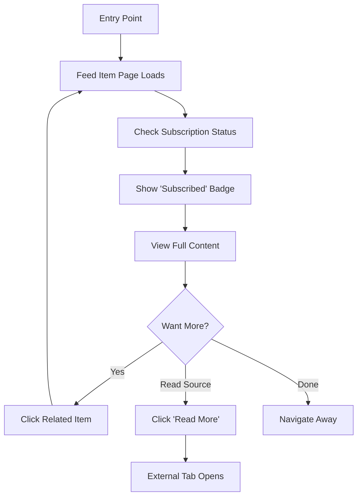
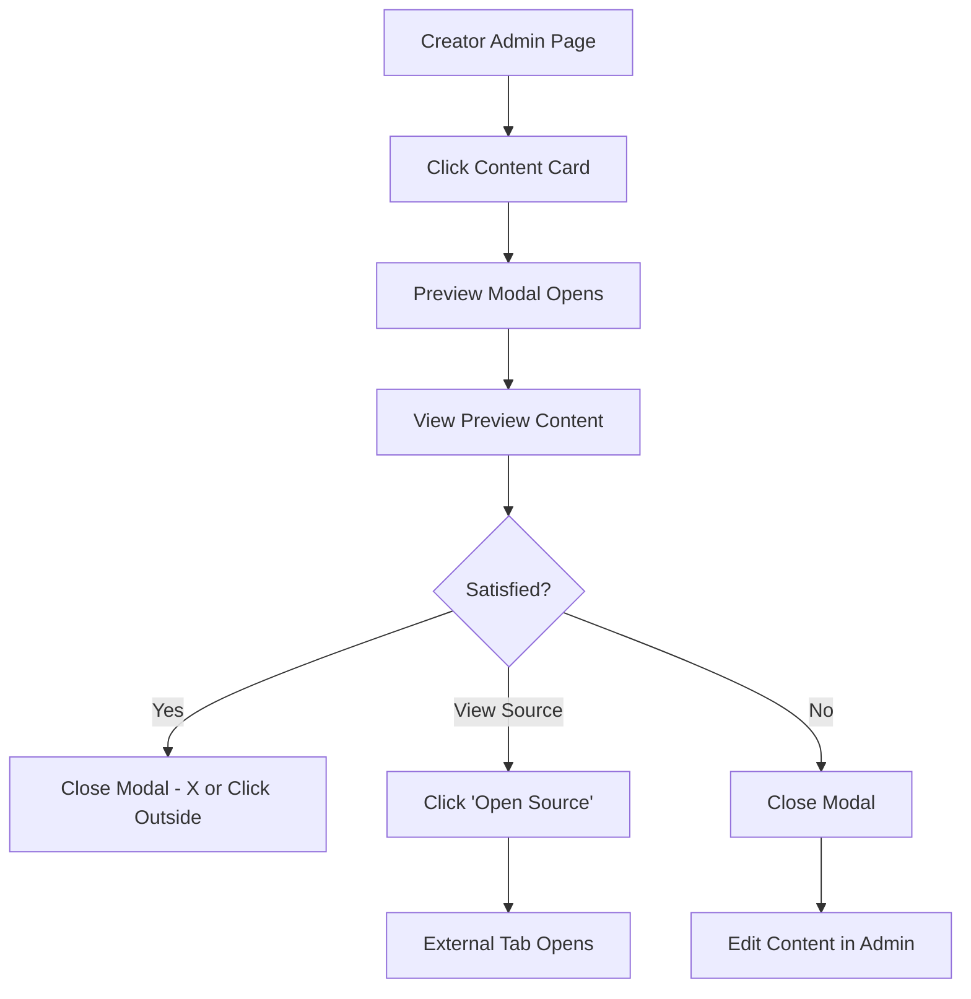
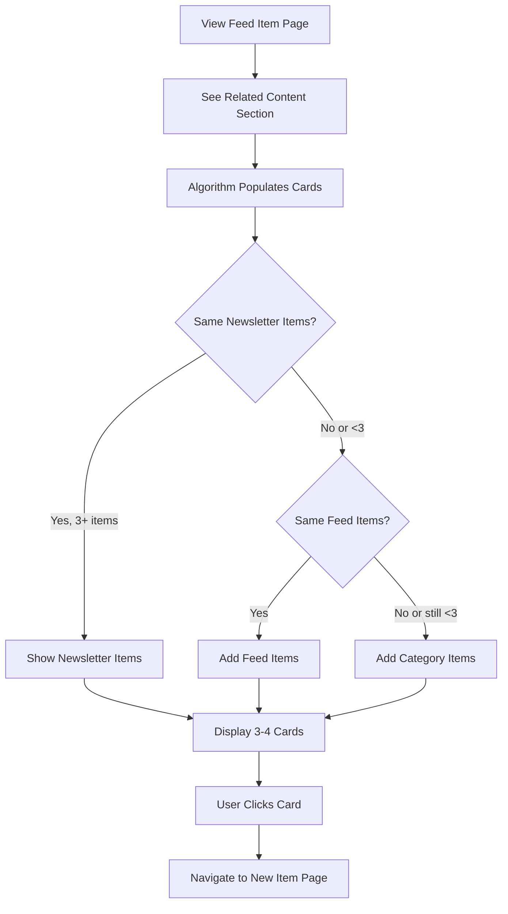

# SmartNews - Public Feed Item Detail Page UI/UX Specification

**Story**: 1.6.2 - Frontend - Public Feed Item Detail Page
**Version**: 1.0
**Created**: 2025-12-01
**Author**: Sally (UX Expert)

---

## 1. Introduction

This document defines the user experience goals, information architecture, user flows, and visual design specifications for **SmartNews's Public Feed Item Detail Page** (Story 1.6.2). It serves as the foundation for visual design and frontend development, ensuring a cohesive and user-centered experience for individual feed item pages.

### 1.1 Overall UX Goals & Principles

#### Target User Personas

| Persona | Description | Key Needs |
|---------|-------------|-----------|
| **Visitor (Unauthenticated)** | First-time users discovering content via shared links, search engines, or social media | Quick content preview, clear value proposition, easy path to subscribe |
| **Subscriber (Authenticated)** | Existing subscribers consuming their curated content | Seamless reading experience, related content discovery, no repetitive CTAs |
| **Creator (Admin)** | Content curators previewing how their items will appear publicly | Preview functionality before publishing, validation of content presentation |

#### Usability Goals

1. **Instant Content Access**: Users can read full item details within 2 seconds of page load
2. **Clear Conversion Path**: Non-subscribers understand subscription value within 10 seconds
3. **Discoverability**: Users find 3-4 related items easily, encouraging deeper engagement
4. **Shareability**: URLs are clean, memorable, and SEO-optimized for social sharing
5. **Cross-Device Consistency**: Experience is equally good on mobile (60% expected traffic) and desktop

#### Design Principles

1. **Content-First Layout**: Hero treatment for item content; secondary elements (subscribe, related) support but don't distract
2. **Progressive Disclosure**: Show full article details on page, deeper engagement options in sidebar
3. **Contextual CTAs**: Subscribe prompts appear only when relevant (non-subscribers only)
4. **Respectful Design**: Subscribed users aren't pestered; visitors aren't blocked from content
5. **Mobile-Native**: Touch-optimized, fast-loading, no horizontal scroll at any breakpoint

### 1.2 Change Log

| Date | Version | Description | Author |
|------|---------|-------------|--------|
| 2025-12-01 | 1.0 | Initial specification based on Story 1.6.2 | Sally (UX Expert) |

---

## 2. Information Architecture (IA)

### 2.1 Site Map / Screen Inventory

```mermaid
graph TD
    A[SmartNews Public] --> B[/discover]
    A --> C[/feed/slug]
    C --> D[/feed/slug/item-slug]

    D --> D1[Main Content Area]
    D --> D2[Sidebar]

    D1 --> D1a[Item Title - H1]
    D1 --> D1b[Item Thumbnail]
    D1 --> D1c[Item Description]
    D1 --> D1d[Metadata - Date, Source]
    D1 --> D1e[Read More CTA]

    D2 --> D2a[Feed Info Card]
    D2 --> D2b[Subscribe Button/Badge]
    D2 --> D2c[Related Content Section]

    E[Creator Admin] --> F[/creator/library]
    E --> G[/creator/feeds/id]
    F --> H[Content Preview Modal]
    G --> H
```

### 2.2 Navigation Structure

**Primary Navigation:** Global header with logo, discovery link, and user menu (unchanged from existing)

**Secondary Navigation:**
- Breadcrumb: Home > Feed Name > Item Title
- Back link to parent feed page

**Contextual Navigation:**
- Related content cards (navigate to other item detail pages)
- Feed name link (navigate to feed page)
- "Read More" external link (opens source in new tab)

### 2.3 URL Structure

| Route Pattern | Example | Purpose |
|---------------|---------|---------|
| `/feed/[slug]/[itemSlug]` | `/feed/tech-weekly/ai-revolution-2025` | Public feed item detail page |
| `/creator/library` | - | Creator content library (modal trigger) |
| `/creator/feeds/[id]` | - | Creator feed management (modal trigger) |

**Slug Generation Rules:**
- Lowercase transformation
- Spaces → hyphens
- Remove special characters
- Max 60 characters
- Example: "The AI Revolution: What's Next?" → `the-ai-revolution-whats-next`

---

## 3. User Flows

### 3.1 Flow 1: Visitor Views Item & Subscribes

**User Goal:** Discover interesting content and subscribe to the feed for more

**Entry Points:**
- Direct URL (shared link, social media)
- Search engine result
- Click from `/discover` page
- Click from `/feed/[slug]` page

**Success Criteria:** User completes subscription and sees success confirmation



**Edge Cases & Error Handling:**
- Network error during subscribe → Show error toast, button remains clickable
- Auth modal closed without action → User remains on page, can retry
- Already subscribed (race condition) → Show "Already subscribed" toast, update UI
- Invalid feed/item → 404 page with "Return to Discover" CTA

### 3.2 Flow 2: Subscriber Views Item

**User Goal:** Read curated content without friction

**Entry Points:**
- Email newsletter link
- Direct URL bookmark
- Click from subscribed feed page

**Success Criteria:** User reads content and optionally explores related items



**Edge Cases & Error Handling:**
- Subscription expired/cancelled → Fallback to visitor flow (show Subscribe button)
- Feed deleted → 404 with explanation message

### 3.3 Flow 3: Creator Previews Content (Admin Modal)

**User Goal:** See how content appears to subscribers before making it public

**Entry Points:**
- Click content card in `/creator/library`
- Click content card in `/creator/feeds/[id]`

**Success Criteria:** Creator sees accurate preview and can verify content quality



**Edge Cases & Error Handling:**
- Content has no thumbnail → Show placeholder or hide image section
- Very long description → Scrollable content area within modal
- External link broken → Still shows link, user discovers on click

### 3.4 Flow 4: Related Content Discovery

**User Goal:** Find more interesting content after reading current item

**Entry Points:**
- Scroll to related content section (desktop sidebar or mobile bottom)

**Success Criteria:** User clicks through to another item, increasing engagement



**Edge Cases & Error Handling:**
- No related items found → Hide section entirely (don't show empty state)
- Only 1-2 items found → Show what's available, don't force 4
- API timeout → Show section skeleton briefly, then hide if no data

---

## 4. Wireframes & Mockups

### 4.1 Design Files

**Primary Design Tool:** Code-based implementation using shadcn/ui components (no separate Figma required)

**Reference Patterns:**
- shadcn/ui Card component for content display
- shadcn/ui Dialog component for Creator Preview Modal
- shadcn/ui Button, Badge, Skeleton components

### 4.2 Key Screen Layouts

#### Screen 1: Feed Item Detail Page (Desktop - 1024px+)

**Purpose:** Full content viewing with subscription and related content in sidebar

**Layout:**
```
┌─────────────────────────────────────────────────────────────────┐
│  [Logo]              SmartNews              [User Menu]          │
├─────────────────────────────────────────────────────────────────┤
│  Home > Tech Weekly > AI Revolution 2025                        │
├───────────────────────────────────┬─────────────────────────────┤
│                                   │                             │
│  ┌─────────────────────────────┐  │  ┌───────────────────────┐  │
│  │      [Item Thumbnail]       │  │  │   Feed Info Card      │  │
│  │         800x450             │  │  │   ┌─────┐             │  │
│  └─────────────────────────────┘  │  │   │ Img │ Tech Weekly │  │
│                                   │  │   └─────┘             │  │
│  # AI Revolution 2025             │  │   Category: Technology │  │
│                                   │  │   Frequency: Weekly    │  │
│  Published: Nov 14, 2025          │  │                        │  │
│  Source: TechCrunch               │  │   [Subscribe Button]   │  │
│                                   │  │   or [Subscribed ✓]    │  │
│  Lorem ipsum dolor sit amet,      │  └───────────────────────┘  │
│  consectetur adipiscing elit.     │                             │
│  Sed do eiusmod tempor...         │  ┌───────────────────────┐  │
│                                   │  │   Related Content     │  │
│  [Read More →]                    │  │                        │  │
│                                   │  │   ┌─────┐ Title...    │  │
│                                   │  │   │ Img │ Feed Name   │  │
│                                   │  │   └─────┘             │  │
│                                   │  │                        │  │
│                                   │  │   ┌─────┐ Title...    │  │
│                                   │  │   │ Img │ Feed Name   │  │
│                                   │  │   └─────┘             │  │
│                                   │  │                        │  │
│                                   │  │   ┌─────┐ Title...    │  │
│                                   │  │   │ Img │ Feed Name   │  │
│                                   │  │   └─────┘             │  │
│                                   │  └───────────────────────┘  │
└───────────────────────────────────┴─────────────────────────────┘
```

**Key Elements:**
- Main content area: 2/3 width (`lg:col-span-2`)
- Sidebar: 1/3 width (`lg:col-span-1`)
- Container: `max-w-7xl mx-auto px-4 py-8`
- Grid: `grid grid-cols-1 lg:grid-cols-3 gap-8`

**Interaction Notes:**
- "Read More" button opens external link in new tab
- Subscribe button shows loading spinner during API call
- Related item cards are fully clickable (entire card, not just title)

#### Screen 2: Feed Item Detail Page (Mobile - 375px)

**Purpose:** Single-column layout optimized for touch and readability

**Layout:**
```
┌─────────────────────────┐
│  [≡]  SmartNews  [User]  │
├─────────────────────────┤
│  ← Back to Tech Weekly  │
├─────────────────────────┤
│                         │
│  ┌───────────────────┐  │
│  │  [Item Thumbnail] │  │
│  │      Full Width   │  │
│  └───────────────────┘  │
│                         │
│  # AI Revolution 2025   │
│                         │
│  Nov 14, 2025 · Source  │
│                         │
│  Lorem ipsum dolor sit  │
│  amet, consectetur...   │
│                         │
│  ┌───────────────────┐  │
│  │   [Read More →]   │  │
│  └───────────────────┘  │
│                         │
├─────────────────────────┤
│  ┌───────────────────┐  │
│  │  Tech Weekly      │  │
│  │  Technology       │  │
│  │  [Subscribe]      │  │
│  └───────────────────┘  │
├─────────────────────────┤
│  Related Content        │
│                         │
│  ┌─────┬────────────┐  │
│  │ Img │ Title...   │  │
│  │     │ Feed Name  │  │
│  └─────┴────────────┘  │
│                         │
│  ┌─────┬────────────┐  │
│  │ Img │ Title...   │  │
│  │     │ Feed Name  │  │
│  └─────┴────────────┘  │
│                         │
│  ┌─────┬────────────┐  │
│  │ Img │ Title...   │  │
│  │     │ Feed Name  │  │
│  └─────┴────────────┘  │
└─────────────────────────┘
```

**Key Elements:**
- Single column: `grid-cols-1`
- Full-width thumbnail
- Stacked sections: Content → Feed Info → Related
- Touch targets: minimum 44px height

**Interaction Notes:**
- Back link replaces breadcrumb (simpler for mobile)
- Subscribe button is full-width for easy tapping
- Related cards show 3 items max (vs 4 on desktop)

#### Screen 3: Creator Content Preview Modal (Desktop)

**Purpose:** Preview how content appears publicly from admin pages

**Layout:**
```
┌─────────────────────────────────────────────────────────────────┐
│                     (Backdrop - Semi-transparent)               │
│                                                                 │
│        ┌─────────────────────────────────────────────┐          │
│        │                                         [X] │          │
│        ├─────────────────────────────────────────────┤          │
│        │                                             │          │
│        │  ┌───────────────────────────────────────┐  │          │
│        │  │         [Item Thumbnail]              │  │          │
│        │  │            600x340                    │  │          │
│        │  └───────────────────────────────────────┘  │          │
│        │                                             │          │
│        │  ## AI Revolution 2025                      │          │
│        │                                             │          │
│        │  Nov 14, 2025 · TechCrunch                  │          │
│        │  Feed: Tech Weekly                          │          │
│        │                                             │          │
│        │  Lorem ipsum dolor sit amet, consectetur    │          │
│        │  adipiscing elit. Sed do eiusmod tempor     │          │
│        │  incididunt ut labore et dolore magna...    │          │
│        │                                             │          │
│        │  ┌───────────────────────────────────────┐  │          │
│        │  │         [Open Source →]               │  │          │
│        │  └───────────────────────────────────────┘  │          │
│        │                                             │          │
│        └─────────────────────────────────────────────┘          │
│                                                                 │
└─────────────────────────────────────────────────────────────────┘
```

**Key Elements:**
- Modal width: `max-w-2xl` (672px)
- Centered with backdrop
- Scrollable content if description is long
- Close button (X) in top-right corner

**Interaction Notes:**
- Click outside modal → closes
- Press Escape → closes
- Focus trapped within modal (accessibility)
- "Open Source" opens external link in new tab

#### Screen 4: Creator Content Preview Modal (Mobile)

**Purpose:** Full-screen preview on small devices

**Layout:**
```
┌─────────────────────────┐
│  Content Preview    [X] │
├─────────────────────────┤
│                         │
│  ┌───────────────────┐  │
│  │  [Item Thumbnail] │  │
│  │    Full Width     │  │
│  └───────────────────┘  │
│                         │
│  ## AI Revolution 2025  │
│                         │
│  Nov 14, 2025           │
│  TechCrunch             │
│  Feed: Tech Weekly      │
│                         │
│  Lorem ipsum dolor sit  │
│  amet, consectetur      │
│  adipiscing elit...     │
│                         │
│  (Scrollable area)      │
│                         │
├─────────────────────────┤
│  ┌───────────────────┐  │
│  │  [Open Source →]  │  │
│  └───────────────────┘  │
└─────────────────────────┘
```

**Key Elements:**
- Near full-screen: `w-full h-[90vh]` or similar
- Fixed header with close button
- Scrollable content area
- Fixed footer with action button

---

## 5. Component Library / Design System

### 5.1 Design System Approach

**Approach:** Extend shadcn/ui components exclusively. No custom UI components.

**Base Components (Already Installed):**
- `Card`, `CardHeader`, `CardContent`, `CardFooter`
- `Button`
- `Badge`
- `Skeleton`
- `Dialog`, `DialogContent`, `DialogHeader`, `DialogTitle`

### 5.2 Core Components for This Feature

#### Component: FeedItemDetailPage

**Purpose:** Main page component for `/feed/[slug]/[itemSlug]` route

**Variants:** None (single layout adapts responsively)

**States:**
- Loading: Show Skeleton placeholders
- Error: Show error message with "Return to Discover" link
- Not Found: Show 404 message
- Success: Show full content

**Usage Guidelines:**
- Client component (`'use client'`)
- Use `isMounted` pattern to prevent hydration mismatches
- Fetch data in `useEffect`, not during render

#### Component: FeedInfoSidebar

**Purpose:** Display feed information and subscribe CTA

**Variants:**
- `visitor`: Shows Subscribe button
- `subscriber`: Shows "Subscribed" badge
- `loading`: Shows Skeleton

**States:**
- Default: Ready to interact
- Loading: Subscribe button shows spinner
- Success: Button transforms to badge with animation

**Usage Guidelines:**
- Always check auth state with `isMounted` guard
- Use `useAuthStore` for user state
- Call `getMySubscriptions()` to check subscription status

#### Component: RelatedContentSection

**Purpose:** Display related feed items for discovery

**Variants:**
- `sidebar`: Vertical stack for desktop sidebar
- `grid`: 2-column grid for mobile bottom section

**States:**
- Loading: Show 3-4 Skeleton cards
- Empty: Hide section entirely (no empty state)
- Populated: Show 3-4 related item cards

**Usage Guidelines:**
- Implement priority algorithm: Newsletter → Feed → Category
- Filter out current item from results
- Adjust count based on viewport (3 mobile, 4 desktop)

#### Component: RelatedItemCard

**Purpose:** Clickable card for related content items

**Variants:** None

**States:**
- Default: Normal display
- Hover: Elevated shadow, slight scale
- Focus: Visible focus ring (accessibility)

**Usage Guidelines:**
- Entire card is clickable (wrap in `Link`)
- Use `line-clamp-2` for title truncation
- Image: 80x80 mobile, 120x120 desktop

#### Component: ContentPreviewModal

**Purpose:** Creator admin preview of public item appearance

**Variants:** None (responsive)

**States:**
- Closed: Not rendered
- Open: Modal visible with content
- Loading: Show skeleton inside modal (if async data needed)

**Usage Guidelines:**
- Use shadcn `Dialog` component
- Implement focus trap and Escape-to-close
- Match public page content layout inside modal

---

## 6. Branding & Style Guide

### 6.1 Visual Identity

**Brand Guidelines:** Use existing SmartNews design tokens from `globals.css`

### 6.2 Color Palette

| Color Type | CSS Variable | Usage |
|------------|--------------|-------|
| Primary | `bg-primary` / `text-primary` | Subscribe button, primary CTAs |
| Secondary | `bg-secondary` | Secondary buttons, badges |
| Accent | `bg-accent` | Hover states, highlights |
| Success | `text-green-*` (toast only) | Subscription success toast |
| Error | `text-destructive` | Error messages |
| Muted | `text-muted-foreground` | Metadata, secondary text |
| Background | `bg-background` | Page background |
| Card | `bg-card` | Card backgrounds |
| Border | `border-border` | Card borders, dividers |

**CRITICAL:** Never hardcode hex colors. Always use CSS variables from `globals.css`.

### 6.3 Typography

#### Font Families
- **Primary:** System font stack (inherited from shadcn)
- **Monospace:** `font-mono` (code snippets if any)

#### Type Scale for Feed Item Page

| Element | Tailwind Class | Usage |
|---------|----------------|-------|
| Item Title | `text-3xl font-bold` (mobile: `text-2xl`) | H1 - Page title |
| Section Heading | `text-xl font-semibold` | H2 - "Related Content" |
| Feed Name | `text-lg font-medium` | Sidebar feed title |
| Body Text | `text-base` | Item description |
| Metadata | `text-sm text-muted-foreground` | Date, source name |
| Card Title | `text-sm font-medium line-clamp-2` | Related item titles |
| Badge | `text-xs` | Category, frequency badges |

### 6.4 Iconography

**Icon Library:** Lucide React (via shadcn)

**Icons Used:**
| Icon | Component | Usage |
|------|-----------|-------|
| `ExternalLink` | "Read More" button | Indicates external navigation |
| `Calendar` | Metadata | Published date |
| `User` | Metadata | Creator name |
| `Check` | Subscribed badge | Confirmation |
| `X` | Modal close | Close button |
| `ArrowLeft` | Mobile back | Return to feed |

### 6.5 Spacing & Layout

**Grid System:**
- Container: `max-w-7xl mx-auto`
- Padding: `px-4` (mobile), `px-6` (tablet), `px-8` (desktop)
- Grid: `grid grid-cols-1 lg:grid-cols-3 gap-8`

**Spacing Scale:**
| Size | Tailwind | Usage |
|------|----------|-------|
| 2 | `gap-2`, `space-y-2` | Tight groupings (icon + text) |
| 4 | `gap-4`, `space-y-4` | Standard spacing between elements |
| 6 | `gap-6`, `space-y-6` | Section separation within cards |
| 8 | `gap-8`, `py-8` | Major section separation |

---

## 7. Accessibility Requirements

### 7.1 Compliance Target

**Standard:** WCAG 2.1 Level AA

### 7.2 Key Requirements

**Visual:**
- Color contrast ratios: 4.5:1 minimum for text (shadcn defaults comply)
- Focus indicators: Visible focus rings on all interactive elements (shadcn provides)
- Text sizing: Base 16px, responsive scaling, user zoom supported

**Interaction:**
- Keyboard navigation: All elements reachable via Tab, Enter/Space to activate
- Screen reader support: Proper heading hierarchy (h1 > h2), ARIA labels on buttons
- Touch targets: Minimum 44x44px for all clickable elements on mobile

**Content:**
- Alternative text: All images have descriptive alt text (item title for thumbnails)
- Heading structure: Single h1 (item title), h2 for sections (Related Content)
- Form labels: Subscribe button has accessible name

### 7.3 Specific ARIA Labels

| Element | ARIA Label |
|---------|------------|
| Subscribe Button | `aria-label="Subscribe to {feedName}"` |
| Subscribed Badge | `aria-label="You are subscribed to {feedName}"` |
| Read More Link | `aria-label="Read full article at {domain}"` |
| Related Item Card | `aria-label="View {itemTitle}"` |
| Modal Close Button | `aria-label="Close preview"` |
| External Link Icon | `aria-hidden="true"` (decorative) |

### 7.4 Testing Strategy

- **Automated:** axe-core via browser extension during development
- **Manual:** Keyboard-only navigation testing
- **Screen Reader:** VoiceOver (macOS) testing for critical flows
- **Lighthouse:** Accessibility audit score >90

---

## 8. Responsiveness Strategy

### 8.1 Breakpoints

| Breakpoint | Min Width | Max Width | Target Devices |
|------------|-----------|-----------|----------------|
| Mobile | 375px | 639px | iPhone SE, standard phones |
| Tablet | 640px | 1023px | iPad, small laptops |
| Desktop | 1024px | 1279px | Standard laptops, monitors |
| Wide | 1280px | - | Large monitors, ultrawide |

### 8.2 Adaptation Patterns

**Layout Changes:**
| Viewport | Layout | Columns |
|----------|--------|---------|
| Mobile | Single column, stacked | 1 |
| Tablet | Flexible, sidebar below | 1-2 |
| Desktop | Two-column (2/3 + 1/3) | 3 (grid) |

**Navigation Changes:**
| Viewport | Navigation |
|----------|------------|
| Mobile | Back link (← Back to Feed) |
| Tablet+ | Breadcrumb (Home > Feed > Item) |

**Content Priority:**
| Viewport | Order |
|----------|-------|
| Mobile | Content → Feed Info → Related |
| Desktop | Content (left) + Feed Info + Related (right sidebar) |

**Image Adaptations:**
| Element | Mobile | Desktop |
|---------|--------|---------|
| Item Thumbnail | Full width, 16:9 | 800x450, contained |
| Related Thumbnails | 80x80 | 120x120 |

**Interaction Changes:**
| Viewport | Touch/Click |
|----------|-------------|
| Mobile | Larger touch targets (44px min), swipe-friendly |
| Desktop | Hover states, smaller click targets acceptable |

---

## 9. Animation & Micro-interactions

### 9.1 Motion Principles

1. **Subtle and Fast:** Animations should enhance, not distract (150-300ms)
2. **Meaningful:** Motion indicates state change or provides feedback
3. **Accessible:** Respect `prefers-reduced-motion` media query
4. **Consistent:** Use same easing curves throughout

### 9.2 Key Animations

| Animation | Description | Duration | Easing |
|-----------|-------------|----------|--------|
| Page Load | Fade in main content | 200ms | ease-out |
| Skeleton Pulse | Loading placeholder shimmer | 1.5s loop | linear |
| Button Loading | Spinner rotation | infinite | linear |
| Subscribe Success | Button → Badge transform | 300ms | ease-in-out |
| Card Hover | Subtle lift + shadow | 150ms | ease-out |
| Modal Open | Fade + scale from 95% | 200ms | ease-out |
| Modal Close | Fade + scale to 95% | 150ms | ease-in |
| Toast Enter | Slide up + fade | 200ms | ease-out |

### 9.3 Reduced Motion Support

```css
@media (prefers-reduced-motion: reduce) {
  * {
    animation-duration: 0.01ms !important;
    transition-duration: 0.01ms !important;
  }
}
```

---

## 10. Performance Considerations

### 10.1 Performance Goals

| Metric | Target | Measurement |
|--------|--------|-------------|
| Page Load (3G) | <2s | Time to Interactive |
| First Contentful Paint | <1s | Lighthouse metric |
| Largest Contentful Paint | <2.5s | Core Web Vital |
| Interaction Response | <100ms | User input → visual feedback |
| Animation FPS | 60fps | Smooth motion |

### 10.2 Design Strategies

**Image Optimization:**
- Use Next.js `<Image>` component for all images
- Implement `priority` for above-fold thumbnail
- Use appropriate `sizes` attribute for responsive images
- Consider blur placeholder for large images

**Loading Strategy:**
- Show skeleton immediately (no layout shift)
- Load critical content first (title, description)
- Lazy load related content section
- Defer non-critical JavaScript

**Bundle Optimization:**
- Use only shadcn components (tree-shakeable)
- Avoid importing entire icon libraries
- Dynamic import for modal component

**Caching:**
- Cache feed data in component state
- Consider React Query for future optimization
- Leverage browser caching for static assets

---

## 11. Next Steps

### 11.1 Immediate Actions

1. **Review this specification** with development team
2. **Validate user personas** with product team (especially mobile traffic assumption)
3. **Begin implementation** following Task breakdown in Story 1.6.2
4. **Create E2E tests** as per mandatory testing requirements
5. **Update DAILY_PROGRESS.md** after implementation milestones

### 11.2 Design Handoff Checklist

- [x] All user flows documented (4 flows)
- [x] Component inventory complete (5 components)
- [x] Accessibility requirements defined (WCAG AA)
- [x] Responsive strategy clear (4 breakpoints)
- [x] Brand guidelines incorporated (CSS variables only)
- [x] Performance goals established (<2s load)
- [ ] Implementation complete (pending dev)
- [ ] E2E tests passing 2x (pending dev)

### 11.3 Open Questions

1. **Analytics:** Should we track click-through rates on related content?
2. **Social Sharing:** Should we add social share buttons (Twitter, LinkedIn)?
3. **Print Styles:** Is print-friendly layout needed for item pages?
4. **Offline:** Should we consider service worker caching for read-later?

---

## 12. Appendix

### A. Related Story References

- **Story 1.6:** Subscriber Discovery & Experience (completed)
- **Story 1.6.1:** Feed Gating (ready for review)
- **Story 1.6.2:** This story - Public Feed Item Detail Page

### B. API Endpoints Used

| Endpoint | Method | Purpose |
|----------|--------|---------|
| `/source-items/by-hash/{hash}` | GET | Fetch item by content hash |
| `/public/feeds/{slug}/preview` | GET | Get feed details |
| `/subscriptions/my-subscriptions` | GET | Check user subscriptions |
| `/subscriptions/` | POST | Create new subscription |
| `/feed-items/?feed_id={id}` | GET | Get items for related content |

### C. File Structure (New Files)

```
src/
├── app/
│   └── (subscriber)/
│       └── feed/
│           └── [slug]/
│               └── [itemSlug]/
│                   └── page.tsx          # Feed item detail page
├── components/
│   ├── subscriber/
│   │   └── feed-item/
│   │       ├── FeedInfoSidebar.tsx       # Feed info + subscribe
│   │       ├── RelatedContentSection.tsx # Related items
│   │       └── RelatedItemCard.tsx       # Single related card
│   └── creator/
│       └── content/
│           └── ContentPreviewModal.tsx   # Admin preview modal
└── lib/
    └── utils/
        └── slug.ts                       # Slug generation utility
```

---

*Document generated by Sally (UX Expert) using BMAD™ Create Document workflow*
