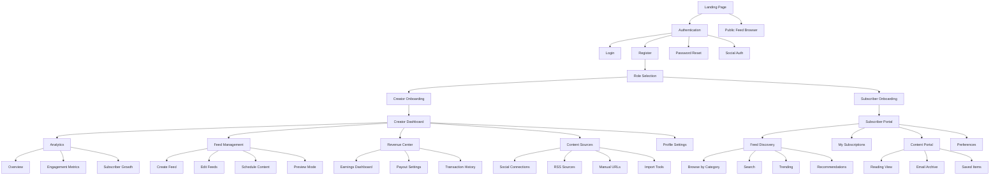
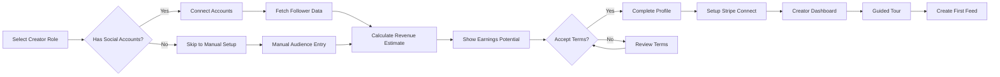
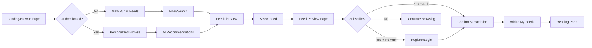
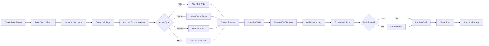

# smartfeed Admin UI - UI/UX Specification

## Introduction

This document defines the user experience goals, information architecture, user flows, and visual design specifications for smartfeed Admin UI's user interface. It serves as the foundation for visual design and frontend development, ensuring a cohesive and user-centered experience.

### Overall UX Goals & Principles

#### Target User Personas

**1. Content Creator Pro**

- Professional content curators with established social media presence (10K+ followers)
- Tech-savvy individuals seeking to monetize their curation skills
- Values: Revenue transparency, analytics insights, efficient workflow tools
- Pain points: Time-consuming manual curation, unclear monetization paths

**2. Aspiring Curator**

- Emerging content creators with growing audiences (1K-10K followers)
- Seeking supplemental income through content curation
- Values: Easy onboarding, clear guidance, growth tools
- Pain points: Complex platform setup, unclear value proposition

**3. Premium Subscriber**

- Professionals seeking high-quality curated content
- Limited time for content discovery
- Values: Content quality, personalization, time efficiency
- Pain points: Information overload, irrelevant content, subscription fatigue

**4. Casual Reader**

- Occasional content consumers
- Interest-based content discovery
- Values: Free access options, easy navigation, no commitment
- Pain points: Too many subscriptions, content discovery friction

#### Usability Goals

1. **Onboarding Efficiency**: New creators can complete setup and publish first feed within 15 minutes
2. **Content Discovery**: Subscribers find relevant feeds within 3 clicks from homepage
3. **Revenue Transparency**: Creators understand earnings calculation immediately
4. **Mobile Accessibility**: Full functionality on mobile devices with touch-optimized interactions
5. **Error Recovery**: Clear guidance for all error states with actionable recovery paths

#### Design Principles

1. **Clarity Through Hierarchy** - Information architecture that guides users naturally through complex workflows
2. **Trust Through Transparency** - Revenue calculations, data usage, and platform mechanics clearly explained
3. **Efficiency Via Automation** - Smart defaults, bulk actions, and AI assistance reduce manual work
4. **Delight in Discovery** - Make content exploration engaging and rewarding
5. **Accessible by Design** - WCAG 2.1 AA compliance as baseline, not afterthought

### Change Log

| Date       | Version | Description                   | Author     |
| ---------- | ------- | ----------------------------- | ---------- |
| 2025-09-25 | 1.0     | Initial specification created | Sarah (PO) |

## Information Architecture (IA)

### Site Map / Screen Inventory

### Navigation Structure

**Primary Navigation:**

- Creator Mode: Dashboard | Feeds | Analytics | Revenue | Settings
- Subscriber Mode: Discover | My Feeds | Reading Portal | Account
- Contextual role switcher for users with both roles

**Secondary Navigation:**

- Creator: Within each section, tab-based navigation for subsections
- Subscriber: Filter and sort controls within content areas
- Universal: Search bar, notifications, user menu

**Breadcrumb Strategy:**

- Show for depths > 2 levels
- Format: Home > Section > Subsection > Current Page
- Clickable parents for easy navigation back

## User Flows

### Creator Onboarding Flow

**User Goal:** Complete creator account setup and understand revenue potential

**Entry Points:**

- Landing page CTA
- Register page role selection
- Subscriber account upgrade

**Success Criteria:**

- Social accounts connected
- Revenue estimate viewed
- First feed created or scheduled

#### Flow Diagram

#### Edge Cases & Error Handling:

- Social API connection failures: Offer retry with manual fallback
- Stripe Connect issues: Allow provisional access with banner reminder
- Invalid follower counts: Validation with explanation of requirements
- Rate limiting: Queue connections with progress indicator

**Notes:** Revenue calculator should be interactive, allowing creators to adjust variables and see potential earnings in real-time.

### Subscriber Content Discovery Flow

**User Goal:** Find and subscribe to relevant content feeds

**Entry Points:**

- Homepage browse section
- Search bar
- Email recommendation links
- Social media shares

**Success Criteria:**

- Relevant feeds discovered
- Preview content accessed
- Subscription completed

#### Flow Diagram

#### Edge Cases & Error Handling:

- No results found: Suggest related categories or popular feeds
- Payment failures: Clear error messaging with retry options
- Feed unavailable: Explanation with similar alternatives
- Preview limits reached: Clear upgrade path messaging

**Notes:** Preview should show enough content to demonstrate value without giving away premium content.

### Content Creation & Publishing Flow

**User Goal:** Import content, create curated feed, and publish to subscribers

**Entry Points:**

- Creator Dashboard quick action
- Feed Management section
- Import tools trigger

**Success Criteria:**

- Content sources configured
- Feed created with content
- Publishing schedule set

#### Flow Diagram

#### Edge Cases & Error Handling:

- Invalid RSS feeds: Validation with error details and fix suggestions
- Social API limits: Queue system with estimated processing time
- Duplicate content: Automatic detection with merge options
- Publishing failures: Retry mechanism with draft preservation

**Notes:** Auto-save throughout the process to prevent data loss. Provide templates for common feed types.

## Wireframes & Mockups

**Primary Design Files:** [Figma - smartfeed Design System](https://figma.com/smartfeed-ui)

### Key Screen Layouts

#### Creator Dashboard

**Purpose:** Central hub for creators to monitor performance and access all features

**Key Elements:**

- Revenue summary card with trend chart
- Subscriber growth metrics
- Recent activity feed
- Quick action buttons (Create Feed, Import Content, View Analytics)
- Active feeds list with performance indicators
- Upcoming scheduled content preview

**Interaction Notes:**

- Drag-and-drop feed reordering
- Inline quick edits for feed settings
- Hover states show additional metrics
- Click-through to detailed views

**Design File Reference:** Figma/Screens/Creator/Dashboard

#### Feed Discovery Page

**Purpose:** Help subscribers find relevant content through browsing and search

**Key Elements:**

- Hero search bar with autocomplete
- Category navigation pills
- Featured feeds carousel
- Infinite scroll feed grid
- Filter sidebar (category, price, rating, language)
- Sort options (trending, newest, popular)

**Interaction Notes:**

- Live search with debouncing
- Lazy loading for images
- Quick preview on hover
- One-click subscribe with confirmation

**Design File Reference:** Figma/Screens/Subscriber/Discovery

#### Content Reading Portal

**Purpose:** Optimized reading experience for subscribed content

**Key Elements:**

- Multi-column layout toggle (list/card/reader view)
- Feed selector dropdown
- Content cards with source attribution
- Reading progress indicator
- Save for later functionality
- Share tools integration

**Interaction Notes:**

- Keyboard shortcuts for navigation
- Swipe gestures on mobile
- Auto-mark as read on scroll
- Offline reading mode support

**Design File Reference:** Figma/Screens/Subscriber/Portal

## Component Library / Design System

**Design System Approach:** Extend shadcn/ui components with smartfeed-specific variants and patterns. Maintain consistency with shadcn's design philosophy while adding platform-specific components.

### Core Components

#### FeedCard

**Purpose:** Display feed information consistently across discovery and management interfaces

**Variants:**

- Compact (list view)
- Standard (grid view)
- Featured (hero placement)

**States:**

- Default, Hover, Selected, Loading, Error, Disabled

**Usage Guidelines:**

- Always show creator attribution
- Include key metrics (subscribers, rating)
- Maintain 16:9 aspect ratio for images
- Truncate descriptions at 2 lines

#### RevenueMetric

**Purpose:** Display earnings and financial metrics with appropriate context

**Variants:**

- Summary (large number with trend)
- Compact (inline metric)
- Detailed (with breakdown)

**States:**

- Default, Loading, Updated (animation), Error

**Usage Guidelines:**

- Always show currency symbol
- Include time period context
- Use green/red for positive/negative changes
- Animate value changes smoothly

#### ContentImporter

**Purpose:** Universal interface for importing content from various sources

**Variants:**

- Single URL input
- Bulk import textarea
- File upload dropzone
- Social media selector

**States:**

- Empty, Validating, Success, Error, Processing

**Usage Guidelines:**

- Show supported formats clearly
- Provide format examples
- Real-time validation feedback
- Progress indication for bulk operations

#### SubscriptionButton

**Purpose:** Handle all subscription-related actions with appropriate states

**Variants:**

- Subscribe (default CTA)
- Subscribed (management mode)
- Upgrade (for tier changes)
- Preview (trial mode)

**States:**

- Default, Hover, Loading, Success, Error, Disabled

**Usage Guidelines:**

- Show price clearly if applicable
- Confirm destructive actions
- Indicate subscription benefits
- Handle authentication flows gracefully

## Branding & Style Guide

### Visual Identity

**Brand Guidelines:** smartfeed maintains a professional yet approachable aesthetic, balancing creator creativity with subscriber trust.

### Color Palette

| Color Type | Hex Code                  | Usage                                            |
| ---------- | ------------------------- | ------------------------------------------------ |
| Primary    | #6366F1                   | Primary actions, brand elements, links           |
| Secondary  | #8B5CF6                   | Secondary CTAs, accents, creator elements        |
| Accent     | #EC4899                   | Subscriber elements, notifications, highlights   |
| Success    | #10B981                   | Positive feedback, confirmations, growth metrics |
| Warning    | #F59E0B                   | Cautions, pending states, important notices      |
| Error      | #EF4444                   | Errors, destructive actions, critical alerts     |
| Neutral    | #64748B, #94A3B8, #E2E8F0 | Text, borders, backgrounds (slate scale)         |

### Typography

#### Font Families

- **Primary:** Inter (sans-serif) - UI text and body content
- **Secondary:** Lexend (sans-serif) - Headlines and marketing
- **Monospace:** JetBrains Mono - Code, IDs, technical content

#### Type Scale

| Element | Size | Weight | Line Height |
| ------- | ---- | ------ | ----------- |
| H1      | 36px | 700    | 1.2         |
| H2      | 30px | 600    | 1.3         |
| H3      | 24px | 600    | 1.4         |
| Body    | 16px | 400    | 1.6         |
| Small   | 14px | 400    | 1.5         |

### Iconography

**Icon Library:** Lucide Icons (consistent with shadcn/ui)

**Usage Guidelines:**

- Use outlined style for navigation and actions
- 20px default size, 16px for inline, 24px for primary actions
- Maintain 4px minimum spacing from text
- Include labels for critical actions (not just icons)

### Spacing & Layout

**Grid System:** 12-column grid with 24px gutters on desktop, 16px on mobile

**Spacing Scale:** 4px base unit (0.25rem)

- xs: 4px
- sm: 8px
- md: 16px
- lg: 24px
- xl: 32px
- 2xl: 48px
- 3xl: 64px

## Accessibility Requirements

### Compliance Target

**Standard:** WCAG 2.1 Level AA compliance minimum, with AAA for critical paths

### Key Requirements

**Visual:**

- Color contrast ratios: 4.5:1 for normal text, 3:1 for large text, 3:1 for UI components
- Focus indicators: 2px solid outline with 2px offset, high contrast color
- Text sizing: Minimum 14px, scalable to 200% without horizontal scroll

**Interaction:**

- Keyboard navigation: All interactive elements accessible via keyboard with logical tab order
- Screen reader support: Semantic HTML, ARIA labels, live regions for dynamic content
- Touch targets: Minimum 44x44px on mobile, 32x32px on desktop

**Content:**

- Alternative text: Descriptive alt text for all informative images, empty alt for decorative
- Heading structure: Logical hierarchy, no skipped levels, one H1 per page
- Form labels: Visible labels for all inputs, error messages linked to fields

### Testing Strategy

- Automated testing with axe-core in development pipeline
- Manual keyboard navigation testing for all new features
- Screen reader testing with NVDA (Windows) and VoiceOver (Mac/iOS)
- Color blindness simulation for all color-dependent interfaces
- Regular audits with lighthouse and WAVE tools

## Responsiveness Strategy

### Breakpoints

| Breakpoint | Min Width | Max Width | Target Devices         |
| ---------- | --------- | --------- | ---------------------- |
| Mobile     | 320px     | 639px     | Phones, small tablets  |
| Tablet     | 640px     | 1023px    | Tablets, small laptops |
| Desktop    | 1024px    | 1535px    | Laptops, desktops      |
| Wide       | 1536px    | -         | Large monitors, TVs    |

### Adaptation Patterns

**Layout Changes:**

- Mobile: Single column, stacked navigation, bottom sheet modals
- Tablet: Two column where beneficial, side drawer navigation
- Desktop: Full multi-column layouts, persistent sidebars
- Wide: Centered content with max-width constraints

**Navigation Changes:**

- Mobile: Bottom tab bar for primary nav, hamburger for secondary
- Tablet: Collapsible sidebar, top navigation bar
- Desktop+: Persistent sidebar, breadcrumbs, quick access toolbar

**Content Priority:**

- Mobile: Essential information first, progressive disclosure for details
- Tablet: Balanced information density, expandable sections
- Desktop+: Full information display, advanced features visible

**Interaction Changes:**

- Mobile: Touch-optimized with swipe gestures, larger tap targets
- Tablet: Mixed touch/cursor support, hover states on capable devices
- Desktop+: Full hover interactions, right-click menus, keyboard shortcuts

## Animation & Micro-interactions

### Motion Principles

1. **Purpose-Driven**: Every animation serves a functional purpose
2. **Consistent Timing**: 200ms for micro, 300ms for standard, 400ms for complex
3. **Natural Easing**: ease-in-out for most, ease-out for entrances, ease-in for exits
4. **Respect Preferences**: Honor prefers-reduced-motion settings
5. **Performance First**: GPU-accelerated properties only (transform, opacity)

### Key Animations

- **Page Transitions:** Fade with subtle slide (Duration: 300ms, Easing: ease-in-out)
- **Modal Appearance:** Scale + fade from trigger point (Duration: 200ms, Easing: ease-out)
- **Success Feedback:** Checkmark draw + pulse (Duration: 400ms, Easing: ease-in-out)
- **Loading States:** Skeleton pulse animation (Duration: 1.5s, Easing: ease-in-out)
- **Hover States:** Color/shadow transitions (Duration: 150ms, Easing: ease-out)
- **Tab Switches:** Sliding underline indicator (Duration: 200ms, Easing: ease-in-out)
- **Card Interactions:** Subtle lift on hover (Duration: 200ms, Easing: ease-out)
- **Number Changes:** Count-up animation for metrics (Duration: 600ms, Easing: ease-out)

## Performance Considerations

### Performance Goals

- **Page Load:** Initial meaningful paint < 1.5s, interactive < 3s
- **Interaction Response:** < 100ms for user inputs
- **Animation FPS:** Consistent 60fps for all animations

### Design Strategies

- Implement progressive image loading with blur-up technique
- Use skeleton screens instead of loading spinners
- Virtualize long lists (feed cards, content items)
- Lazy load below-the-fold content
- Optimize images with Next.js Image component
- Implement aggressive caching for static assets
- Use CSS containment for complex components
- Debounce/throttle expensive operations
- Preload critical fonts and above-the-fold images
- Code-split by route and lazy load heavy components

## Next Steps

### Immediate Actions

1. Review specification with development team for technical feasibility
2. Create high-fidelity mockups for critical user paths in Figma
3. Prototype complex interactions for user testing
4. Develop component library documentation for developers
5. Conduct accessibility audit of proposed designs
6. Set up design token system for development handoff

### Design Handoff Checklist

- [x] All user flows documented
- [x] Component inventory complete
- [x] Accessibility requirements defined
- [x] Responsive strategy clear
- [x] Brand guidelines incorporated
- [x] Performance goals established
- [ ] Figma designs created and linked
- [ ] Interactive prototypes built
- [ ] Design tokens exported
- [ ] Developer documentation prepared
- [ ] Stakeholder approval obtained

## Checklist Results

_UI/UX checklist will be run upon completion of visual designs and prototypes._
