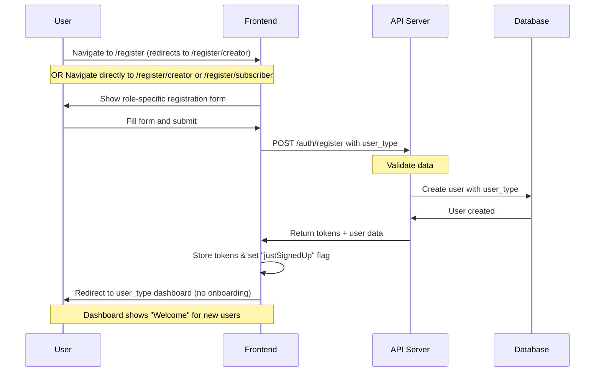
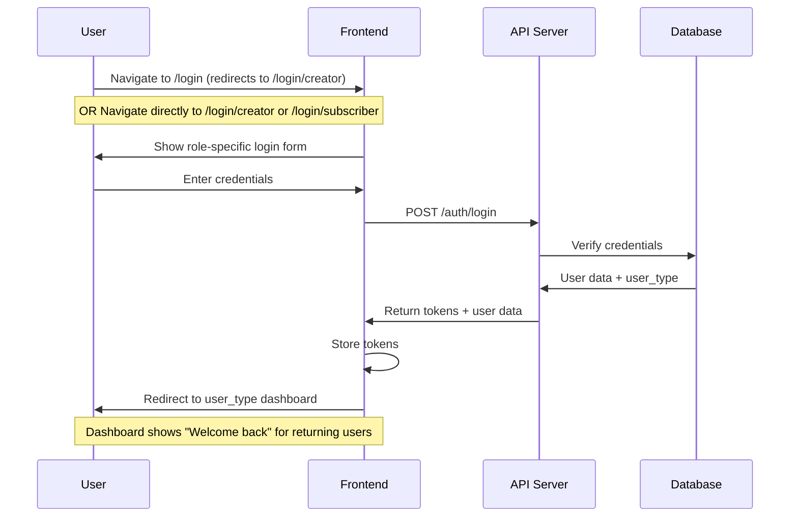
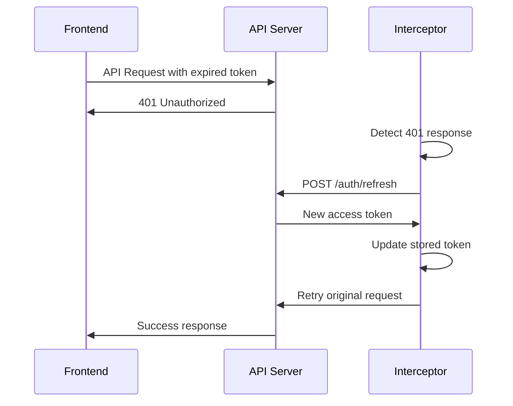
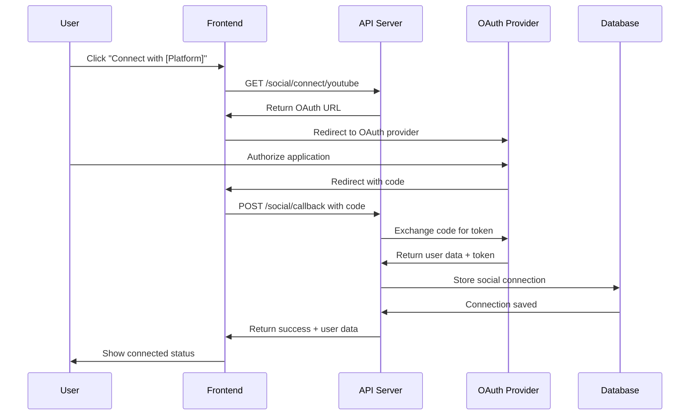
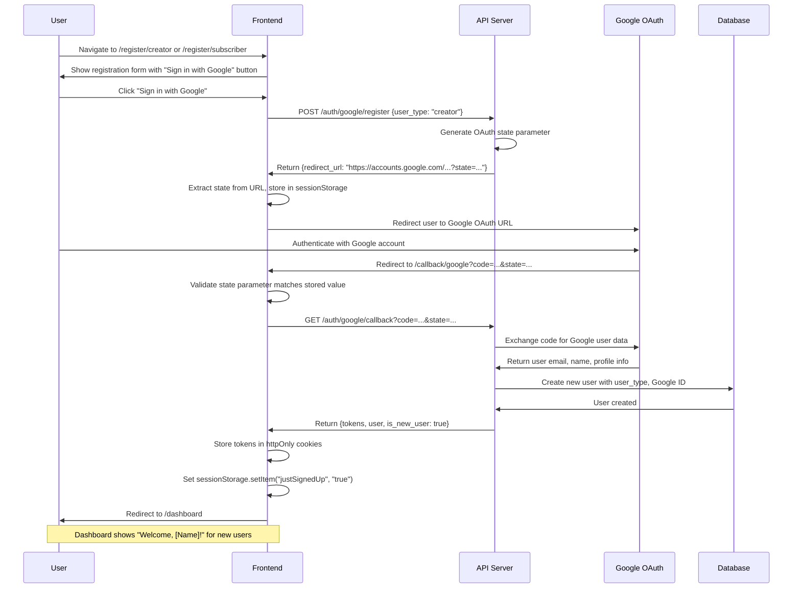
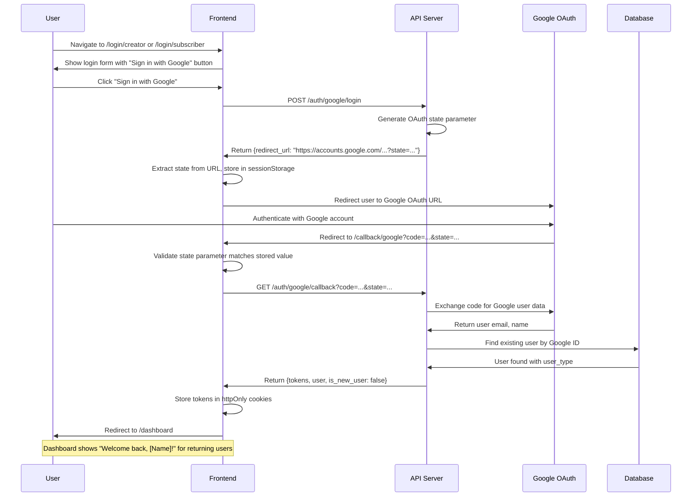
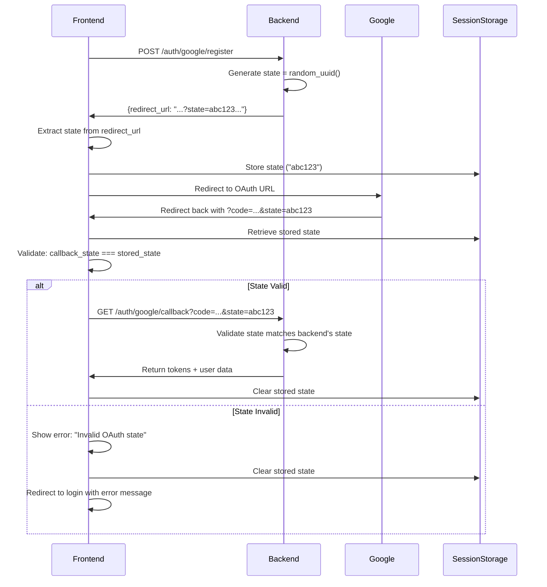

# Authentication Flow Documentation

## Overview

smartfeed uses JWT-based authentication with user_type-based access control for creators and subscribers. The authentication system supports both traditional email/password login and social media OAuth.

## Authentication Architecture

### Token Management

- **Access Token**: Short-lived JWT (15 minutes) for API requests
- **Refresh Token**: Long-lived token (7 days) for obtaining new access tokens
- **Storage**: Tokens stored in httpOnly cookies for security

### User Roles

1. **Creator**: Content curators who create feeds and earn revenue
2. **Subscriber**: Users who discover and consume content
3. **Admin**: Platform administrators (future implementation)

## Authentication URL Structure

**Updated 2025-10-08**: Separate authentication pages by user type for improved UX and clearer user journeys.

### Registration URLs

- `/register` → Redirects to `/register/creator` (default)
- `/register/creator` → Creator-specific signup page with creator branding
- `/register/subscriber` → Subscriber-specific signup page with subscriber branding

**Cross-linking**: Each page includes a link to switch between creator and subscriber registration.

### Login URLs

- `/login` → Redirects to `/login/creator` (default)
- `/login/creator` → Creator-specific login page with creator branding
- `/login/subscriber` → Subscriber-specific login page with subscriber branding

**Cross-linking**: Each page includes a link to switch between creator and subscriber login.

### Design Rationale

1. **Clearer User Journeys**: Users immediately see role-specific content and messaging
2. **Better Branding**: Each page shows testimonials and imagery relevant to that user type
3. **Reduced Friction**: No user_type selection step required during signup
4. **Improved SEO**: Dedicated pages for "creator signup" and "subscriber signup"
5. **Analytics Clarity**: Separate conversion funnels for each user type

### Welcome Messages

- **New Users**: Dashboard displays "Welcome, [Name]!" (first login after signup)
- **Returning Users**: Dashboard displays "Welcome back, [Name]!" (subsequent logins)

Implementation uses `sessionStorage` flag set during registration to determine new vs. returning users.

## Authentication Flows

### 1. Registration Flow

**Updated 2025-10-08**: Separate registration pages for creators and subscribers.



#### Implementation

**New Structure (2025-10-08)**: Separate pages for each user type.

```typescript
// app/(auth)/register/page.tsx - Redirects to creator
import { redirect } from "next/navigation";

export default function RegisterPage() {
  redirect("/register/creator");
}

// app/(auth)/register/creator/page.tsx - Creator registration
export default function CreatorRegisterPage() {
  const router = useRouter();
  const { register: registerUser } = useAuthStore();

  const onSubmit = async (data: RegistrationInput) => {
    await registerUser({
      ...data,
      user_type: "creator",
    });

    // Mark as new user for welcome message
    sessionStorage.setItem("justSignedUp", "true");
    router.push("/dashboard");
  };

  return (
    <div className="grid min-h-screen lg:grid-cols-2">
      {/* Left: Registration form with creator branding */}
      {/* Right: Testimonial/branding panel */}
      {/* Includes link to /register/subscriber */}
    </div>
  );
}

// app/(auth)/register/subscriber/page.tsx - Subscriber registration
// Similar structure with subscriber branding
```

### 2. Login Flow

**Updated 2025-10-08**: Separate login pages for creators and subscribers.



#### Implementation

**New Structure (2025-10-08)**: Separate pages for each user type.

```typescript
// app/(auth)/login/page.tsx - Redirects to creator
import { redirect } from "next/navigation";

export default function LoginPage() {
  redirect("/login/creator");
}

// app/(auth)/login/creator/page.tsx - Creator login
export default function CreatorLoginPage() {
  const { login } = useAuthStore();
  const router = useRouter();

  const onSubmit = async (data: LoginInput) => {
    await login(data);
    router.push("/dashboard");
  };

  return (
    <div className="grid min-h-screen lg:grid-cols-2">
      {/* Left: Login form with creator branding */}
      {/* Right: Testimonial/branding panel */}
      {/* Includes link to /login/subscriber */}
    </div>
  );
}

// app/(auth)/login/subscriber/page.tsx - Subscriber login
// Similar structure with subscriber branding
```

### 3. Token Refresh Flow



#### Implementation

```typescript
// lib/api/auth-interceptor.ts
import axios from "axios";
import { tokenManager } from "./token-manager";

const apiClient = axios.create({
  baseURL: process.env.NEXT_PUBLIC_API_URL,
});

// Request interceptor
apiClient.interceptors.request.use(
  async (config) => {
    const token = await tokenManager.getAccessToken();
    if (token) {
      config.headers.Authorization = `Bearer ${token}`;
    }
    return config;
  },
  (error) => Promise.reject(error)
);

// Response interceptor for token refresh
apiClient.interceptors.response.use(
  (response) => response,
  async (error) => {
    const originalRequest = error.config;

    if (error.response?.status === 401 && !originalRequest._retry) {
      originalRequest._retry = true;

      try {
        await tokenManager.refreshAccessToken();
        const newToken = await tokenManager.getAccessToken();
        originalRequest.headers.Authorization = `Bearer ${newToken}`;
        return apiClient(originalRequest);
      } catch (refreshError) {
        // Refresh failed, redirect to login
        window.location.href = "/login";
        return Promise.reject(refreshError);
      }
    }

    return Promise.reject(error);
  }
);
```

### 4. Social Media OAuth Flow

**Note:** This flow is for connecting social media accounts AFTER authentication (for content import). For Google OAuth authentication, see Section 5 below.



#### Implementation

```typescript
// components/auth/social-connect.tsx
export function SocialConnect({ platform }: { platform: string }) {
  const handleConnect = async () => {
    try {
      // Get OAuth URL from backend
      const { data } = await apiClient.get(`/social/connect/${platform}`);

      // Open OAuth popup
      const popup = window.open(
        data.authUrl,
        'oauth',
        'width=600,height=600'
      );

      // Listen for OAuth completion
      window.addEventListener('message', (event) => {
        if (event.data.type === 'oauth-success') {
          popup?.close();
          // Handle success
          refetchProfile();
          toast.success(`${platform} connected successfully`);
        }
      });
    } catch (error) {
      toast.error(`Failed to connect ${platform}`);
    }
  };

  return (
    <Button onClick={handleConnect}>
      <SocialIcon platform={platform} />
      Connect {platform}
    </Button>
  );
}
```

### 5. Google OAuth Authentication Flow

**Updated 2025-10-14**: Google OAuth integration for user authentication (login and registration).

**Important Distinction:**

- **This Flow (Section 5):** Google OAuth for user LOGIN/REGISTRATION
- **Previous Flow (Section 4):** Social media OAuth for CONTENT SOURCES (post-login feature)

Google OAuth provides a one-click authentication experience for both new and returning users, eliminating the need for password creation and reducing signup friction.

#### 5.1 Google OAuth Registration Flow



#### 5.2 Google OAuth Login Flow



#### 5.3 OAuth Security: State Parameter Validation

The OAuth state parameter provides CSRF protection. The implementation uses backend-generated state to ensure synchronization:



**Key Security Features:**

- Backend generates cryptographically secure state parameter
- Frontend extracts and stores backend's state from OAuth URL
- State validated on callback (frontend check + backend check)
- State cleared from sessionStorage after use
- CSRF protection ensures request originated from legitimate user session

#### 5.4 Implementation Details

##### GoogleOAuthButton Component

```typescript
// src/components/auth/GoogleOAuthButton.tsx
'use client'

import { useState } from 'react'
import { Button } from '@/components/ui/button'
import { Loader2 } from 'lucide-react'
import { useAuthStore } from '@/lib/stores/auth-store'

interface GoogleOAuthButtonProps {
  mode: 'login' | 'register'
  userType?: 'creator' | 'subscriber'
  className?: string
}

export function GoogleOAuthButton({
  mode,
  userType,
  className
}: GoogleOAuthButtonProps) {
  const [isLoading, setIsLoading] = useState(false)
  const { googleLogin, googleRegister } = useAuthStore()

  const handleClick = async () => {
    setIsLoading(true)
    try {
      if (mode === 'register' && userType) {
        await googleRegister(userType)
      } else {
        await googleLogin()
      }
    } catch (error) {
      console.error('Google OAuth error:', error)
      setIsLoading(false)
    }
  }

  return (
    <Button
      variant="outline"
      type="button"
      disabled={isLoading}
      onClick={handleClick}
      className={className}
      aria-label={mode === 'register' ? 'Sign up with Google' : 'Sign in with Google'}
    >
      {isLoading ? (
        <>
          <Loader2 className="mr-2 h-4 w-4 animate-spin" />
          Connecting to Google...
        </>
      ) : (
        <>
          <GoogleLogo className="mr-2 h-4 w-4" />
          {mode === 'register' ? 'Sign up with Google' : 'Sign in with Google'}
        </>
      )}
    </Button>
  )
}
```

##### Auth Store Methods

```typescript
// src/lib/stores/auth-store.ts (Google OAuth methods)
import { create } from "zustand";
import { apiClient } from "@/lib/api/client";

interface AuthStore {
  // ... existing fields
  googleRegister: (userType: "creator" | "subscriber", affiliateHash?: string) => Promise<void>;
  googleLogin: () => Promise<void>;
  handleGoogleCallback: (code: string, state: string) => Promise<void>;
}

export const useAuthStore = create<AuthStore>((set) => ({
  // ... existing methods

  googleRegister: async (userType, affiliateHash) => {
    // Call backend to get OAuth URL
    const response = await apiClient.post("/auth/google/register", {
      user_type: userType,
      ...(affiliateHash && { affiliate_hash: affiliateHash }),
    });

    const redirectUrl = response.data.redirect_url;

    // Extract state from backend's OAuth URL
    const url = new URL(redirectUrl);
    const state = url.searchParams.get("state");

    if (state) {
      // Store backend's state for later validation
      sessionStorage.setItem("oauth_state", state);
    }

    // Redirect to Google OAuth
    window.location.href = redirectUrl;
  },

  googleLogin: async () => {
    // Call backend to get OAuth URL
    const response = await apiClient.post("/auth/google/login");

    const redirectUrl = response.data.redirect_url;

    // Extract state from backend's OAuth URL
    const url = new URL(redirectUrl);
    const state = url.searchParams.get("state");

    if (state) {
      // Store backend's state for later validation
      sessionStorage.setItem("oauth_state", state);
    }

    // Redirect to Google OAuth
    window.location.href = redirectUrl;
  },

  handleGoogleCallback: async (code, state) => {
    // Validate state parameter (CSRF protection)
    const storedState = sessionStorage.getItem("oauth_state");

    if (!storedState || state !== storedState) {
      sessionStorage.removeItem("oauth_state");
      throw new Error("Invalid OAuth state parameter");
    }

    // Exchange code for tokens
    const response = await apiClient.get("/auth/google/callback", {
      params: { code, state },
    });

    const { user, is_new_user } = response.data;

    // Update auth state
    set({
      user,
      isAuthenticated: true,
      isLoading: false,
    });

    // Mark new users for welcome message
    if (is_new_user) {
      sessionStorage.setItem("justSignedUp", "true");
    }

    // Clean up OAuth state
    sessionStorage.removeItem("oauth_state");
  },
}));
```

##### OAuth Callback Page

```typescript
// src/app/(auth)/callback/google/page.tsx
'use client'

import { useEffect, useState } from 'react'
import { useRouter, useSearchParams } from 'next/navigation'
import { useAuthStore } from '@/lib/stores/auth-store'
import { Alert, AlertDescription } from '@/components/ui/alert'
import { Button } from '@/components/ui/button'
import { Loader2 } from 'lucide-react'

export default function GoogleCallbackPage() {
  const router = useRouter()
  const searchParams = useSearchParams()
  const { handleGoogleCallback, user } = useAuthStore()
  const [error, setError] = useState<string | null>(null)

  useEffect(() => {
    const code = searchParams.get('code')
    const state = searchParams.get('state')
    const errorParam = searchParams.get('error')

    // User canceled OAuth
    if (errorParam === 'access_denied') {
      router.push('/login?error=oauth_cancelled')
      return
    }

    if (!code || !state) {
      setError('Missing authorization code or state parameter')
      return
    }

    // Process OAuth callback
    handleGoogleCallback(code, state)
      .then(() => {
        // Small delay to ensure state is set
        setTimeout(() => {
          const userType = user?.user_type || 'creator'
          router.push(userType === 'creator' ? '/dashboard' : '/portal')
        }, 100)
      })
      .catch((err) => {
        console.error('OAuth callback error:', err)
        setError(err.message || 'Failed to complete Google authentication')
      })
  }, [searchParams, handleGoogleCallback, router, user])

  if (error) {
    return (
      <div className="flex min-h-screen items-center justify-center p-4">
        <div className="w-full max-w-md space-y-4">
          <Alert variant="destructive">
            <AlertDescription>{error}</AlertDescription>
          </Alert>
          <div className="flex gap-2">
            <Button onClick={() => router.push('/login')} variant="outline" className="flex-1">
              Return to Login
            </Button>
            <Button onClick={() => router.push('/register')} className="flex-1">
              Create Account
            </Button>
          </div>
        </div>
      </div>
    )
  }

  return (
    <div className="flex min-h-screen items-center justify-center">
      <div className="text-center space-y-4">
        <Loader2 className="h-8 w-8 animate-spin mx-auto" />
        <p className="text-sm text-muted-foreground">Completing Google sign in...</p>
      </div>
    </div>
  )
}
```

#### 5.5 Usage Examples

##### Adding Google OAuth to Registration Page

```typescript
// src/app/(auth)/register/creator/page.tsx
import { GoogleOAuthButton } from '@/components/auth/GoogleOAuthButton'

export default function CreatorRegisterPage() {
  return (
    <div className="space-y-4">
      {/* Google OAuth Button */}
      <GoogleOAuthButton mode="register" userType="creator" className="w-full" />

      {/* Divider */}
      <div className="relative">
        <div className="absolute inset-0 flex items-center">
          <span className="w-full border-t" />
        </div>
        <div className="relative flex justify-center text-xs uppercase">
          <span className="bg-background px-2 text-muted-foreground">
            Or continue with email
          </span>
        </div>
      </div>

      {/* Email/Password Form */}
      <form>...</form>
    </div>
  )
}
```

##### Adding Google OAuth to Login Page

```typescript
// src/app/(auth)/login/creator/page.tsx
import { GoogleOAuthButton } from '@/components/auth/GoogleOAuthButton'

export default function CreatorLoginPage() {
  return (
    <div className="space-y-4">
      {/* Google OAuth Button */}
      <GoogleOAuthButton mode="login" className="w-full" />

      {/* Divider */}
      <div className="relative">
        <div className="absolute inset-0 flex items-center">
          <span className="w-full border-t" />
        </div>
        <div className="relative flex justify-center text-xs uppercase">
          <span className="bg-background px-2 text-muted-foreground">
            Or continue with email
          </span>
        </div>
      </div>

      {/* Email/Password Form */}
      <form>...</form>
    </div>
  )
}
```

#### 5.6 API Endpoints

##### POST /auth/google/register

- **Description:** Initiate Google OAuth registration with user_type selection
- **Request Body:**
  ```json
  {
    "user_type": "creator" | "subscriber",
    "affiliate_hash": "string" // optional
  }
  ```
- **Response:**
  ```json
  {
    "redirect_url": "https://accounts.google.com/o/oauth2/v2/auth?client_id=...&state=..."
  }
  ```
- **Frontend Action:** Extract state from redirect_url, store in sessionStorage, redirect user

##### POST /auth/google/login

- **Description:** Initiate Google OAuth login for existing users
- **Request Body:** None
- **Response:**
  ```json
  {
    "redirect_url": "https://accounts.google.com/o/oauth2/v2/auth?client_id=...&state=..."
  }
  ```
- **Frontend Action:** Extract state from redirect_url, store in sessionStorage, redirect user

##### GET /auth/google/callback

- **Description:** Exchange authorization code for user data and tokens
- **Query Parameters:**
  - `code` (string, required): OAuth authorization code from Google
  - `state` (string, required): OAuth state for CSRF validation
- **Response:**
  ```json
  {
    "user": {
      "id": "...",
      "email": "user@gmail.com",
      "name": "User Name",
      "user_type": "creator",
      "google_id": "..."
    },
    "is_new_user": true
  }
  ```
- **Cookies Set:** `access_token` (httpOnly), `refresh_token` (httpOnly)
- **Frontend Action:** Update auth store, redirect to dashboard

#### 5.7 Error Handling

**Common Error Scenarios:**

1. **User Cancels OAuth:**
   - Google redirects with `?error=access_denied`
   - Frontend redirects to login with informative message
   - User can retry authentication

2. **Invalid State Parameter:**
   - Frontend validates state before calling backend
   - Shows error: "Invalid OAuth state parameter"
   - Provides "Return to Login" button
   - Cleans up sessionStorage

3. **Authorization Code Exchange Fails:**
   - Backend returns error if code is invalid/expired
   - Frontend displays: "Failed to complete Google authentication"
   - Logs error to console for debugging
   - Provides retry options

4. **Missing User Type (Registration):**
   - Backend returns error if user_type not provided for registration
   - Should not occur if GoogleOAuthButton used correctly
   - Frontend validates userType prop is provided in register mode

#### 5.8 Testing Google OAuth

**Unit Tests:**

```typescript
// src/components/auth/__tests__/GoogleOAuthButton.test.tsx
describe('GoogleOAuthButton', () => {
  it('calls googleRegister with userType in register mode', async () => {
    const mockGoogleRegister = jest.fn()
    render(<GoogleOAuthButton mode="register" userType="creator" />)

    fireEvent.click(screen.getByRole('button'))

    expect(mockGoogleRegister).toHaveBeenCalledWith('creator')
  })

  it('displays loading state during OAuth flow', () => {
    render(<GoogleOAuthButton mode="login" />)

    fireEvent.click(screen.getByRole('button'))

    expect(screen.getByText('Connecting to Google...')).toBeInTheDocument()
  })
})
```

**Integration Tests:**

```typescript
// src/lib/stores/__tests__/auth-store.test.ts
describe("Google OAuth Methods", () => {
  it("googleRegister extracts and stores state from OAuth URL", async () => {
    const mockResponse = {
      data: {
        redirect_url: "https://accounts.google.com/oauth?state=abc123",
      },
    };
    apiClient.post = jest.fn().mockResolvedValue(mockResponse);

    await useAuthStore.getState().googleRegister("creator");

    expect(sessionStorage.getItem("oauth_state")).toBe("abc123");
  });

  it("handleGoogleCallback validates state parameter", async () => {
    sessionStorage.setItem("oauth_state", "valid-state");

    await expect(
      useAuthStore.getState().handleGoogleCallback("code", "invalid-state")
    ).rejects.toThrow("Invalid OAuth state parameter");
  });
});
```

#### 5.9 Backend Configuration Requirements

**Google Cloud Console Setup:**

- OAuth 2.0 Client ID created
- Authorized redirect URI: Frontend callback URL (e.g., `https://localhost:3000/callback/google`)
- Scopes: `email`, `profile`, `openid`

**Backend Environment Variables:**

```env
GOOGLE_CLIENT_ID=your_google_client_id
GOOGLE_CLIENT_SECRET=your_google_client_secret
GOOGLE_REDIRECT_URI=https://localhost:3000/callback/google
```

**Important:** The redirect URI must point to the FRONTEND callback page, not the backend API. This ensures users see the React callback page, which then calls the backend API to complete authentication.

## Protected Routes

### Middleware Implementation

```typescript
// middleware.ts
import { NextResponse } from "next/server";
import type { NextRequest } from "next/server";
import { verifyToken } from "@/lib/auth/jwt";

export async function middleware(request: NextRequest) {
  const token = request.cookies.get("access_token")?.value;
  const path = request.nextUrl.pathname;

  // Define protected routes by user_type
  const protectedRoutes = {
    "/creator": "creator",
    "/subscriber": "subscriber",
    "/admin": "admin",
  };

  // Check if path needs protection
  const routeEntry = Object.entries(protectedRoutes).find(([route]) => path.startsWith(route));

  if (routeEntry) {
    const [, requiredRole] = routeEntry;

    if (!token) {
      // No token, redirect to login
      return NextResponse.redirect(new URL("/login", request.url));
    }

    try {
      const payload = await verifyToken(token);

      if (payload.user_type !== requiredRole) {
        // Wrong user_type, redirect to appropriate dashboard
        const redirectPath =
          payload.user_type === "creator" ? "/creator/dashboard" : "/subscriber/portal";

        return NextResponse.redirect(new URL(redirectPath, request.url));
      }
    } catch (error) {
      // Invalid token, redirect to login
      return NextResponse.redirect(new URL("/login", request.url));
    }
  }

  return NextResponse.next();
}

export const config = {
  matcher: ["/creator/:path*", "/subscriber/:path*", "/admin/:path*"],
};
```

## Auth Context Provider

```typescript
// lib/context/auth-context.tsx
'use client';

import { createContext, useContext, useState, useEffect } from 'react';
import { apiClient } from '@/lib/api/client';

interface AuthContextType {
  user: User | null;
  isLoading: boolean;
  login: (credentials: LoginCredentials) => Promise<User>;
  register: (data: RegisterData) => Promise<User>;
  logout: () => Promise<void>;
  refreshUser: () => Promise<void>;
}

const AuthContext = createContext<AuthContextType | null>(null);

export function AuthProvider({ children }: { children: React.ReactNode }) {
  const [user, setUser] = useState<User | null>(null);
  const [isLoading, setIsLoading] = useState(true);

  useEffect(() => {
    // Check if user is logged in on mount
    checkAuth();
  }, []);

  const checkAuth = async () => {
    try {
      const { data } = await apiClient.get('/auth/me');
      setUser(data);
    } catch (error) {
      setUser(null);
    } finally {
      setIsLoading(false);
    }
  };

  const login = async (credentials: LoginCredentials): Promise<User> => {
    const { data } = await apiClient.post('/auth/login', credentials);
    setUser(data.user);
    return data.user;
  };

  const register = async (registerData: RegisterData): Promise<User> => {
    const { data } = await apiClient.post('/auth/register', registerData);
    setUser(data.user);
    return data.user;
  };

  const logout = async () => {
    try {
      await apiClient.post('/auth/logout');
    } finally {
      setUser(null);
      window.location.href = '/';
    }
  };

  const refreshUser = async () => {
    await checkAuth();
  };

  return (
    <AuthContext.Provider
      value={{
        user,
        isLoading,
        login,
        register,
        logout,
        refreshUser,
      }}
    >
      {children}
    </AuthContext.Provider>
  );
}

export const useAuth = () => {
  const context = useContext(AuthContext);
  if (!context) {
    throw new Error('useAuth must be used within AuthProvider');
  }
  return context;
};
```

## Security Best Practices

### 1. Token Storage

```typescript
// Use httpOnly cookies via API routes
// app/api/auth/set-cookies/route.ts
import { NextResponse } from "next/server";

export async function POST(request: Request) {
  const { accessToken, refreshToken } = await request.json();

  const response = NextResponse.json({ success: true });

  // Set httpOnly cookies
  response.cookies.set("access_token", accessToken, {
    httpOnly: true,
    secure: process.env.NODE_ENV === "production",
    sameSite: "strict",
    maxAge: 60 * 15, // 15 minutes
  });

  response.cookies.set("refresh_token", refreshToken, {
    httpOnly: true,
    secure: process.env.NODE_ENV === "production",
    sameSite: "strict",
    maxAge: 60 * 60 * 24 * 7, // 7 days
  });

  return response;
}
```

### 2. CSRF Protection

```typescript
// Generate CSRF token for forms
export async function generateCSRFToken(): Promise<string> {
  const token = crypto.randomUUID();
  // Store in session
  return token;
}

// Verify CSRF token in API routes
export function verifyCSRFToken(token: string): boolean {
  // Check against stored token
  return true;
}
```

### 3. Rate Limiting

```typescript
// lib/auth/rate-limiter.ts
const attempts = new Map<string, number[]>();

export function checkRateLimit(identifier: string): boolean {
  const now = Date.now();
  const userAttempts = attempts.get(identifier) || [];

  // Remove attempts older than 15 minutes
  const recentAttempts = userAttempts.filter((time) => now - time < 15 * 60 * 1000);

  if (recentAttempts.length >= 5) {
    return false; // Too many attempts
  }

  recentAttempts.push(now);
  attempts.set(identifier, recentAttempts);
  return true;
}
```

### 4. Input Validation

```typescript
// lib/schemas/auth.schema.ts
import { z } from "zod";

export const loginSchema = z.object({
  email: z.string().email().toLowerCase().trim(),
  password: z.string().min(8).max(100),
});

export const registerSchema = z
  .object({
    email: z.string().email().toLowerCase().trim(),
    password: z
      .string()
      .min(8)
      .max(100)
      .regex(/[A-Z]/, "Must contain uppercase letter")
      .regex(/[a-z]/, "Must contain lowercase letter")
      .regex(/[0-9]/, "Must contain number"),
    confirmPassword: z.string(),
    name: z.string().min(2).max(100).trim(),
    user_type: z.enum(["creator", "subscriber"]),
  })
  .refine((data) => data.password === data.confirmPassword, {
    message: "Passwords don't match",
    path: ["confirmPassword"],
  });
```

## Error Handling

### Authentication Errors

```typescript
// lib/auth/errors.ts
export class AuthError extends Error {
  constructor(
    public code: string,
    message: string,
    public status: number = 401
  ) {
    super(message);
    this.name = "AuthError";
  }
}

export const AUTH_ERRORS = {
  INVALID_CREDENTIALS: new AuthError("INVALID_CREDENTIALS", "Invalid email or password", 401),
  TOKEN_EXPIRED: new AuthError("TOKEN_EXPIRED", "Your session has expired", 401),
  UNAUTHORIZED: new AuthError(
    "UNAUTHORIZED",
    "You are not authorized to access this resource",
    403
  ),
  ACCOUNT_LOCKED: new AuthError(
    "ACCOUNT_LOCKED",
    "Your account has been locked due to too many failed attempts",
    423
  ),
};
```

### Error Display Component

```typescript
// components/auth/auth-error.tsx
export function AuthError({ error }: { error: AuthError }) {
  const getMessage = () => {
    switch (error.code) {
      case 'INVALID_CREDENTIALS':
        return 'The email or password you entered is incorrect.';
      case 'TOKEN_EXPIRED':
        return 'Your session has expired. Please log in again.';
      case 'ACCOUNT_LOCKED':
        return 'Your account has been temporarily locked. Please try again later.';
      default:
        return 'An error occurred. Please try again.';
    }
  };

  return (
    <Alert variant="destructive">
      <AlertCircle className="h-4 w-4" />
      <AlertTitle>Authentication Error</AlertTitle>
      <AlertDescription>{getMessage()}</AlertDescription>
    </Alert>
  );
}
```

## Testing Authentication

### Unit Tests

```typescript
// __tests__/auth/login.test.tsx
import { render, screen, fireEvent, waitFor } from '@testing-library/react';
import { LoginPage } from '@/app/(auth)/login/page';

describe('Login', () => {
  it('validates email format', async () => {
    render(<LoginPage />);

    const emailInput = screen.getByLabelText('Email');
    const submitButton = screen.getByRole('button', { name: 'Login' });

    fireEvent.change(emailInput, { target: { value: 'invalid-email' } });
    fireEvent.click(submitButton);

    await waitFor(() => {
      expect(screen.getByText('Invalid email address')).toBeInTheDocument();
    });
  });

  it('successfully logs in user', async () => {
    render(<LoginPage />);

    const emailInput = screen.getByLabelText('Email');
    const passwordInput = screen.getByLabelText('Password');
    const submitButton = screen.getByRole('button', { name: 'Login' });

    fireEvent.change(emailInput, { target: { value: 'user@example.com' } });
    fireEvent.change(passwordInput, { target: { value: 'password123' } });
    fireEvent.click(submitButton);

    await waitFor(() => {
      expect(window.location.href).toContain('/dashboard');
    });
  });
});
```
