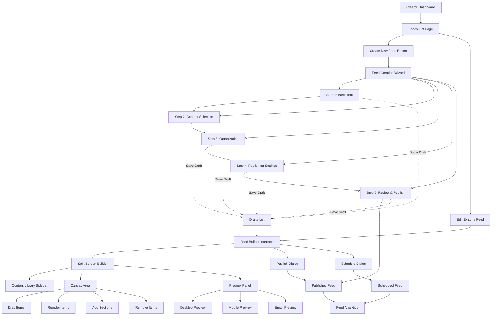
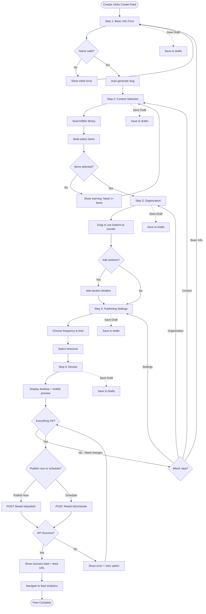
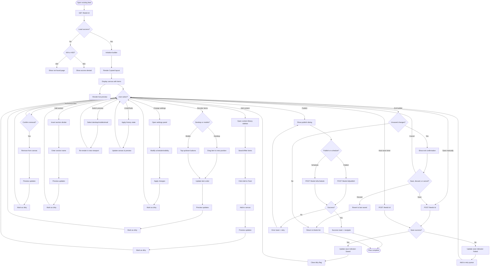
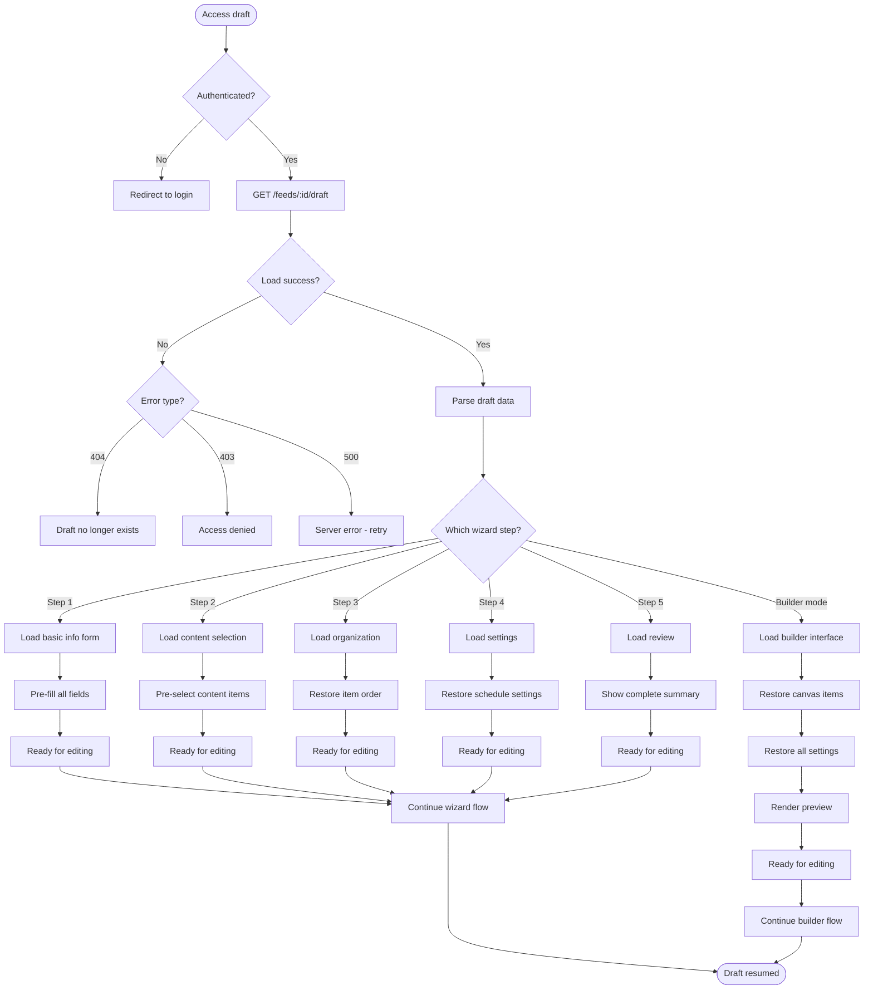
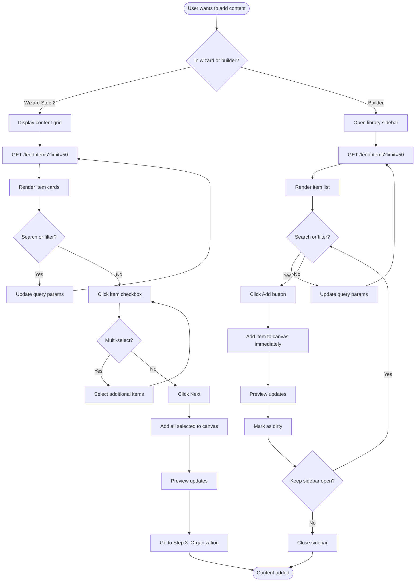
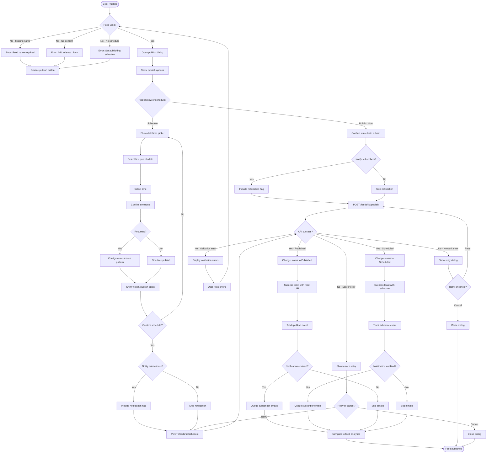

# Story 1.3: Feed Creation & Publication System - UI/UX Specification

**Created by**: Sally (UX Expert) 🎨
**Date**: 2025-10-06
**Story Reference**: `docs/stories/1.3.frontend.story.md`
**Status**: In Development

---

## 📋 Table of Contents

1. [Introduction](#introduction)
2. [Overall UX Goals & Principles](#overall-ux-goals--principles)
3. [Information Architecture](#information-architecture)
4. [User Flows](#user-flows)
5. [Wireframes & Mockups](#wireframes--mockups)
6. [Component Library](#component-library)
7. [Branding & Style Guide](#branding--style-guide)
8. [Accessibility Requirements](#accessibility-requirements)
9. [Responsiveness Strategy](#responsiveness-strategy)
10. [Animation & Micro-interactions](#animation--micro-interactions)
11. [Performance Considerations](#performance-considerations)
12. [Next Steps](#next-steps)

---

## Introduction

This document defines the user experience goals, information architecture, user flows, and visual design specifications for **SmartNews Feed Creation & Publication System**'s user interface. It serves as the foundation for visual design and frontend development, ensuring a cohesive and user-centered experience.

### Purpose & Scope

The Feed Creation System is the **core creative tool** for approved SmartNews creators. It enables them to:

- **Create feeds** through an intuitive multi-step wizard
- **Curate content** by selecting items from their content library
- **Organize visually** using drag-and-drop interactions
- **Preview in real-time** across multiple viewports (desktop, mobile, email)
- **Schedule publication** with flexible frequency options
- **Save drafts** with automatic conflict resolution

This specification focuses on the **visual builder interface** - a split-screen editor with live preview, content library sidebar, and publishing workflow. It addresses the unique UX challenges of:

1. **Complex multi-step flows** without overwhelming users
2. **Drag-and-drop on touch devices** (mobile creators)
3. **Real-time preview synchronization** across viewports
4. **Performance with large content libraries** (1000+ items)
5. **Auto-save and conflict resolution** for long editing sessions

### Key User Needs

Based on Story 1.3 requirements, creators need:

- ✅ **Speed & Efficiency** - Create a feed in under 15 minutes
- ✅ **Visual Confidence** - See exactly what subscribers will receive
- ✅ **Flexible Organization** - Rearrange content easily until it feels right
- ✅ **Safety** - Never lose work due to crashes or accidental navigation
- ✅ **Mobile Capability** - Edit feeds on tablets and phones (not just desktop)

### Design System Foundation

This specification builds on **SmartNews's existing design system**:

- **UI Framework**: shadcn/ui components and blocks
- **Color System**: Variables from `globals.css` (no new colors)
- **Typography**: Existing scale and font families
- **Spacing**: Tailwind spacing system
- **Interactions**: Consistent with Dashboard (Story 1.2)

---

## Overall UX Goals & Principles

### Target User Personas

#### Primary: The Professional Content Curator

- **Profile**: Approved creator with an established content library (200+ items)
- **Behavior**: Creates 2-3 feeds regularly (daily or weekly schedules)
- **Values**: Efficiency and preview accuracy
- **Devices**: Both desktop (primary) and tablet (secondary)
- **Technical Comfort**: Medium to high
- **Pain Point**: Needs to visualize final output before publishing

#### Secondary: The Mobile-First Creator

- **Profile**: Approved creator who works primarily on tablets/phones
- **Behavior**: Creates feeds opportunistically (during commute, breaks)
- **Values**: Simplicity and touch-optimized interactions
- **Devices**: Tablet and mobile primarily
- **Technical Comfort**: Medium
- **Pain Point**: Desktop-only tools don't fit workflow; needs alternative to complex drag-and-drop

### Usability Goals

1. **Ease of Learning** - First-time creators can publish their first feed within 15 minutes (including onboarding tour)
2. **Efficiency of Use** - Experienced creators can create and publish a feed in under 10 minutes
3. **Error Prevention** - Auto-save every 30 seconds prevents data loss; confirmation dialogs for destructive actions
4. **Memorability** - Infrequent creators can return after weeks without relearning the interface
5. **Preview Accuracy** - Preview matches published feed with 99%+ visual fidelty across viewports
6. **Mobile Capability** - Tablet users can complete 80% of feed creation tasks (with graceful degradation for complex reordering)

### Core Design Principles

1. **Visual Builder Over Forms**
   - Show, don't just describe
   - Live preview is the source of truth, not form fields
   - Every change reflects immediately in the preview

2. **Progressive Disclosure**
   - Start simple (name + description)
   - Gradually reveal complexity (sections, scheduling, email templates)
   - Don't show everything at once

3. **Drag or Click, Never Both**
   - Provide alternative interaction methods
   - Desktop users can drag-and-drop
   - Mobile users can use up/down buttons
   - Same outcome, different paths

4. **Preview-Driven Workflow**
   - Every action instantly reflects in the preview
   - Creators make decisions based on what they see
   - Visual feedback trumps text descriptions

5. **Forgiving Interactions**
   - Undo/redo available throughout
   - Drafts save automatically every 30 seconds
   - Exit warnings prevent accidental data loss
   - Users should feel safe experimenting

---

## Information Architecture

### Site Map / Screen Inventory

The Feed Creation System consists of two primary modes: **Wizard Mode** (for new feeds) and **Builder Mode** (for editing/organizing). Here's the complete screen hierarchy:



### Screen Descriptions

#### Wizard Mode Screens

1. **Step 1: Basic Info** (`/feeds/create`)
   - Feed name, description, category selection
   - Slug generation (auto from name, editable)
   - Tag input
   - **Exit Options**: Save draft, cancel (with warning)

2. **Step 2: Content Selection** (`/feeds/create?step=2`)
   - Browse content library with search/filters
   - Multi-select content items
   - Quick preview of each item
   - Suggested content based on categories
   - **Exit Options**: Save draft, back to step 1, skip to builder

3. **Step 3: Organization** (`/feeds/create?step=3`)
   - Light version of builder (drag-and-drop or up/down buttons)
   - Add section dividers
   - Reorder selected content
   - **Exit Options**: Save draft, back to step 2

4. **Step 4: Publishing Settings** (`/feeds/create?step=4`)
   - Frequency (daily, weekly, biweekly, monthly)
   - Send time and timezone
   - Enable/disable feed toggle
   - Subscriber visibility rules
   - **Exit Options**: Save draft, back to step 3

5. **Step 5: Review & Publish** (`/feeds/create?step=5`)
   - Summary of all settings
   - Final preview (desktop + mobile)
   - Publish button or Schedule button
   - **Exit Options**: Save draft, back to edit any step

#### Builder Mode Screens

6. **Feed Builder Interface** (`/feeds/:id/edit`)
   - **Left**: Content Library sidebar (collapsible)
   - **Center**: Canvas area with drag-and-drop
   - **Right**: Live preview panel (resizable, switchable viewports)
   - **Top**: Toolbar with save status, undo/redo, publish
   - **Exit Options**: Auto-save indicator, manual save, exit confirmation

7. **Content Library Sidebar**
   - Search bar
   - Filters (date, source, category)
   - Paginated item list (virtualized)
   - "Add to Feed" buttons
   - Import from existing feed option

8. **Canvas Area**
   - Drag-and-drop zone
   - Feed item cards (with drag handles)
   - Section divider insertion
   - Empty state with "Add Content" CTA
   - Reorder controls (desktop: drag, mobile: buttons)

9. **Preview Panel**
   - Viewport selector (desktop/tablet/mobile)
   - Email template toggle
   - Refresh preview button
   - Share preview link
   - QR code for mobile testing

#### Supporting Screens

10. **Publish Dialog** (Modal)
    - Publish immediately or schedule
    - Final checklist (name, content count, schedule)
    - Email notification toggle
    - Confirmation and feedback

11. **Schedule Dialog** (Modal)
    - Calendar picker for first send
    - Recurring schedule configuration
    - Timezone selector
    - Preview of send dates

12. **Drafts List** (`/feeds/drafts`)
    - All saved drafts
    - Resume editing button
    - Delete draft option
    - Auto-saved timestamp

### Navigation Structure

#### Primary Navigation

- **Main App Sidebar** (from Dashboard Story 1.2)
  - Dashboard
  - Content Library
  - **Feeds** ← Current section
    - All Feeds
    - Drafts
    - Scheduled
    - Published
  - Revenue
  - Settings

#### Secondary Navigation (Within Feed Creation)

**Wizard Mode:**

- **Step Progress Indicator** (top of page)
  - Shows current step (1-5)
  - Clickable to jump to completed steps
  - Shows completion status per step

- **Action Buttons** (bottom of each step)
  - Cancel / Back / Next / Save Draft
  - Position: Bottom right (mobile: bottom sticky bar)

**Builder Mode:**

- **Floating Toolbar** (top of canvas)
  - Breadcrumb: Dashboard > Feeds > [Feed Name]
  - Undo / Redo
  - Auto-save status
  - Save button (manual)
  - Publish button
  - Exit button

- **Contextual Menus** (right-click or long-press)
  - On feed items: Edit, Remove, Duplicate, Move to Section
  - On sections: Rename, Delete Section, Add Items

#### Breadcrumb Strategy

All pages include breadcrumbs for context:

- **Wizard**: `Dashboard > Feeds > Create New Feed > [Current Step]`
- **Builder**: `Dashboard > Feeds > [Feed Name] > Edit`
- **Drafts**: `Dashboard > Feeds > Drafts`

Mobile: Breadcrumbs collapse to back button + current page title

### URL Structure

```
/feeds                          # Feeds list (all feeds)
/feeds/create                   # Wizard Step 1
/feeds/create?step=2            # Wizard Step 2
/feeds/create?step=3            # Wizard Step 3
/feeds/create?step=4            # Wizard Step 4
/feeds/create?step=5            # Wizard Step 5
/feeds/drafts                   # Drafts list
/feeds/:id                      # View published feed
/feeds/:id/edit                 # Builder mode
/feeds/:id/analytics            # Feed analytics
/feeds/:slug/preview            # Public preview link (shareable)
```

---

## User Flows

### Flow 1: Create New Feed (Wizard - Happy Path)

**User Goal**: Create and publish a new feed from scratch using the guided wizard

**Entry Points**:

- "Create New Feed" button on Feeds List page
- "Create Feed" CTA from empty dashboard state
- Quick action from main navigation

**Success Criteria**:

- Feed is published and visible to subscribers
- Creator receives confirmation with feed URL
- Feed appears in "Published" feeds list

#### Flow Diagram



#### Edge Cases & Error Handling

**During Wizard:**

- **User exits mid-flow**: Show dialog: "Save draft before leaving?" with options: Save & Exit, Discard, Cancel
- **Duplicate feed name**: Show inline warning, suggest append date/number to name
- **No content selected at Step 2**: Prevent advancing with warning banner: "Select at least 1 content item"
- **Network failure during draft save**: Retry automatically (3 attempts), then show error toast with manual retry button
- **Session timeout**: Preserve draft in localStorage, restore on re-authentication

**At Publishing:**

- **Publish API fails**: Display error message, offer retry or "Save and publish later" options
- **Schedule conflicts**: Warn if schedule overlaps with another feed, suggest alternative times
- **Missing required fields**: Highlight incomplete steps in progress indicator, prevent publish

**Browser Events:**

- **Refresh/back button**: Intercept if unsaved changes exist, show confirmation dialog
- **Tab close**: Use `beforeunload` event to warn about unsaved work

#### Notes

- **Auto-save frequency**: Every 30 seconds after changes, debounced
- **Step skipping**: Users can skip Step 2 (content selection) and add items later in builder mode
- **Mobile flow**: Same steps, but reordering in Step 3 uses up/down buttons instead of drag-and-drop
- **First-time users**: Show onboarding tooltips at each step (dismissible, don't repeat)

---

### Flow 2: Edit Existing Feed (Builder Mode)

**User Goal**: Modify an existing feed's content, organization, or settings using the visual builder

**Entry Points**:

- "Edit" button from Feeds List
- "Edit Feed" from feed analytics page
- Resume from draft

**Success Criteria**:

- Changes are saved (auto or manual)
- Preview reflects all changes accurately
- User can publish/schedule updated feed

#### Flow Diagram



#### Edge Cases & Error Handling

**During Editing:**

- **Preview rendering fails**: Show "Preview unavailable" message, allow editing to continue, provide refresh button
- **Large content libraries (1000+ items)**: Virtualize sidebar list, load items on scroll
- **Concurrent edits (multiple tabs)**: Detect conflict on save, show merge dialog with options: Keep local, Keep server, Compare
- **Network disconnection**: Queue changes locally, show "Offline" indicator, sync when reconnected
- **Drag-and-drop on touch devices**: Provide haptic feedback, show drop zones clearly, fall back to buttons if drag fails

**Performance Issues:**

- **Preview lag (>500ms)**: Debounce preview updates, show loading indicator
- **Memory leaks from large feeds**: Implement item recycling, lazy-load preview content
- **Browser crashes**: Restore from last auto-save using localStorage backup

**Content Issues:**

- **Removed content item**: Show placeholder in canvas with "Content unavailable" message, allow removal
- **Invalid content URLs**: Display error icon on item, allow editing or removal
- **Empty feed (all items removed)**: Show empty state with "Add content to continue" CTA

#### Notes

- **Undo/Redo limits**: Maintain 50-action history, clear on publish
- **Auto-save conflict resolution**: Last write wins, with user notification of overwrite
- **Preview sync**: Throttled to max 2 updates per second to prevent performance issues
- **Mobile builder**: Sidebar overlay instead of side-by-side, preview accessible via bottom sheet

---

### Flow 3: Resume Draft

**User Goal**: Continue working on a previously saved draft feed

**Entry Points**:

- "Resume" button from Drafts List
- "Continue editing" notification/email
- Direct URL to draft

**Success Criteria**:

- Draft loads with all previous changes intact
- User can continue from any wizard step or enter builder mode
- Draft state matches last save exactly

#### Flow Diagram



#### Edge Cases & Error Handling

**Draft Loading Issues:**

- **Partial draft (incomplete data)**: Fill missing fields with defaults, mark incomplete steps in progress indicator
- **Outdated draft format**: Attempt migration to current format, fall back to basic info if migration fails
- **Content items deleted since draft save**: Replace with placeholder, notify user of missing items
- **Conflicting drafts (multiple devices)**: Show "Multiple drafts found" dialog, let user choose which to keep

**Data Integrity:**

- **Corrupted draft data**: Attempt recovery, show warning if data loss occurred, offer to start fresh
- **Very old drafts (>30 days)**: Warn user that feed settings may be outdated, offer to review settings

#### Notes

- **Draft expiration**: Drafts auto-delete after 90 days of inactivity (with email warning at 80 days)
- **Draft list sorting**: Most recently modified first
- **Draft preview thumbnails**: Generate on save for quick visual identification

---

### Flow 4: Add Content to Feed (Core Interaction)

**User Goal**: Select and add content items from the library to the current feed

**Entry Points**:

- Wizard Step 2 (Content Selection)
- Builder mode content library sidebar
- "Add Content" button on empty canvas

**Success Criteria**:

- Content item appears in canvas/feed
- Preview updates to show new item
- Item can be reordered and removed

#### Flow Diagram



#### Edge Cases & Error Handling

**Content Library Issues:**

- **Empty library**: Show empty state with "Import content first" CTA, link to content import flow
- **Loading failures**: Show error state, provide retry button, maintain last successful state
- **Slow loading (>3s)**: Show skeleton loaders, allow cancellation
- **Item preview unavailable**: Show placeholder image with title, allow selection anyway

**Selection Issues:**

- **Duplicate additions**: Prevent adding same item twice (in wizard), show "Already added" toast (in builder)
- **Content limit reached**: Show warning at 100 items, prevent additions beyond 200 items
- **Already in another feed**: Allow addition but show info badge "Also in [Feed Name]"

**Performance:**

- **Large libraries (10,000+ items)**: Implement virtualization, infinite scroll, require search/filters
- **Image loading**: Lazy-load thumbnails, use low-quality placeholders

#### Notes

- **Suggested content**: Show AI-recommended items based on feed categories and creator history
- **Batch actions**: Allow selecting multiple items, then bulk add/remove
- **Content preview**: Click item for full preview modal before adding

---

### Flow 5: Publish Feed

**User Goal**: Make the feed live and available to subscribers (immediately or scheduled)

**Entry Points**:

- Wizard Step 5 "Publish" button
- Builder toolbar "Publish" button
- Feeds list "Publish draft" action

**Success Criteria**:

- Feed status changes to "Published" or "Scheduled"
- Subscribers receive notification (if enabled)
- Feed appears on public discovery page
- Creator receives confirmation

#### Flow Diagram



#### Edge Cases & Error Handling

**Pre-Publish Validation:**

- **Empty feed**: Block publish, show error: "Add at least 1 content item"
- **Missing required fields**: Highlight incomplete sections, prevent publish
- **Schedule conflicts**: Warn if overlaps with another feed, allow override
- **Past date selected**: Block submit, show error: "Select future date"
- **Invalid timezone**: Default to creator's timezone, show warning

**During Publishing:**

- **Network timeout**: Retry 3 times with exponential backoff, then show failure
- **Rate limiting**: Show "Too many publish attempts" error, suggest waiting
- **Concurrent modification**: Detect if feed was edited elsewhere, offer reload

**Post-Publish:**

- **Email queue failure**: Log error, show warning but consider publish successful
- **Analytics tracking failure**: Fail silently, don't block user flow
- **Feed not appearing publicly**: Show "Published, but may take up to 5 min to appear" notice

**Schedule-Specific:**

- **Timezone confusion**: Always show time in creator's timezone + UTC for clarity
- **Daylight saving time changes**: Warn if schedule crosses DST boundary
- **Future date too far**: Limit scheduling to 6 months ahead, show warning

#### Notes

- **Preview before publish**: Always show final preview in dialog
- **Publish checklist**: Show summary: "X items, [Schedule], [Categories], [Notify: Yes/No]"
- **Undo publish**: Creators can unpublish within 5 minutes, show undo toast
- **First publish celebration**: Show confetti animation for first-time publishers

---

## Wireframes & Mockups

### Design File References

**Primary Design Files**: To be created in Figma (link to be added)

**Prototype Links**: Interactive prototypes will be created for:

- Complete wizard flow (Steps 1-5)
- Builder interface with all interactions
- Mobile/tablet responsive variants

**Design System Base**: All wireframes use shadcn/ui components as foundation. Refer to existing SmartNews component library in `/docs/frontend/components/shadcn-components.md`.

---

### Key Screen Layouts

#### 1. Wizard - Step 1: Basic Information

**Purpose**: Capture essential feed metadata to initialize creation

**Route**: `/feeds/create` (Step 1)

**Layout Wireframe** (Desktop: 1280px+):

```
┌─────────────────────────────────────────────────────────────────────────────┐
│ ☰ Sidebar  │  Dashboard > Feeds > Create New Feed                           │
├────────────┼────────────────────────────────────────────────────────────────┤
│            │                                                                 │
│ Dashboard  │  ┌──────────────────────────────────────────────────────────┐ │
│ Content    │  │  Create New Feed                                         │ │
│ Feeds  ←   │  └──────────────────────────────────────────────────────────┘ │
│ Revenue    │                                                                 │
│ Settings   │  ┌─────────────────────────────────────────────────────────┐  │
│            │  │ Step Progress: ● ○ ○ ○ ○                                │  │
│            │  │ Basic Info | Content | Organization | Settings | Review  │  │
│            │  └─────────────────────────────────────────────────────────┘  │
│            │                                                                 │
│            │  ┌─────────────────────────────────────────────────────────┐  │
│            │  │ Basic Information                                        │  │
│            │  │                                                          │  │
│            │  │ Feed Name *                                              │  │
│            │  │ ┌────────────────────────────────────────────────────┐  │  │
│            │  │ │ Tech News Daily                                     │  │  │
│            │  │ └────────────────────────────────────────────────────┘  │  │
│            │  │                                                          │  │
│            │  │ Feed URL                                                 │  │
│            │  │ ┌────────────────────────────────────────────────────┐  │  │
│            │  │ │ smartnews.example/f/tech-news-daily  [Edit]              │  │  │
│            │  │ └────────────────────────────────────────────────────┘  │  │
│            │  │ ℹ️  Auto-generated from feed name                        │  │
│            │  │                                                          │  │
│            │  │ Description *                                            │  │
│            │  │ ┌────────────────────────────────────────────────────┐  │  │
│            │  │ │ Daily curated collection of the most important     │  │  │
│            │  │ │ tech news, product launches, and industry          │  │  │
│            │  │ │ insights...                                         │  │  │
│            │  │ │                                                     │  │  │
│            │  │ └────────────────────────────────────────────────────┘  │  │
│            │  │ 127/500 characters                                       │  │
│            │  │                                                          │  │
│            │  │ Category *                                               │  │
│            │  │ ┌────────────────────────────────────────────────────┐  │  │
│            │  │ │ Technology                           ▼              │  │  │
│            │  │ └────────────────────────────────────────────────────┘  │  │
│            │  │                                                          │  │
│            │  │ Tags (optional)                                          │  │
│            │  │ ┌────────────────────────────────────────────────────┐  │  │
│            │  │ │ [AI] [Startups] [Product Launches]     + Add tag   │  │  │
│            │  │ └────────────────────────────────────────────────────┘  │  │
│            │  │ Press Enter or comma to add                              │  │
│            │  │                                                          │  │
│            │  │ Cover Image (optional)                                   │  │
│            │  │ ┌──────────────────────┐                                │  │
│            │  │ │   [ 📷 ]             │                                │  │
│            │  │ │   Upload Image       │  Recommended: 1200x630px      │  │
│            │  │ │   or drag and drop   │  PNG, JPG up to 5MB           │  │
│            │  │ └──────────────────────┘                                │  │
│            │  │                                                          │  │
│            │  └─────────────────────────────────────────────────────────┘  │
│            │                                                                 │
│            │  ┌──────────────────────────────────────────────────────────┐ │
│            │  │  [Cancel]  [Save Draft]              [Next: Add Content] │ │
│            │  └──────────────────────────────────────────────────────────┘ │
│            │                                                                 │
└────────────┴─────────────────────────────────────────────────────────────────┘
```

**Key Elements**:

1. **Header Section**
   - Page title: "Create New Feed"
   - Step progress indicator (5 steps, currently on step 1)
   - Visual progress dots + step labels

2. **Form Card** (shadcn Card component)
   - Title: "Basic Information"
   - All form fields with labels and validation
   - Character counters where applicable

3. **Feed Name Input** (shadcn Input)
   - Required field indicator (\*)
   - Real-time validation
   - Auto-focus on page load

4. **Feed URL Display** (shadcn Input with readonly state)
   - Auto-generated from feed name (slug)
   - Editable via [Edit] button
   - Shows full public URL format

5. **Description Textarea** (shadcn Textarea)
   - Multi-line input (min-height: 96px)
   - Character counter: X/500
   - Helper text below

6. **Category Select** (shadcn Select)
   - Dropdown with predefined categories
   - Single selection
   - Required field

7. **Tags Input** (Custom component with shadcn Badge)
   - Comma or Enter to add tags
   - Tag pills displayed with X remove button
   - Helper text for interaction guidance

8. **Cover Image Upload** (Custom dropzone with shadcn Card)
   - Drag-and-drop area
   - Click to browse
   - Image preview once uploaded
   - Recommended dimensions shown

9. **Action Buttons** (shadcn Button components)
   - Cancel (variant: ghost) - left aligned
   - Save Draft (variant: outline) - middle
   - Next (variant: default, primary) - right aligned

**Component Specifications**:

```typescript
// Form schema (Zod)
const feedBasicInfoSchema = z.object({
  name: z.string().min(3, "Name must be at least 3 characters").max(100),
  slug: z.string().regex(/^[a-z0-9-]+$/, "Only lowercase letters, numbers, and hyphens"),
  description: z.string().min(20, "Description must be at least 20 characters").max(500),
  category: z.string().min(1, "Category is required"),
  tags: z.array(z.string()).max(10, "Maximum 10 tags"),
  coverImage: z.instanceof(File).optional()
});

// Component structure
<Card className="max-w-3xl mx-auto">
  <CardHeader>
    <CardTitle>Basic Information</CardTitle>
  </CardHeader>
  <CardContent>
    <Form {...form}>
      <form onSubmit={form.handleSubmit(onSubmit)} className="space-y-6">
        {/* Form fields */}
      </form>
    </Form>
  </CardContent>
  <CardFooter className="flex justify-between">
    <Button variant="ghost" onClick={handleCancel}>Cancel</Button>
    <div className="flex gap-2">
      <Button variant="outline" onClick={handleSaveDraft}>Save Draft</Button>
      <Button type="submit">Next: Add Content</Button>
    </div>
  </CardFooter>
</Card>
```

**Interaction Notes**:

- **Slug auto-generation**: On blur of feed name, generate slug (lowercase, replace spaces with hyphens)
- **Edit slug**: Click [Edit] button → Input becomes editable → Validate uniqueness on blur
- **Tag input**: Press Enter or comma → Add tag as badge → Click X on badge to remove
- **Cover image**: Drag file → Show upload progress → Display preview → Show remove button
- **Validation**: Real-time on blur, comprehensive on Next button click
- **Unsaved changes**: Warn on Cancel if any field has been modified

**Responsive Behavior** (Mobile: < 768px):

```
┌─────────────────────────────┐
│ ☰  Create New Feed          │
├─────────────────────────────┤
│ ● ○ ○ ○ ○ Step 1 of 5       │
├─────────────────────────────┤
│                             │
│ Feed Name *                 │
│ ┌─────────────────────────┐ │
│ │ Tech News Daily         │ │
│ └─────────────────────────┘ │
│                             │
│ Feed URL                    │
│ ┌─────────────────────────┐ │
│ │ smartnews.example/f/tech...   │ │
│ └─────────────────────────┘ │
│ [Edit]                      │
│                             │
│ Description *               │
│ ┌─────────────────────────┐ │
│ │                         │ │
│ │                         │ │
│ └─────────────────────────┘ │
│ 127/500                     │
│                             │
│ Category *                  │
│ ┌─────────────────────────┐ │
│ │ Technology         ▼    │ │
│ └─────────────────────────┘ │
│                             │
│ (scroll for more fields)    │
│                             │
├─────────────────────────────┤
│ [Cancel]  [Save]  [Next →] │
└─────────────────────────────┘
```

Mobile changes:

- Sidebar hidden (hamburger menu)
- Progress indicator simplified (dots + "Step X of 5")
- Single column layout
- Buttons in sticky footer
- Fields stack vertically

---

#### 2. Wizard - Step 2: Content Selection

**Purpose**: Browse and select content items from library to include in feed

**Route**: `/feeds/create?step=2`

**Layout Wireframe** (Desktop):

```
┌─────────────────────────────────────────────────────────────────────────────┐
│ ☰ Sidebar  │  Dashboard > Feeds > Create New Feed > Add Content             │
├────────────┼────────────────────────────────────────────────────────────────┤
│            │                                                                 │
│ Dashboard  │  ┌──────────────────────────────────────────────────────────┐ │
│ Content    │  │  Add Content to "Tech News Daily"                        │ │
│ Feeds  ←   │  └──────────────────────────────────────────────────────────┘ │
│ Revenue    │                                                                 │
│ Settings   │  ┌─────────────────────────────────────────────────────────┐  │
│            │  │ Step Progress: ● ● ○ ○ ○                                │  │
│            │  │ Basic Info | Content | Organization | Settings | Review  │  │
│            │  └─────────────────────────────────────────────────────────┘  │
│            │                                                                 │
│            │  ┌─────────────────────────────────────────────────────────┐  │
│            │  │ 🔍 Search content...                  [Filter ▼] [Sort ▼] │  │
│            │  └─────────────────────────────────────────────────────────┘  │
│            │                                                                 │
│            │  ┌────────────┬────────────┬────────────┐                      │
│            │  │ ☑️ All     │ Recent     │ Favorites  │  View: [Grid] List  │
│            │  └────────────┴────────────┴────────────┘                      │
│            │                                                                 │
│            │  ┌────────────────────────────────────────────────────────┐   │
│            │  │ Selected: 5 items                        [Clear All]   │   │
│            │  └────────────────────────────────────────────────────────┘   │
│            │                                                                 │
│            │  ┌──────────┐ ┌──────────┐ ┌──────────┐ ┌──────────┐         │
│            │  │ ✓        │ │ ✓        │ │          │ │          │         │
│            │  │ [Image]  │ │ [Image]  │ │ [Image]  │ │ [Image]  │         │
│            │  │          │ │          │ │          │ │          │         │
│            │  │ OpenAI   │ │ Google   │ │ Meta AI  │ │ Apple    │         │
│            │  │ launches │ │ announces│ │ reveals  │ │ unveils  │         │
│            │  │ GPT-4... │ │ Gemini...│ │ Llama 3..│ │ Vision...│         │
│            │  │          │ │          │ │          │ │          │         │
│            │  │ 2h ago   │ │ 5h ago   │ │ 1d ago   │ │ 2d ago   │         │
│            │  │ [👁️ Preview]│ │ [👁️ Preview]│ │ [👁️ Preview]│ │ [👁️ Preview]│    │
│            │  └──────────┘ └──────────┘ └──────────┘ └──────────┘         │
│            │                                                                 │
│            │  ┌──────────┐ ┌──────────┐ ┌──────────┐ ┌──────────┐         │
│            │  │ ✓        │ │          │ │          │ │          │         │
│            │  │ [Image]  │ │ [Image]  │ │ [Image]  │ │ [Image]  │         │
│            │  │ ...      │ │ ...      │ │ ...      │ │ ...      │         │
│            │  └──────────┘ └──────────┘ └──────────┘ └──────────┘         │
│            │                                                                 │
│            │  ┌─────────────────────────────────────────────────────────┐  │
│            │  │             [Load More] (48 items remaining)             │  │
│            │  └─────────────────────────────────────────────────────────┘  │
│            │                                                                 │
│            │  ┌──────────────────────────────────────────────────────────┐ │
│            │  │  [← Back]  [Save Draft]        [Next: Organize Content →] │ │
│            │  └──────────────────────────────────────────────────────────┘ │
│            │                                                                 │
└────────────┴─────────────────────────────────────────────────────────────────┘
```

**Key Elements**:

1. **Search & Filter Bar**
   - Search input (debounced, searches title + description)
   - Filter dropdown (by source, category, date range)
   - Sort dropdown (newest, oldest, most viewed)

2. **View Tabs** (shadcn Tabs)
   - All content
   - Recent (last 7 days)
   - Favorites
   - View toggle: Grid vs List

3. **Selection Summary** (shadcn Alert or Card)
   - Shows count of selected items
   - "Clear All" button to deselect

4. **Content Grid** (responsive grid)
   - 4 columns on desktop (1280px+)
   - 3 columns on tablet (768-1279px)
   - 1 column on mobile (< 768px)

5. **Content Card** (shadcn Card with checkbox)
   - Checkbox overlay (top-left)
   - Thumbnail image
   - Title (truncated to 2 lines)
   - Metadata (time ago)
   - Preview button (eye icon)

6. **Pagination/Infinite Scroll**
   - "Load More" button
   - Shows remaining count
   - Lazy loads 50 items at a time

**Component Specifications**:

```typescript
// Content item card
interface ContentItemCard {
  id: string;
  title: string;
  description: string;
  imageUrl: string;
  sourceUrl: string;
  publishedAt: Date;
  isSelected: boolean;
}

<Card
  className={cn(
    "cursor-pointer transition-all hover:shadow-md",
    isSelected && "ring-2 ring-primary"
  )}
  onClick={handleToggleSelect}
>
  <div className="relative">
    {/* Checkbox overlay */}
    <Checkbox
      checked={isSelected}
      className="absolute top-2 left-2 z-10 bg-background"
    />

    {/* Thumbnail */}
    <div className="aspect-video bg-muted">
      
    </div>
  </div>

  <CardHeader className="p-4">
    <CardTitle className="text-sm line-clamp-2">{title}</CardTitle>
    <CardDescription className="text-xs">{timeAgo}</CardDescription>
  </CardHeader>

  <CardFooter className="p-4 pt-0">
    <Button
      variant="ghost"
      size="sm"
      className="w-full"
      onClick={(e) => {
        e.stopPropagation();
        handlePreview();
      }}
    >
      <Eye className="w-4 h-4 mr-2" />
      Preview
    </Button>
  </CardFooter>
</Card>
```

**Interaction Notes**:

- **Card selection**: Click anywhere on card → Toggle checkbox → Add/remove from selection
- **Preview**: Click Preview button → Open modal with full content → Doesn't affect selection
- **Multi-select**: Shift+click to select range (desktop only)
- **Keyboard**: Arrow keys to navigate, Space to select, Enter to preview (a11y)
- **Search**: Debounced 300ms, shows loading skeleton while searching
- **No results**: Show empty state with "Try different search terms" message
- **Minimum selection**: Warning banner if trying to proceed with 0 items

---

#### 3. Feed Builder Interface (Main Screen)

**Purpose**: Visual editing environment with drag-and-drop, content library, and live preview

**Route**: `/feeds/:id/edit`

**Layout Wireframe** (Desktop: 1440px+):

```
┌─────────────────────────────────────────────────────────────────────────────────────────────────┐
│ ☰ │ Dashboard > Feeds > Tech News Daily                                                          │
├───┼──────────────────────────────────────────────────────────────────────────────────────────────┤
│   │ ┌──────────────────────────────────────────────────────────────────────────────────────────┐│
│   │ │ 🔄 [Undo] [Redo]  │  Auto-saved 2 minutes ago ✓  │  [⚙️ Settings] [📤 Publish] [✕ Close] ││
│   │ └──────────────────────────────────────────────────────────────────────────────────────────┘│
├───┼──┬──────────────────────────────────────────────────────────────┬────────────────────────────┤
│ D │  │ Content Library          [Collapse ◀]                        │ Feed Preview    [🖥️ 📱 📧] │
│ a │  ├──────────────────────────────────────────────────────────────┤                            │
│ s │  │ 🔍 Search...                          [Filter ▼]             │ ┌────────────────────────┐ │
│ h │  ├──────────────────────────────────────────────────────────────┤ │                        │ │
│ b │  │                                                               │ │  Tech News Daily       │ │
│ o │  │ ┌───────────────────────────┐                                │ │                        │ │
│ a │  │ │ 📰 OpenAI launches GPT-4o │ [+]                            │ │  ┌──────────────────┐ │ │
│ r │  │ │ 2 hours ago               │                                │ │  │  [Image]         │ │ │
│ d │  │ └───────────────────────────┘                                │ │  │  OpenAI launches │ │ │
│   │  │                                                               │ │  │  GPT-4o with...  │ │ │
│   │  │ ┌───────────────────────────┐                                │ │  │  2 hours ago     │ │ │
│   │  │ │ 📰 Google announces Gemini│ [+]                            │ │  └──────────────────┘ │ │
│ F │  │ │ 5 hours ago               │                                │ │                        │ │
│ e │  │ └───────────────────────────┘                                │ │  ┌──────────────────┐ │ │
│ e │  │                                                               │ │  │  [Image]         │ │ │
│ d │  │ ┌───────────────────────────┐                                │ │  │  Google announces│ │ │
│ s │  │ │ 📰 Meta reveals Llama 3   │ [+]                            │ │  │  Gemini 2.0...   │ │ │
│   │  │ │ 1 day ago                 │                                │ │  │  5 hours ago     │ │ │
│ R │  │ └───────────────────────────┘                                │ │  └──────────────────┘ │ │
│ e │  │                                                               │ │                        │ │
│ v │  │ ┌───────────────────────────┐                                │ │  ────────────────────  │ │
│ e │  │ │ 📰 Apple unveils Vision...│ [+]                            │ │  SECTION: Breaking     │ │
│ n │  │ │ 2 days ago                │                                │ │  ────────────────────  │ │
│ u │  │ └───────────────────────────┘                                │ │                        │ │
│ e │  │                                                               │ │  ┌──────────────────┐ │ │
│   │  │ [Load More...]                                                │ │  │  [Image]         │ │ │
│   │  │                                                               │ │  │  Meta reveals... │ │ │
│   │  │                                                               │ │  └──────────────────┘ │ │
│   │  │                                                               │ │                        │ │
│   │  │                                                               │ │  (scrollable)          │ │
│   │  │                                                               │ └────────────────────────┘ │
│   │  │                                                               │                            │
│   │  │                                                               │ [Share Preview] [QR Code]  │
│   ├──┴───────────────────────────────────────────────────────────────┴────────────────────────────┤
│   │                            Feed Canvas (Drag & Drop Area)                                     │
│   │ ┌────────────────────────────────────────────────────────────────────────────────────────────┐│
│   │ │                                                                                            ││
│   │ │  ≡ ┌────────────────────────────────────────────────────────────────────────────┐ ⋮      ││
│   │ │    │ 📰 [Image]  OpenAI launches GPT-4o with real-time voice and vision        │  [🗑️]   ││
│   │ │    │            OpenAI's latest model GPT-4o introduces groundbreaking...       │        ││
│   │ │    │            2 hours ago • techcrunch.com                                     │        ││
│   │ │    └────────────────────────────────────────────────────────────────────────────┘        ││
│   │ │                                                                                            ││
│   │ │  ≡ ┌────────────────────────────────────────────────────────────────────────────┐ ⋮      ││
│   │ │    │ 📰 [Image]  Google announces Gemini 2.0 with multimodal capabilities       │  [🗑️]   ││
│   │ │    │            Google's next-generation AI model brings native multi...         │        ││
│   │ │    │            5 hours ago • theverge.com                                       │        ││
│   │ │    └────────────────────────────────────────────────────────────────────────────┘        ││
│   │ │                                                                                            ││
│   │ │  [+ Add Section Divider]                                                                   ││
│   │ │                                                                                            ││
│   │ │  ────────────────────────────────────────────────────────────────────────────────────     ││
│   │ │  SECTION: Breaking News                                             [✏️ Rename] [🗑️ Delete]││
│   │ │  ────────────────────────────────────────────────────────────────────────────────────     ││
│   │ │                                                                                            ││
│   │ │  ≡ ┌────────────────────────────────────────────────────────────────────────────┐ ⋮      ││
│   │ │    │ 📰 [Image]  Meta reveals Llama 3 with 405B parameters                       │  [🗑️]   ││
│   │ │    │            Meta's largest language model to date features...                │        ││
│   │ │    │            1 day ago • meta.ai                                              │        ││
│   │ │    └────────────────────────────────────────────────────────────────────────────┘        ││
│   │ │                                                                                            ││
│   │ │  [+ Add Content] [+ Add Section]                                                          ││
│   │ │                                                                                            ││
│   │ │  (Empty drop zone - drag items here)                                                       ││
│   │ │                                                                                            ││
│   │ └────────────────────────────────────────────────────────────────────────────────────────────┘│
│   └────────────────────────────────────────────────────────────────────────────────────────────────┘
```

**Key Elements**:

1. **Floating Toolbar** (sticky top)
   - Undo/Redo buttons (with keyboard shortcuts Cmd/Ctrl+Z, Cmd/Ctrl+Shift+Z)
   - Auto-save status indicator
   - Settings button (feed configuration)
   - Publish button (primary action)
   - Close button (with unsaved changes warning)

2. **Three-Panel Layout**
   - **Left**: Content Library sidebar (280px, collapsible to 0px)
   - **Center**: Canvas area (flex-grow)
   - **Right**: Preview panel (400px, resizable 300-600px)

3. **Content Library Sidebar** (shadcn Sheet or fixed sidebar)
   - Collapsible with expand/collapse button
   - Search bar at top
   - Filter dropdown
   - Scrollable list of content items
   - Each item has [+] button to add to canvas

4. **Canvas Area** (DnD context from @dnd-kit)
   - Drag handles (≡ icon) on each item
   - Content item cards (expanded view)
   - Section dividers (full-width separator with title)
   - Empty state: "Add content to get started"
   - Context menu on right-click (Edit, Duplicate, Delete)
   - Keyboard shortcuts (Delete key to remove selected item)

5. **Preview Panel** (iframe or live render)
   - Viewport selector buttons (Desktop/Mobile/Email)
   - Live update as canvas changes (debounced 500ms)
   - Scrollable preview content
   - Share preview link button
   - QR code generator for mobile testing

**Component Specifications**:

```typescript
// Canvas item component (draggable)
import { useSortable } from '@dnd-kit/sortable';
import { CSS } from '@dnd-kit/utilities';

function CanvasItem({ item, onRemove }: { item: FeedItem; onRemove: () => void }) {
  const {
    attributes,
    listeners,
    setNodeRef,
    transform,
    transition,
    isDragging,
  } = useSortable({ id: item.id });

  const style = {
    transform: CSS.Transform.toString(transform),
    transition,
    opacity: isDragging ? 0.5 : 1,
  };

  return (
    <div
      ref={setNodeRef}
      style={style}
      className={cn(
        "group relative mb-4 p-4 border rounded-lg bg-card",
        isDragging && "shadow-lg z-50"
      )}
    >
      {/* Drag handle */}
      <div
        {...attributes}
        {...listeners}
        className="absolute left-2 top-1/2 -translate-y-1/2 cursor-grab active:cursor-grabbing"
      >
        <GripVertical className="w-5 h-5 text-muted-foreground" />
      </div>

      {/* Content */}
      <div className="ml-8 mr-8">
        <div className="flex gap-4">
          
          <div className="flex-1">
            <h3 className="font-semibold text-sm mb-1">{item.title}</h3>
            <p className="text-xs text-muted-foreground line-clamp-2 mb-2">
              {item.description}
            </p>
            <div className="text-xs text-muted-foreground">
              {formatDistanceToNow(item.publishedAt)} • {item.source}
            </div>
          </div>
        </div>
      </div>

      {/* Actions menu */}
      <DropdownMenu>
        <DropdownMenuTrigger asChild>
          <Button
            variant="ghost"
            size="sm"
            className="absolute right-2 top-2 opacity-0 group-hover:opacity-100"
          >
            <MoreVertical className="w-4 h-4" />
          </Button>
        </DropdownMenuTrigger>
        <DropdownMenuContent align="end">
          <DropdownMenuItem onClick={() => handleEdit(item)}>
            <Edit className="w-4 h-4 mr-2" />
            Edit
          </DropdownMenuItem>
          <DropdownMenuItem onClick={() => handleDuplicate(item)}>
            <Copy className="w-4 h-4 mr-2" />
            Duplicate
          </DropdownMenuItem>
          <DropdownMenuSeparator />
          <DropdownMenuItem
            onClick={onRemove}
            className="text-destructive"
          >
            <Trash2 className="w-4 h-4 mr-2" />
            Remove
          </DropdownMenuItem>
        </DropdownMenuContent>
      </DropdownMenu>
    </div>
  );
}
```

**Interaction Notes**:

- **Drag to reorder**: Click and hold ≡ handle → drag up/down → drop to reorder
- **Add from library**: Click [+] button → Item appears at end of canvas → Auto-scroll to new item
- **Remove item**: Click ⋮ menu → Remove → Show undo toast for 5 seconds
- **Add section**: Click [+ Add Section] → Inline input appears → Enter name → Section divider inserted
- **Preview updates**: Debounced 500ms after last canvas change
- **Viewport switching**: Click device icon → Preview re-renders with new dimensions → Smooth transition
- **Auto-save**: Triggers 30 seconds after last change → Shows "Saving..." → Shows "Saved" with checkmark

**Responsive Behavior** (Tablet: 768-1279px):

```
┌────────────────────────────────────────────────────┐
│ Toolbar (collapsible)                              │
├────────────────────────────────────────────────────┤
│                                                    │
│ Canvas Area (full width)                           │
│ ┌────────────────────────────────────────────────┐ │
│ │ Canvas items                                   │ │
│ │                                                │ │
│ │ (Content library as drawer/sheet)              │ │
│ │ (Preview as bottom sheet)                      │ │
│ └────────────────────────────────────────────────┘ │
│                                                    │
│ [📚 Library] [👁️ Preview] buttons (bottom bar)     │
└────────────────────────────────────────────────────┘
```

Tablet changes:

- Content library becomes left drawer (swipe from left or tap button)
- Preview becomes bottom sheet (swipe up or tap button)
- Canvas takes full width when panels closed
- Drag-and-drop still works (with touch gestures)

**Mobile Behavior** (< 768px):

- Sidebar navigation hidden (hamburger menu)
- Single-panel view (canvas only)
- Content library as full-screen modal
- Preview as separate page/modal
- Drag-and-drop replaced with up/down buttons:

```
┌─────────────────────────┐
│ Feed Item               │
│ [Image]                 │
│ Title...                │
│                         │
│ [↑ Move Up]             │
│ [↓ Move Down]           │
│ [⋮ More] [🗑️ Remove]     │
└─────────────────────────┘
```

---

#### 4. Preview Panel Variants

**Purpose**: Show accurate representation of feed across different viewing contexts

**Preview Modes**:

1. **Desktop Preview** (Default)

```
┌────────────────────────┐
│ [🖥️] [📱] [📧]         │  ← Viewport selector
├────────────────────────┤
│                        │
│  Tech News Daily       │
│  @creator_name         │
│                        │
│  ┌──────────────────┐ │
│  │  [Image]         │ │
│  │  OpenAI launches │ │
│  │  GPT-4o with...  │ │
│  │  2 hours ago     │ │
│  │  [Read More →]   │ │
│  └──────────────────┘ │
│                        │
│  ┌──────────────────┐ │
│  │  [Image]         │ │
│  │  Google announces│ │
│  │  Gemini 2.0...   │ │
│  │  5 hours ago     │ │
│  │  [Read More →]   │ │
│  └──────────────────┘ │
│                        │
│  ─── Breaking News ─── │
│                        │
│  ┌──────────────────┐ │
│  │  [Image]         │ │
│  │  Meta reveals... │ │
│  └──────────────────┘ │
│                        │
│  (scrollable)          │
│                        │
└────────────────────────┘
```

2. **Mobile Preview** (iPhone viewport)

```
┌────────────────────────┐
│ [🖥️] [📱] [📧]         │
├────────────────────────┤
│ ┌──────────────────┐   │
│ │ 🔔 Tech News     │   │  ← Mobile header
│ │ Daily       ︙   │   │
│ ├──────────────────┤   │
│ │                  │   │
│ │ [Full-width img] │   │
│ │                  │   │
│ │ OpenAI launches  │   │
│ │ GPT-4o with...   │   │
│ │                  │   │
│ │ 2h ago • 5 min   │   │
│ │                  │   │
│ │ [Tap to Read →]  │   │
│ │                  │   │
│ ├──────────────────┤   │
│ │                  │   │
│ │ [Full-width img] │   │
│ │                  │   │
│ │ Google announces │   │
│ │ Gemini 2.0...    │   │
│ │                  │   │
│ ├──────────────────┤   │
│ │ (scrollable)     │   │
│ └──────────────────┘   │
└────────────────────────┘
```

3. **Email Preview** (HTML email template)

```
┌────────────────────────┐
│ [🖥️] [📱] [📧]         │
├────────────────────────┤
│ From: Tech News Daily  │
│ Subject: Your Daily... │
│ ────────────────────── │
│                        │
│ Hi [Subscriber],       │
│                        │
│ Here's your Tech News  │
│ Daily for Oct 6, 2025  │
│                        │
│ ┌──────────────────┐   │
│ │ [Banner Image]   │   │
│ └──────────────────┘   │
│                        │
│ OpenAI launches GPT-4o │
│ OpenAI's latest model  │
│ GPT-4o introduces...   │
│                        │
│ [Read Full Article →]  │
│                        │
│ ──────────────────────│
│                        │
│ Google announces...    │
│ [Read More →]          │
│                        │
│ ──────────────────────│
│                        │
│ View in Browser        │
│ Unsubscribe           │
│                        │
└────────────────────────┘
```

**Preview Panel Actions**:

- **Share Preview**: Generate temporary public URL (expires in 24h)
- **QR Code**: Generate QR for easy mobile testing
- **Refresh**: Manual refresh button (if auto-update is paused)
- **Copy Link**: Copy preview URL to clipboard

---

#### 5. Publish Dialog

**Purpose**: Final confirmation and options before making feed live

**Layout Wireframe**:

```
┌────────────────────────────────────────────┐
│ Publish Feed                        [✕]   │
├────────────────────────────────────────────┤
│                                            │
│ You're about to publish "Tech News Daily"  │
│                                            │
│ ┌────────────────────────────────────────┐ │
│ │ When should this feed be published?    │ │
│ │                                        │ │
│ │ ○ Publish Now                          │ │
│ │   Subscribers will receive             │ │
│ │   notification immediately             │ │
│ │                                        │ │
│ │ ● Schedule for Later                   │ │
│ │   Choose specific date and time        │ │
│ │                                        │ │
│ │   ┌────────────────┐  ┌────────────┐ │ │
│ │   │ Oct 7, 2025  ▼ │  │ 9:00 AM  ▼│ │ │
│ │   └────────────────┘  └────────────┘ │ │
│ │                                        │ │
│ │   Timezone: Pacific Time (UTC-7) ▼    │ │
│ │                                        │ │
│ │   ☑️ Repeat: Daily at 9:00 AM          │ │
│ │                                        │ │
│ └────────────────────────────────────────┘ │
│                                            │
│ ┌────────────────────────────────────────┐ │
│ │ Notify Subscribers                     │ │
│ │                                        │ │
│ │ ☑️ Send email notification (1,234 subs)│ │
│ │ ☑️ Send push notification              │ │
│ └────────────────────────────────────────┘ │
│                                            │
│ ┌────────────────────────────────────────┐ │
│ │ Feed Summary                           │ │
│ │ • 8 content items                      │ │
│ │ • 2 sections                           │ │
│ │ • Category: Technology                 │ │
│ │ • Estimated reading time: 24 min       │ │
│ └────────────────────────────────────────┘ │
│                                            │
│ ┌────────────────────────────────────────┐ │
│ │ [Desktop Preview]  [Mobile Preview]    │ │
│ │                                        │ │
│ │ (Thumbnail previews)                   │ │
│ └────────────────────────────────────────┘ │
│                                            │
├────────────────────────────────────────────┤
│  [Cancel]           [Save Draft] [Publish] │
└────────────────────────────────────────────┘
```

**Key Elements**:

1. **Publishing Options** (shadcn RadioGroup)
   - Publish Now (immediate)
   - Schedule for Later (with date/time pickers)

2. **Schedule Configuration** (conditional, shown if "Schedule" selected)
   - Date picker (shadcn Calendar)
   - Time picker (shadcn Select or custom)
   - Timezone selector (shadcn Select)
   - Repeat toggle (shadcn Checkbox)

3. **Notification Settings** (shadcn Checkbox group)
   - Email notification toggle (shows subscriber count)
   - Push notification toggle

4. **Feed Summary** (shadcn Card or Alert)
   - Read-only summary of feed details
   - Item count, sections, category
   - Estimated reading time

5. **Preview Thumbnails** (shadcn Tabs)
   - Small previews of desktop/mobile views
   - Click to enlarge (opens modal)

6. **Action Buttons** (shadcn Dialog footer)
   - Cancel (variant: ghost)
   - Save Draft (variant: outline)
   - Publish (variant: default, primary)

**Interaction Notes**:

- **Radio selection**: Select "Publish Now" → Hide schedule fields; Select "Schedule" → Show date/time pickers
- **Date validation**: Can't select past dates → Show error inline
- **Timezone default**: Auto-detect user's timezone, allow override
- **Repeat pattern**: Check "Repeat" → Show frequency dropdown (Daily, Weekly, Custom)
- **Preview dates**: Show next 5 scheduled publish dates below timezone
- **Notification count**: Dynamically show subscriber count next to email toggle
- **Publish button state**: Disabled if validation errors exist

---

## Component Library

### Component Architecture

All components build on **shadcn/ui** as the base design system. This section defines custom components and patterns specific to the Feed Creation System.

**Component Organization**:

```
/components/feeds/
├── wizard/
│   ├── FeedWizard.tsx              # Wizard container with step management
│   ├── StepProgress.tsx             # Progress indicator component
│   ├── BasicInfoStep.tsx            # Step 1: Basic information form
│   ├── ContentSelectionStep.tsx     # Step 2: Content grid
│   ├── OrganizationStep.tsx         # Step 3: Content organization
│   ├── PublishSettingsStep.tsx      # Step 4: Publishing configuration
│   └── ReviewStep.tsx               # Step 5: Final review
├── builder/
│   ├── FeedBuilder.tsx              # Main builder container
│   ├── BuilderToolbar.tsx           # Top toolbar with actions
│   ├── ContentLibrarySidebar.tsx    # Left sidebar with content
│   ├── BuilderCanvas.tsx            # Center drag-drop area
│   ├── CanvasItem.tsx               # Draggable feed item
│   ├── SectionDivider.tsx           # Section separator
│   └── PreviewPanel.tsx             # Right preview panel
├── preview/
│   ├── FeedPreview.tsx              # Preview container
│   ├── ViewportSelector.tsx         # Device switcher
│   ├── DesktopPreview.tsx           # Desktop rendering
│   ├── MobilePreview.tsx            # Mobile rendering
│   └── EmailPreview.tsx             # Email template rendering
├── dialogs/
│   ├── PublishDialog.tsx            # Publish confirmation modal
│   ├── ScheduleDialog.tsx           # Schedule configuration modal
│   └── ExitConfirmDialog.tsx        # Unsaved changes warning
└── shared/
    ├── ContentCard.tsx              # Reusable content item card
    ├── TagInput.tsx                 # Tag input with badges
    ├── ImageUpload.tsx              # Drag-drop image uploader
    └── AutoSaveIndicator.tsx        # Save status indicator
```

---

### Core Components

#### 1. StepProgress Component

**Purpose**: Visual progress indicator for wizard flow

**Usage**:

```typescript
<StepProgress
  currentStep={2}
  totalSteps={5}
  completedSteps={[1]}
  onStepClick={(step) => handleNavigateToStep(step)}
/>
```

**Component Spec**:

```typescript
interface StepProgressProps {
  currentStep: number;           // Current active step (1-5)
  totalSteps: number;             // Total number of steps (5)
  completedSteps: number[];       // Array of completed step numbers
  onStepClick?: (step: number) => void; // Click handler for navigation
  labels?: string[];              // Optional step labels
}

export function StepProgress({
  currentStep,
  totalSteps,
  completedSteps,
  onStepClick,
  labels = ["Basic Info", "Content", "Organization", "Settings", "Review"]
}: StepProgressProps) {
  return (
    <div className="flex items-center justify-between w-full max-w-3xl mx-auto py-4">
      {Array.from({ length: totalSteps }, (_, i) => i + 1).map((step) => {
        const isCompleted = completedSteps.includes(step);
        const isCurrent = step === currentStep;
        const isClickable = isCompleted || step < currentStep;

        return (
          <React.Fragment key={step}>
            <div className="flex flex-col items-center gap-2">
              {/* Step circle */}
              <button
                onClick={() => isClickable && onStepClick?.(step)}
                disabled={!isClickable}
                className={cn(
                  "w-10 h-10 rounded-full flex items-center justify-center font-semibold transition-all",
                  isCurrent && "bg-primary text-primary-foreground ring-4 ring-primary/20",
                  isCompleted && !isCurrent && "bg-primary/20 text-primary",
                  !isCompleted && !isCurrent && "bg-muted text-muted-foreground",
                  isClickable && "cursor-pointer hover:scale-110"
                )}
              >
                {isCompleted && !isCurrent ? (
                  <Check className="w-5 h-5" />
                ) : (
                  step
                )}
              </button>

              {/* Step label */}
              <span className={cn(
                "text-xs font-medium text-center hidden sm:block",
                isCurrent && "text-primary",
                !isCurrent && "text-muted-foreground"
              )}>
                {labels[step - 1]}
              </span>
            </div>

            {/* Connecting line */}
            {step < totalSteps && (
              <div className={cn(
                "flex-1 h-0.5 mx-2",
                step < currentStep ? "bg-primary" : "bg-muted"
              )} />
            )}
          </React.Fragment>
        );
      })}
    </div>
  );
}
```

**Variants**:

- **Desktop**: Full labels visible
- **Mobile**: Dots only with "Step X of Y" text

---

#### 2. ContentCard Component

**Purpose**: Reusable card for displaying content items in grids and lists

**Usage**:

```typescript
<ContentCard
  item={contentItem}
  isSelected={selectedIds.includes(contentItem.id)}
  onSelect={() => toggleSelection(contentItem.id)}
  onPreview={() => openPreview(contentItem)}
  variant="grid" // or "list"
/>
```

**Component Spec**:

```typescript
interface ContentCardProps {
  item: FeedItem;
  isSelected?: boolean;
  onSelect?: () => void;
  onPreview?: () => void;
  variant?: "grid" | "list";
  showCheckbox?: boolean;
  showAddButton?: boolean;
}

export function ContentCard({
  item,
  isSelected = false,
  onSelect,
  onPreview,
  variant = "grid",
  showCheckbox = true,
  showAddButton = false
}: ContentCardProps) {
  if (variant === "list") {
    return (
      <Card
        className={cn(
          "flex items-center gap-4 p-4 cursor-pointer transition-all hover:shadow-md",
          isSelected && "ring-2 ring-primary bg-primary/5"
        )}
        onClick={onSelect}
      >
        {showCheckbox && (
          <Checkbox checked={isSelected} className="flex-shrink-0" />
        )}

        

        <div className="flex-1 min-w-0">
          <h4 className="font-semibold text-sm truncate">{item.title}</h4>
          <p className="text-xs text-muted-foreground line-clamp-1">
            {item.description}
          </p>
          <p className="text-xs text-muted-foreground mt-1">
            {formatDistanceToNow(item.publishedAt)} • {item.source}
          </p>
        </div>

        {showAddButton && (
          <Button
            size="sm"
            variant="outline"
            onClick={(e) => {
              e.stopPropagation();
              onSelect?.();
            }}
          >
            <Plus className="w-4 h-4" />
          </Button>
        )}
      </Card>
    );
  }

  // Grid variant
  return (
    <Card
      className={cn(
        "group cursor-pointer transition-all hover:shadow-md",
        isSelected && "ring-2 ring-primary"
      )}
      onClick={onSelect}
    >
      <div className="relative">
        {showCheckbox && (
          <Checkbox
            checked={isSelected}
            className="absolute top-2 left-2 z-10 bg-background shadow-sm"
          />
        )}

        {showAddButton && (
          <Button
            size="sm"
            variant="outline"
            className="absolute top-2 right-2 z-10 bg-background shadow-sm opacity-0 group-hover:opacity-100 transition-opacity"
            onClick={(e) => {
              e.stopPropagation();
              onSelect?.();
            }}
          >
            <Plus className="w-4 h-4" />
          </Button>
        )}

        <div className="aspect-video bg-muted overflow-hidden">
          
        </div>
      </div>

      <CardHeader className="p-4 pb-2">
        <CardTitle className="text-sm line-clamp-2 leading-snug">
          {item.title}
        </CardTitle>
      </CardHeader>

      <CardContent className="p-4 pt-0">
        <p className="text-xs text-muted-foreground">
          {formatDistanceToNow(item.publishedAt)}
        </p>
      </CardContent>

      <CardFooter className="p-4 pt-0">
        <Button
          variant="ghost"
          size="sm"
          className="w-full"
          onClick={(e) => {
            e.stopPropagation();
            onPreview?.();
          }}
        >
          <Eye className="w-4 h-4 mr-2" />
          Preview
        </Button>
      </CardFooter>
    </Card>
  );
}
```

**States**:

- Default
- Selected (ring border + background tint)
- Hover (shadow + image scale)
- Disabled (opacity reduced)

---

#### 3. CanvasItem Component (Draggable)

**Purpose**: Draggable feed item in builder canvas

**Usage**:

```typescript
<CanvasItem
  item={feedItem}
  onRemove={() => removeItem(feedItem.id)}
  onEdit={() => editItem(feedItem.id)}
  isDragging={false}
/>
```

**Component Spec** (full implementation shown in wireframes section):

**Key Features**:

- Drag handle (≡ icon) with cursor change
- Context menu (⋮) with actions: Edit, Duplicate, Remove
- Hover state reveals actions
- Smooth drag animations with @dnd-kit

**Accessibility**:

- Keyboard support: Tab to focus, Space to grab, Arrow keys to move, Escape to cancel
- Screen reader announces "Draggable item, press Space to grab"

---

#### 4. SectionDivider Component

**Purpose**: Visual separator with optional title for grouping content

**Usage**:

```typescript
<SectionDivider
  title="Breaking News"
  onRename={(newTitle) => updateSection(id, newTitle)}
  onDelete={() => deleteSection(id)}
  isEditing={false}
/>
```

**Component Spec**:

```typescript
interface SectionDividerProps {
  id: string;
  title: string;
  onRename?: (newTitle: string) => void;
  onDelete?: () => void;
  isEditing?: boolean;
}

export function SectionDivider({
  id,
  title,
  onRename,
  onDelete,
  isEditing = false
}: SectionDividerProps) {
  const [isEditMode, setIsEditMode] = React.useState(isEditing);
  const [editValue, setEditValue] = React.useState(title);

  const handleSave = () => {
    if (editValue.trim()) {
      onRename?.(editValue.trim());
      setIsEditMode(false);
    }
  };

  return (
    <div className="group relative flex items-center gap-4 py-6 my-4">
      {/* Left line */}
      <div className="flex-1 h-px bg-border" />

      {/* Section title or input */}
      {isEditMode ? (
        <Input
          value={editValue}
          onChange={(e) => setEditValue(e.target.value)}
          onBlur={handleSave}
          onKeyDown={(e) => {
            if (e.key === "Enter") handleSave();
            if (e.key === "Escape") setIsEditMode(false);
          }}
          className="w-48 h-8 text-sm font-semibold text-center"
          autoFocus
        />
      ) : (
        <h3 className="text-sm font-semibold uppercase tracking-wider text-muted-foreground whitespace-nowrap">
          {title}
        </h3>
      )}

      {/* Right line */}
      <div className="flex-1 h-px bg-border" />

      {/* Actions (visible on hover) */}
      {!isEditMode && (
        <div className="absolute right-4 flex gap-1 opacity-0 group-hover:opacity-100 transition-opacity">
          <Button
            size="sm"
            variant="ghost"
            onClick={() => setIsEditMode(true)}
          >
            <Pencil className="w-3 h-3" />
          </Button>
          <Button
            size="sm"
            variant="ghost"
            onClick={onDelete}
            className="text-destructive hover:text-destructive"
          >
            <Trash2 className="w-3 h-3" />
          </Button>
        </div>
      )}
    </div>
  );
}
```

---

#### 5. AutoSaveIndicator Component

**Purpose**: Shows save status in builder toolbar

**Usage**:

```typescript
<AutoSaveIndicator
  status={saveStatus}
  lastSaved={lastSavedTime}
/>
```

**Component Spec**:

```typescript
type SaveStatus = "idle" | "saving" | "saved" | "error";

interface AutoSaveIndicatorProps {
  status: SaveStatus;
  lastSaved?: Date;
  onRetry?: () => void;
}

export function AutoSaveIndicator({
  status,
  lastSaved,
  onRetry
}: AutoSaveIndicatorProps) {
  const statusConfig = {
    idle: {
      icon: null,
      text: "",
      color: "text-muted-foreground"
    },
    saving: {
      icon: <Loader2 className="w-4 h-4 animate-spin" />,
      text: "Saving...",
      color: "text-muted-foreground"
    },
    saved: {
      icon: <Check className="w-4 h-4" />,
      text: lastSaved
        ? `Saved ${formatDistanceToNow(lastSaved, { addSuffix: true })}`
        : "All changes saved",
      color: "text-green-600 dark:text-green-400"
    },
    error: {
      icon: <AlertCircle className="w-4 h-4" />,
      text: "Failed to save",
      color: "text-destructive"
    }
  };

  const config = statusConfig[status];

  return (
    <div className={cn("flex items-center gap-2 text-sm", config.color)}>
      {config.icon}
      <span>{config.text}</span>
      {status === "error" && onRetry && (
        <Button
          size="sm"
          variant="ghost"
          onClick={onRetry}
          className="h-6 px-2"
        >
          Retry
        </Button>
      )}
    </div>
  );
}
```

---

#### 6. TagInput Component

**Purpose**: Input field for adding tags with keyboard support

**Usage**:

```typescript
<TagInput
  tags={tags}
  onAddTag={(tag) => setTags([...tags, tag])}
  onRemoveTag={(index) => setTags(tags.filter((_, i) => i !== index))}
  maxTags={10}
  placeholder="Add tags..."
/>
```

**Component Spec**:

```typescript
interface TagInputProps {
  tags: string[];
  onAddTag: (tag: string) => void;
  onRemoveTag: (index: number) => void;
  maxTags?: number;
  placeholder?: string;
}

export function TagInput({
  tags,
  onAddTag,
  onRemoveTag,
  maxTags = 10,
  placeholder = "Add tags..."
}: TagInputProps) {
  const [inputValue, setInputValue] = React.useState("");
  const inputRef = React.useRef<HTMLInputElement>(null);

  const handleKeyDown = (e: React.KeyboardEvent) => {
    if (e.key === "Enter" || e.key === ",") {
      e.preventDefault();
      addTag();
    } else if (e.key === "Backspace" && !inputValue && tags.length > 0) {
      onRemoveTag(tags.length - 1);
    }
  };

  const addTag = () => {
    const trimmed = inputValue.trim();
    if (trimmed && !tags.includes(trimmed) && tags.length < maxTags) {
      onAddTag(trimmed);
      setInputValue("");
    }
  };

  return (
    <div className="space-y-2">
      <div
        className="flex flex-wrap gap-2 p-3 border rounded-md min-h-[42px] cursor-text"
        onClick={() => inputRef.current?.focus()}
      >
        {tags.map((tag, index) => (
          <Badge key={index} variant="secondary" className="gap-1">
            {tag}
            <button
              onClick={() => onRemoveTag(index)}
              className="ml-1 hover:text-destructive"
            >
              <X className="w-3 h-3" />
            </button>
          </Badge>
        ))}

        <input
          ref={inputRef}
          type="text"
          value={inputValue}
          onChange={(e) => setInputValue(e.target.value)}
          onKeyDown={handleKeyDown}
          onBlur={addTag}
          placeholder={tags.length === 0 ? placeholder : ""}
          className="flex-1 min-w-[120px] outline-none bg-transparent text-sm"
          disabled={tags.length >= maxTags}
        />
      </div>

      <p className="text-xs text-muted-foreground">
        Press Enter or comma to add. {tags.length}/{maxTags} tags
      </p>
    </div>
  );
}
```

---

#### 7. ImageUpload Component

**Purpose**: Drag-and-drop image uploader with preview

**Usage**:

```typescript
<ImageUpload
  onUpload={(file) => handleImageUpload(file)}
  currentImage={feedCoverImage}
  onRemove={() => setFeedCoverImage(null)}
  maxSize={5 * 1024 * 1024} // 5MB
  recommendedDimensions="1200x630"
/>
```

**Component Spec**:

```typescript
interface ImageUploadProps {
  onUpload: (file: File) => void;
  currentImage?: string; // URL
  onRemove?: () => void;
  maxSize?: number; // bytes
  recommendedDimensions?: string;
  accept?: string;
}

export function ImageUpload({
  onUpload,
  currentImage,
  onRemove,
  maxSize = 5 * 1024 * 1024,
  recommendedDimensions = "1200x630",
  accept = "image/png,image/jpeg,image/jpg"
}: ImageUploadProps) {
  const [isDragging, setIsDragging] = React.useState(false);
  const [error, setError] = React.useState<string | null>(null);
  const fileInputRef = React.useRef<HTMLInputElement>(null);

  const handleFile = (file: File) => {
    setError(null);

    // Validate file type
    if (!file.type.startsWith("image/")) {
      setError("Please upload an image file");
      return;
    }

    // Validate file size
    if (file.size > maxSize) {
      setError(`File size must be less than ${maxSize / 1024 / 1024}MB`);
      return;
    }

    onUpload(file);
  };

  const handleDrop = (e: React.DragEvent) => {
    e.preventDefault();
    setIsDragging(false);

    const file = e.dataTransfer.files[0];
    if (file) handleFile(file);
  };

  const handleFileInput = (e: React.ChangeEvent<HTMLInputElement>) => {
    const file = e.target.files?.[0];
    if (file) handleFile(file);
  };

  if (currentImage) {
    return (
      <div className="relative w-full max-w-md">
        
        <Button
          size="sm"
          variant="destructive"
          className="absolute top-2 right-2"
          onClick={onRemove}
        >
          <Trash2 className="w-4 h-4 mr-1" />
          Remove
        </Button>
      </div>
    );
  }

  return (
    <div className="space-y-2">
      <div
        className={cn(
          "border-2 border-dashed rounded-lg p-8 text-center cursor-pointer transition-colors",
          isDragging && "border-primary bg-primary/5",
          !isDragging && "border-muted hover:border-primary/50"
        )}
        onDragOver={(e) => {
          e.preventDefault();
          setIsDragging(true);
        }}
        onDragLeave={() => setIsDragging(false)}
        onDrop={handleDrop}
        onClick={() => fileInputRef.current?.click()}
      >
        <ImageIcon className="w-12 h-12 mx-auto mb-4 text-muted-foreground" />
        <p className="text-sm font-medium mb-1">
          Upload Image or drag and drop
        </p>
        <p className="text-xs text-muted-foreground">
          Recommended: {recommendedDimensions}px
        </p>
        <p className="text-xs text-muted-foreground">
          PNG, JPG up to {maxSize / 1024 / 1024}MB
        </p>

        <input
          ref={fileInputRef}
          type="file"
          accept={accept}
          onChange={handleFileInput}
          className="hidden"
        />
      </div>

      {error && (
        <Alert variant="destructive">
          <AlertCircle className="w-4 h-4" />
          <AlertDescription>{error}</AlertDescription>
        </Alert>
      )}
    </div>
  );
}
```

---

### Component Patterns

#### Empty States

All screens with dynamic content need empty state designs:

```typescript
// Empty content library
<div className="flex flex-col items-center justify-center py-12 text-center">
  <Inbox className="w-16 h-16 text-muted-foreground mb-4" />
  <h3 className="text-lg font-semibold mb-2">No content yet</h3>
  <p className="text-sm text-muted-foreground mb-4 max-w-sm">
    Import your first content items to start building feeds.
  </p>
  <Button>
    <Plus className="w-4 h-4 mr-2" />
    Import Content
  </Button>
</div>

// Empty feed canvas
<div className="flex flex-col items-center justify-center py-12 text-center border-2 border-dashed rounded-lg">
  <Layout className="w-16 h-16 text-muted-foreground mb-4" />
  <h3 className="text-lg font-semibold mb-2">Your feed is empty</h3>
  <p className="text-sm text-muted-foreground mb-4 max-w-sm">
    Add content from the library or drag items here to get started.
  </p>
  <Button variant="outline">
    <Plus className="w-4 h-4 mr-2" />
    Add Content
  </Button>
</div>

// No search results
<div className="flex flex-col items-center justify-center py-12 text-center">
  <Search className="w-16 h-16 text-muted-foreground mb-4" />
  <h3 className="text-lg font-semibold mb-2">No results found</h3>
  <p className="text-sm text-muted-foreground mb-4 max-w-sm">
    Try adjusting your search terms or filters.
  </p>
  <Button variant="outline" onClick={clearFilters}>
    Clear Filters
  </Button>
</div>
```

#### Loading States

```typescript
// Skeleton loader for content cards
<Card className="animate-pulse">
  <div className="aspect-video bg-muted" />
  <CardHeader>
    <div className="h-4 bg-muted rounded w-3/4" />
    <div className="h-3 bg-muted rounded w-1/2 mt-2" />
  </CardHeader>
</Card>

// Loading spinner for full-page loads
<div className="flex items-center justify-center py-12">
  <Loader2 className="w-8 h-8 animate-spin text-primary" />
</div>
```

#### Error States

```typescript
// Inline field error
<div className="space-y-1">
  <Input {...field} className={errors.name && "border-destructive"} />
  {errors.name && (
    <p className="text-sm text-destructive flex items-center gap-1">
      <AlertCircle className="w-3 h-3" />
      {errors.name.message}
    </p>
  )}
</div>

// Alert banner for critical errors
<Alert variant="destructive">
  <AlertCircle className="w-4 h-4" />
  <AlertTitle>Failed to save</AlertTitle>
  <AlertDescription>
    Your changes couldn't be saved. Please try again.
  </AlertDescription>
</Alert>
```

---

## Branding & Style Guide

### Color System

**Source**: All colors from `globals.css` - **NO new colors allowed**

**Primary Colors**:

- `primary` - Main brand color for CTAs, active states, focus rings
- `primary-foreground` - Text on primary backgrounds

**Semantic Colors**:

- `destructive` - Error states, delete actions
- `muted` - Disabled states, placeholders
- `accent` - Highlights, hover states
- `border` - Dividers, card borders

**Usage Guidelines**:

- Primary buttons: `bg-primary text-primary-foreground`
- Ghost buttons: `text-primary hover:bg-primary/10`
- Selection rings: `ring-2 ring-primary`
- Error text: `text-destructive`

### Typography

**Font Stack**: System font stack from globals.css

**Scale**:

```css
.text-xs    /* 12px - Metadata, helpers */
.text-sm    /* 14px - Body, cards */
.text-base  /* 16px - Primary body text */
.text-lg    /* 18px - Section headers */
.text-xl    /* 20px - Page titles */
.text-2xl   /* 24px - Hero titles */
```

**Weights**:

- `font-normal` (400) - Body text
- `font-medium` (500) - UI labels
- `font-semibold` (600) - Subheadings, emphasis
- `font-bold` (700) - Page titles

### Spacing

**Tailwind Spacing Scale**: Used consistently throughout

**Common Patterns**:

- Card padding: `p-4` or `p-6`
- Form field gaps: `space-y-4` or `space-y-6`
- Button groups: `gap-2`
- Section margins: `my-8` or `my-12`

### Iconography

**Library**: Lucide React (already in project)

**Size Standards**:

- `w-3 h-3` (12px) - Inline with text
- `w-4 h-4` (16px) - Buttons, badges
- `w-5 h-5` (20px) - Menu icons
- `w-6 h-6` (24px) - Feature icons
- `w-12 h-12` (48px) - Empty state illustrations

**Color**:

- Default: `text-muted-foreground`
- Interactive: `text-foreground hover:text-primary`
- Destructive: `text-destructive`

---

## Accessibility Requirements

### WCAG 2.1 Level AA Compliance

#### Keyboard Navigation

**Required Support**:

- **Tab**: Navigate between interactive elements
- **Enter/Space**: Activate buttons, toggle checkboxes
- **Escape**: Close dialogs, cancel actions
- **Arrow Keys**: Navigate lists, move drag items (when grabbed)
- **Cmd/Ctrl+Z**: Undo
- **Cmd/Ctrl+Shift+Z**: Redo
- **Cmd/Ctrl+S**: Manual save

**Focus Management**:

```typescript
// Visible focus rings (never remove!)
className="focus:ring-2 focus:ring-primary focus:ring-offset-2"

// Trap focus in dialogs
<Dialog>
  <DialogContent onOpenAutoFocus={(e) => firstInput.current?.focus()}>
    {/* content */}
  </DialogContent>
</Dialog>

// Return focus after close
const triggerRef = useRef<HTMLButtonElement>(null);
// On dialog close, focus returns to triggerRef
```

#### Screen Reader Support

**ARIA Labels**:

```typescript
// Drag handle
<div
  {...listeners}
  aria-label="Drag handle. Press Space to grab, Arrow keys to move"
  role="button"
  tabIndex={0}
>
  <GripVertical />
</div>

// Auto-save indicator
<div aria-live="polite" aria-atomic="true">
  {status === "saving" && "Saving changes..."}
  {status === "saved" && "All changes saved"}
  {status === "error" && "Failed to save. Click retry."}
</div>

// Step progress
<nav aria-label="Feed creation progress">
  <button aria-current={isCurrent ? "step" : undefined}>
    Step {stepNumber}: {stepLabel}
  </button>
</nav>
```

**Live Regions**:

- Toast notifications: `role="status"` with `aria-live="polite"`
- Error messages: `role="alert"` with `aria-live="assertive"`
- Loading states: `aria-busy="true"`

#### Color Contrast

**Minimum Ratios** (per WCAG AA):

- Normal text: 4.5:1
- Large text (18px+): 3:1
- UI components: 3:1

**Validation**:

- Test all color combinations with contrast checker
- Never use color alone to convey information
- Supplement with icons, text, or patterns

#### Alternative Text

**Images**:

```typescript
// Decorative


// Informative


// Complex (charts, diagrams)

<div id="chart-description" className="sr-only">
  Detailed description of chart data...
</div>
```

#### Form Accessibility

```typescript
<Label htmlFor="feed-name">
  Feed Name <span className="text-destructive">*</span>
</Label>
<Input
  id="feed-name"
  aria-required="true"
  aria-invalid={!!errors.name}
  aria-describedby={errors.name ? "name-error" : "name-help"}
/>
{errors.name && (
  <p id="name-error" role="alert" className="text-destructive">
    {errors.name.message}
  </p>
)}
<p id="name-help" className="text-muted-foreground">
  This will be displayed to subscribers
</p>
```

---

## Responsiveness Strategy

### Breakpoints

Using Tailwind's default breakpoints:

```
sm: 640px   - Small tablets (portrait)
md: 768px   - Tablets (landscape), small laptops
lg: 1024px  - Desktop
xl: 1280px  - Large desktop
2xl: 1536px - Extra large desktop
```

### Responsive Patterns

#### 1. Wizard Flow

**Mobile (< 768px)**:

- Single column layout
- Sticky header with step indicator
- Sticky footer with action buttons
- Full-width form fields
- Simplified step progress (dots only)

**Tablet (768-1023px)**:

- Two-column layout where appropriate
- Side-by-side buttons
- Full step labels visible

**Desktop (1024px+)**:

- Centered content (max-w-3xl)
- Horizontal step progress with labels
- Spacious form layout

#### 2. Builder Interface

**Mobile (< 768px)**:

- **Stack**: Content library → Canvas → Preview (separate views)
- Bottom nav bar: [Library] [Canvas] [Preview]
- Drag-and-drop replaced with up/down buttons
- Preview opens as full-screen modal

**Tablet (768-1023px)**:

- **Drawer**: Library as left slide-out, Preview as bottom sheet
- Canvas takes full width
- Drag-and-drop works with touch gestures
- Buttons: [Open Library] [Open Preview]

**Desktop (1024px+)**:

- **Three-panel**: Library (280px) | Canvas (flex) | Preview (400px)
- Resizable panels
- Full drag-and-drop support
- All panels visible simultaneously

#### 3. Content Selection Grid

**Mobile**: 1 column (full width cards)
**Tablet**: 2-3 columns
**Desktop**: 4 columns
**Large Desktop**: 5-6 columns

```typescript
<div className="grid grid-cols-1 sm:grid-cols-2 lg:grid-cols-4 xl:grid-cols-5 gap-4">
  {/* Content cards */}
</div>
```

### Touch Optimization

**Minimum Touch Targets**: 44x44px (Apple HIG, WCAG 2.5.5)

```typescript
// Ensure buttons meet minimum size
<Button size="lg" className="min-h-[44px] min-w-[44px]">
  <Plus className="w-5 h-5" />
</Button>

// Increase padding on mobile
<Button className="px-4 py-2 md:px-3 md:py-1.5">
  Action
</Button>
```

**Gesture Support**:

- Swipe to open/close sidebars
- Long-press for context menu
- Pinch to zoom preview (optional)

---

## Animation & Micro-interactions

### Animation Principles

1. **Purpose-Driven**: Every animation serves a functional purpose
2. **Performance First**: Use CSS transforms/opacity (GPU-accelerated)
3. **Respectful**: Honor `prefers-reduced-motion`
4. **Subtle**: Animations should enhance, not distract

### Animation Durations

```css
/* Quick (100-150ms) - Hovers, toggles */
transition-all duration-100

/* Standard (200-300ms) - Most UI transitions */
transition-all duration-200

/* Slow (400-500ms) - Panel slides, page transitions */
transition-all duration-300

/* Extra slow (600ms+) - Success celebrations */
transition-all duration-500
```

### Key Micro-interactions

#### 1. Drag-and-Drop Feedback

```typescript
// Grab cursor on hover
className="cursor-grab active:cursor-grabbing"

// Reduce opacity while dragging
style={{ opacity: isDragging ? 0.5 : 1 }}

// Scale on hover
className="hover:scale-105 transition-transform"

// Drop zone highlight
className={cn(
  "border-2 border-dashed",
  isOver && "border-primary bg-primary/5"
)}
```

#### 2. Button States

```typescript
// Hover
className="hover:bg-primary/90 hover:shadow-md transition-all"

// Active (pressed)
className="active:scale-95"

// Loading
<Button disabled>
  <Loader2 className="w-4 h-4 mr-2 animate-spin" />
  Processing...
</Button>
```

#### 3. Toast Notifications

```typescript
// Slide in from bottom
<Toast className="animate-in slide-in-from-bottom-5">
  <CheckCircle className="w-5 h-5 text-green-600" />
  <div>
    <ToastTitle>Feed Published!</ToastTitle>
    <ToastDescription>
      Subscribers will receive notifications shortly.
    </ToastDescription>
  </div>
</Toast>

// Auto-dismiss after 5s
const { toast } = useToast();
toast({
  title: "Saved",
  description: "Your changes have been saved.",
  duration: 5000,
});
```

#### 4. Success Celebrations

```typescript
// First publish confetti
import confetti from "canvas-confetti";

function celebrateFirstPublish() {
  confetti({
    particleCount: 100,
    spread: 70,
    origin: { y: 0.6 },
  });
}
```

#### 5. Skeleton Loaders

```typescript
<Card className="animate-pulse">
  <div className="aspect-video bg-muted rounded-t-lg" />
  <CardHeader className="space-y-2">
    <div className="h-4 bg-muted rounded w-3/4" />
    <div className="h-3 bg-muted rounded w-1/2" />
  </CardHeader>
</Card>
```

### Reduced Motion

```typescript
// Respect user preferences
className="motion-safe:animate-spin"

// Or via CSS
@media (prefers-reduced-motion: reduce) {
  * {
    animation-duration: 0.01ms !important;
    animation-iteration-count: 1 !important;
    transition-duration: 0.01ms !important;
  }
}
```

---

## Performance Considerations

### Performance Targets

From Story 1.3 requirements:

- **Interaction Response**: <100ms for all interactions
- **Preview Update**: <500ms after canvas changes
- **Initial Load**: <2s for builder interface
- **Auto-save**: <1s to persist changes

### Optimization Strategies

#### 1. Virtualization

**Large Lists** (1000+ items):

```typescript
import { useVirtualizer } from '@tanstack/react-virtual';

function ContentLibrary({ items }: { items: FeedItem[] }) {
  const parentRef = useRef<HTMLDivElement>(null);

  const virtualizer = useVirtualizer({
    count: items.length,
    getScrollElement: () => parentRef.current,
    estimateSize: () => 100, // Estimated row height
    overscan: 5, // Render 5 extra items above/below viewport
  });

  return (
    <div ref={parentRef} className="h-[600px] overflow-auto">
      <div style={{ height: `${virtualizer.getTotalSize()}px` }}>
        {virtualizer.getVirtualItems().map((virtualItem) => (
          <div
            key={virtualItem.key}
            style={{
              position: 'absolute',
              top: 0,
              left: 0,
              width: '100%',
              height: `${virtualItem.size}px`,
              transform: `translateY(${virtualItem.start}px)`,
            }}
          >
            <ContentCard item={items[virtualItem.index]} />
          </div>
        ))}
      </div>
    </div>
  );
}
```

#### 2. Debouncing & Throttling

**Preview Updates**:

```typescript
import { useDebouncedCallback } from "use-debounce";

const debouncedUpdatePreview = useDebouncedCallback(
  (feedData) => {
    updatePreview(feedData);
  },
  500 // Wait 500ms after last change
);

// In onChange handler
debouncedUpdatePreview(feedData);
```

**Search Input**:

```typescript
const debouncedSearch = useDebouncedCallback(
  (query) => {
    fetchSearchResults(query);
  },
  300 // Wait 300ms after user stops typing
);
```

#### 3. Image Optimization

```typescript
// Lazy loading


// Responsive images


// Low-quality placeholders
 setFullImageLoaded(true)}
  className={cn("transition-opacity", fullImageLoaded && "opacity-100")}
/>
```

#### 4. Code Splitting

```typescript
// Lazy load preview components
const DesktopPreview = lazy(() => import('./preview/DesktopPreview'));
const MobilePreview = lazy(() => import('./preview/MobilePreview'));
const EmailPreview = lazy(() => import('./preview/EmailPreview'));

// Wrap in Suspense
<Suspense fallback={<PreviewSkeleton />}>
  {viewportMode === 'desktop' && <DesktopPreview {...props} />}
  {viewportMode === 'mobile' && <MobilePreview {...props} />}
  {viewportMode === 'email' && <EmailPreview {...props} />}
</Suspense>
```

#### 5. React Query Optimization

```typescript
// Stale-while-revalidate pattern
const { data } = useQuery({
  queryKey: ["feed", feedId],
  queryFn: () => fetchFeed(feedId),
  staleTime: 30000, // Consider fresh for 30s
  cacheTime: 300000, // Keep in cache for 5 min
  refetchOnWindowFocus: false, // Don't refetch on tab switch
});

// Optimistic updates
const mutation = useMutation({
  mutationFn: updateFeed,
  onMutate: async (newFeed) => {
    await queryClient.cancelQueries({ queryKey: ["feed", feedId] });
    const previousFeed = queryClient.getQueryData(["feed", feedId]);
    queryClient.setQueryData(["feed", feedId], newFeed);
    return { previousFeed };
  },
  onError: (err, newFeed, context) => {
    queryClient.setQueryData(["feed", feedId], context.previousFeed);
  },
});
```

#### 6. Memoization

```typescript
// Expensive calculations
const sortedItems = useMemo(() => {
  return items.sort((a, b) => b.publishedAt - a.publishedAt);
}, [items]);

// Component memoization
const ContentCard = memo(
  ({ item }: { item: FeedItem }) => {
    // Component implementation
  },
  (prevProps, nextProps) => {
    return (
      prevProps.item.id === nextProps.item.id &&
      prevProps.item.isSelected === nextProps.item.isSelected
    );
  }
);
```

---

## Next Steps

### Immediate Actions (Pre-Development)

1. **Design Review** ✅
   - [ ] Review this spec with design team
   - [ ] Get approval from product manager
   - [ ] Present key flows to stakeholders

2. **Create High-Fidelity Mockups** 🎨
   - [ ] Build Figma designs based on wireframes
   - [ ] Create interactive prototype for user testing
   - [ ] Generate design assets (icons, images)

3. **Technical Planning** 🛠️
   - [ ] Review component architecture with dev team
   - [ ] Estimate development effort per component
   - [ ] Identify technical risks and dependencies

### Development Phase

#### Phase 1: Foundation (Week 1)

- [ ] Set up feed routes and navigation
- [ ] Implement wizard container with step routing
- [ ] Create StepProgress component
- [ ] Build BasicInfoStep form with validation
- [ ] Set up draft saving API integration

#### Phase 2: Content Management (Week 2)

- [ ] Build ContentCard component (grid + list variants)
- [ ] Implement ContentSelectionStep with search/filters
- [ ] Add multi-select functionality
- [ ] Create content preview modal
- [ ] Integrate with feed-items API

#### Phase 3: Builder Interface (Week 3)

- [ ] Set up @dnd-kit for drag-and-drop
- [ ] Build FeedBuilder three-panel layout
- [ ] Implement CanvasItem with drag handles
- [ ] Create ContentLibrarySidebar
- [ ] Add SectionDivider component
- [ ] Implement undo/redo with history management

#### Phase 4: Preview System (Week 4)

- [ ] Build PreviewPanel container
- [ ] Implement ViewportSelector
- [ ] Create DesktopPreview, MobilePreview, EmailPreview
- [ ] Add live preview updates (debounced)
- [ ] Implement share preview link generation

#### Phase 5: Publishing (Week 5)

- [ ] Build PublishDialog with scheduling
- [ ] Create ScheduleDialog with recurrence
- [ ] Implement publish API integration
- [ ] Add success/error handling
- [ ] Create auto-save system with conflict resolution

#### Phase 6: Polish & Optimization (Week 6)

- [ ] Add all empty states
- [ ] Implement loading skeletons
- [ ] Add error boundaries
- [ ] Optimize performance (virtualization, memoization)
- [ ] Complete accessibility audit
- [ ] Responsive testing (mobile, tablet, desktop)

### Testing

- [ ] **Unit Tests**: All custom components (>80% coverage)
- [ ] **Integration Tests**: Complete wizard flow, builder interactions
- [ ] **E2E Tests**: Happy path (create feed → publish), error scenarios
- [ ] **Accessibility Tests**: Automated (axe-core) + manual (screen reader)
- [ ] **Performance Tests**: Measure interaction times, preview latency
- [ ] **Cross-browser**: Chrome, Firefox, Safari, Edge

### Documentation

- [ ] Component API documentation (Storybook)
- [ ] Developer setup guide
- [ ] User help documentation
- [ ] Video tutorial for first-time creators

### Success Metrics Tracking

Monitor against Story 1.3 targets:

- **Feed creation time**: <15 minutes average ⏱️
- **Publishing success rate**: >99% ✅
- **Auto-save data loss**: <0.1% 💾
- **Mobile editing adoption**: >30% 📱
- **Preview accuracy rating**: >4.5/5 ⭐

---

## Document Version History

| Version | Date       | Author            | Changes                             |
| ------- | ---------- | ----------------- | ----------------------------------- |
| 1.0     | 2025-10-06 | Sally (UX Expert) | Initial UI/UX specification created |

---

**END OF SPECIFICATION**
