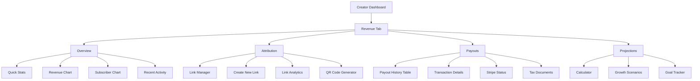
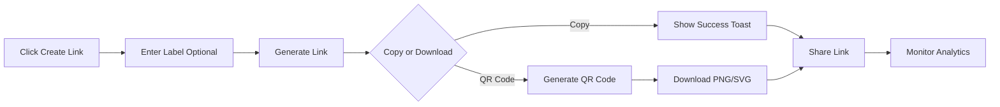
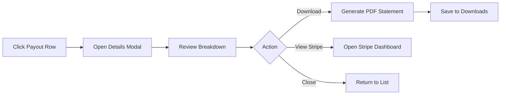
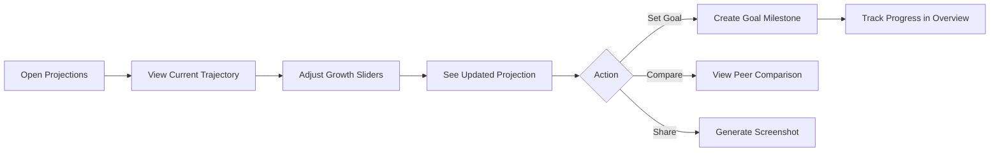

# Story 1.4: Revenue Attribution & Tracking Dashboard - UI/UX Specification

**Version**: 1.0
**Last Updated**: 2025-10-06
**Status**: Ready for Development

---

## 1. Introduction

This document defines the user experience goals, component structure, interaction patterns, and visual specifications **specifically for the Revenue Attribution & Tracking Dashboard** for smartfeed creators.

**Scope**: This spec covers only the revenue dashboard features outlined in Story 1.4. For general frontend architecture, authentication flows, and shared components, refer to `/docs/frontend/README.md`.

**Key Features Covered**:

- Revenue overview dashboard with real-time metrics
- Interactive data visualizations (charts & graphs)
- Attribution link management system
- Payout history & management
- Revenue projection calculator

**Related Documentation**:

- Story Definition: `/docs/stories/1.4.frontend.story.md`
- General Frontend Docs: `/docs/frontend/README.md`
- shadcn/ui Guidelines: `/docs/frontend/README.md#shadcnui-component-usage`

---

## 2. UX Goals & Principles

### 2.1 Target User Personas (Revenue Dashboard Context)

#### Data-Driven Creator

- **Goal**: Deep analytics, exports, and projections to optimize content strategy
- **Behavior**: Regularly checks metrics, exports reports, experiments with projections
- **Pain Points**: Needs transparency, wants to understand every dollar earned

#### Casual Creator

- **Goal**: Quick overview of earnings without overwhelming detail
- **Behavior**: Checks dashboard occasionally, focuses on top-line numbers
- **Pain Points**: Gets lost in too much data, wants simple summaries

#### Growth-Focused Creator

- **Goal**: Track attribution performance and subscriber growth metrics
- **Behavior**: Tests different attribution sources, monitors conversion rates
- **Pain Points**: Needs to know which marketing efforts are paying off

### 2.2 Usability Goals

1. **Instant Understanding** - Key metrics visible within first 3 seconds of page load
2. **Drill-Down Efficiency** - Access detailed breakdowns within 2 clicks from overview
3. **Export Speed** - Generate CSV/Excel reports in under 3 seconds
4. **Attribution Simplicity** - Create and copy attribution links in under 10 seconds

### 2.3 Design Principles (Revenue Dashboard)

1. **Numbers Tell Stories** - Use visual hierarchy and color to make data insights immediate
2. **Progressive Detail** - Overview first, details on demand through expandable sections
3. **Real-Time Transparency** - Show live data updates with smooth transitions
4. **Action-Oriented** - Every metric should suggest a next action (create link, check payout, etc.)

---

## 3. Information Architecture

### 3.1 Revenue Section Structure



### 3.2 Navigation Structure

**Primary Navigation**: Tab-based at top of revenue section

- Overview (default)
- Attribution
- Payouts
- Projections

**Secondary Navigation**: Dashboard header controls

- Date range picker (Quick ranges: Today, 7D, 30D, 90D, Custom)
- Export button (CSV/Excel)
- View settings (Granularity, Currency display)
- Real-time update indicator

**Contextual Actions**: Within each component

- Copy attribution link
- Download payout statement
- Set revenue goal
- Share dashboard snapshot

**Breadcrumb Structure**: `Dashboard > Revenue > [Current Tab]`

---

## 4. Key User Flows

### 4.1 Flow: Create & Share Attribution Link

**User Goal**: Generate a trackable link to share on social media and monitor conversions

**Entry Points**:

- "Create Link" button in Attribution tab
- Quick action in Overview dashboard
- Empty state in Attribution Manager

**Success Criteria**: Link created, copied, and first click tracked

#### Flow Diagram



#### Edge Cases & Error Handling

- **No label provided** → Auto-generate label "Link #N" based on count
- **Copy fails (unsupported browser)** → Show manual copy textbox with instructions
- **QR generation fails** → Display error message, offer retry button
- **Maximum links reached** (if limit exists) → Show upgrade prompt with pricing
- **Network error during creation** → Show retry with exponential backoff

---

### 4.2 Flow: Review Payout & Download Statement

**User Goal**: Verify received payout and download statement for tax records

**Entry Points**:

- Email notification of payout (external link)
- Payouts tab in revenue section
- Dashboard alert "New payout received"

**Success Criteria**: Statement downloaded successfully to user's device

#### Flow Diagram



#### Edge Cases & Error Handling

- **Payout still processing** → Show "Pending" status with estimated completion date
- **PDF generation timeout (>5s)** → Offer email delivery option
- **Missing Stripe connection** → Prompt to connect Stripe account, link to settings
- **Historical payout data missing** → Show "Contact support" message with ticket link
- **Failed payout** → Display failure reason, show "Resolve issue" CTA

---

### 4.3 Flow: Project Future Revenue

**User Goal**: Estimate potential earnings based on different growth scenarios

**Entry Points**:

- Projections tab in revenue section
- "See projections" link in Overview
- Onboarding wizard for new creators (optional)

**Success Criteria**: Projection calculated and displayed, optional goal set

#### Flow Diagram



#### Edge Cases & Error Handling

- **No historical data** → Show industry benchmarks instead, note "Estimated based on similar creators"
- **Unrealistic projection (>1000% growth)** → Display warning tooltip, suggest realistic ranges
- **Goal already exists** → Offer to update existing goal or create additional milestone
- **Projection calculation error** → Fall back to simple linear projection, show "Simplified mode" badge
- **Peer comparison data unavailable** → Hide comparison, show "Coming soon" message

---

## 5. Revenue-Specific Components & Interactions

### 5.1 MetricCard Component

**Purpose**: Display single KPI with trend indicator and optional sparkline

**Base Component**: shadcn `Card` component
**File Location**: `/components/revenue/dashboard/MetricCard.tsx`

#### Variants

| Variant    | Description                                | Use Case               |
| ---------- | ------------------------------------------ | ---------------------- |
| `default`  | Basic metric display                       | Static metrics, counts |
| `trending` | Includes trend arrow and percentage change | Revenue, subscribers   |
| `animated` | Numbers count up on load                   | First page load        |
| `compact`  | Smaller size for mobile                    | Mobile view            |

#### States

| State     | Visual                           | User Action                 |
| --------- | -------------------------------- | --------------------------- |
| `loading` | Skeleton shimmer animation       | Automatic during data fetch |
| `default` | Normal display with hover effect | Clickable for details       |
| `error`   | Red border, retry button         | User can retry fetch        |
| `stale`   | Dimmed opacity (0.7) with badge  | User can manually refresh   |

#### Interactions

- **Click card** → Navigate to detailed view or expand inline
- **Hover** → Show tooltip with detailed breakdown (e.g., "↑ $245 since yesterday")
- **Pull-to-refresh (mobile)** → Refresh all cards simultaneously

#### shadcn Components Used

- `Card`, `CardHeader`, `CardTitle`, `CardContent`
- `Badge` (for trend indicators)
- `Skeleton` (loading state)
- `Tooltip` (hover details)

#### Example Usage

```typescript
<MetricCard
  title="Current Month Revenue"
  value={2450.75}
  format="currency"
  trend={{ value: 12.5, direction: "up" }}
  sparkline={revenueData}
  variant="trending"
  animated
/>
```

---

### 5.2 RevenueChart Component

**Purpose**: Interactive chart showing revenue trends over time with drill-down capabilities

**Chart Library**: Recharts (preferred for Next.js compatibility, TypeScript support)
**File Location**: `/components/revenue/dashboard/RevenueChart.tsx`

#### Chart Types

| Type       | When to Use                   | Data Points           |
| ---------- | ----------------------------- | --------------------- |
| `line`     | Trends over time              | Daily/weekly revenue  |
| `area`     | Visual impact, filled regions | Cumulative revenue    |
| `bar`      | Comparisons between periods   | Month-over-month      |
| `composed` | Multiple metrics layered      | Revenue + subscribers |

#### Interactions

| Interaction       | Behavior                                         | Platform      |
| ----------------- | ------------------------------------------------ | ------------- |
| Hover point       | Show tooltip with exact value, date, and context | All           |
| Click legend item | Toggle series visibility (fade out)              | All           |
| Drag to zoom      | Zoom into selected time range                    | Desktop       |
| Double-click      | Reset zoom to default range                      | Desktop       |
| Swipe             | Pan through time periods                         | Mobile/Tablet |
| Pinch             | Zoom in/out on mobile                            | Mobile/Tablet |

#### Customization Options

- **Date Range Integration**: Syncs with global date picker in header
- **Granularity Toggle**: Hourly / Daily / Weekly / Monthly aggregation
- **Export**: Download chart as PNG (via html2canvas)
- **View Toggle**: Switch between gross revenue / net revenue / both

#### shadcn Components Used

- `Card` (container)
- `Select` (granularity selector)
- `Popover` + `Calendar` (date picker)
- `Button` (export action)
- `Tabs` (view toggle)

#### Performance Considerations

**Data Point Limits**:

- Mobile: Max 30 points (aggregate server-side if more)
- Tablet: Max 60 points
- Desktop: Max 90 points

**Recharts Configuration**:

```typescript
const chartConfig = {
  responsive: true,
  margin: { top: 10, right: 10, bottom: 10, left: 10 },
  animationDuration: 800,
  animationEasing: "ease-out",
};
```

---

### 5.3 AttributionManager Component

**Purpose**: Table listing all attribution links with inline analytics and actions

**Base Component**: shadcn `Table` with sorting and filtering
**File Location**: `/components/revenue/attribution/AttributionManager.tsx`

#### Table Structure

| Column      | Sortable | Filterable   | Width | Actions                           |
| ----------- | -------- | ------------ | ----- | --------------------------------- |
| Label       | Yes      | Search input | 25%   | Edit inline (double-click)        |
| URL         | No       | No           | 30%   | Copy button with success feedback |
| Clicks      | Yes      | Range slider | 10%   | View click details                |
| Conversions | Yes      | Range slider | 10%   | View conversion funnel            |
| Revenue     | Yes      | Range slider | 15%   | -                                 |
| Created     | Yes      | Date picker  | 10%   | -                                 |

#### Interactions

- **Click row** → Expand details panel below row (accordion style)
- **Click copy icon** → Copy URL to clipboard, show success toast
- **Click QR icon** → Open QR code modal with download options
- **Bulk select** → Enable bulk delete/archive actions
- **Empty state** → Large "Create Your First Link" CTA with illustration

#### Responsive Behavior

- **Mobile (<768px)**: Switch to card layout, show key metrics only, "View more" expands details
- **Tablet (768-1024px)**: Scrollable table, sticky header, hide less important columns
- **Desktop (>1024px)**: Full table, all columns visible, inline actions on hover

#### shadcn Components Used

- `Table`, `TableHeader`, `TableBody`, `TableRow`, `TableCell`
- `Input` (search)
- `Button` (actions)
- `Badge` (status indicators)
- `Dialog` (QR modal)
- `Checkbox` (bulk select)
- `DropdownMenu` (row actions)

---

### 5.4 PayoutHistory Component

**Purpose**: Paginated table of payout transactions with details and filters

**Base Component**: shadcn `Table` + DataTable pattern
**File Location**: `/components/revenue/payouts/PayoutHistory.tsx`

#### Table Structure

- **Columns**: Date | Amount | Status | Method | Actions
- **Pagination**: 10 rows per page, load more on scroll (virtual scrolling for 50+ rows)
- **Filters**: Status dropdown, Date range picker, Payment method
- **Sort**: Date (default descending), Amount

#### Status Badge Colors (using CSS variables)

| Status       | Badge Color     | CSS Variable    |
| ------------ | --------------- | --------------- |
| `completed`  | Success green   | `--success`     |
| `pending`    | Warning yellow  | `--warning`     |
| `failed`     | Destructive red | `--destructive` |
| `processing` | Muted gray      | `--muted`       |

#### Row Actions

- **View Details** → Open PayoutDetails modal with full breakdown
- **Download Statement** → Generate and download PDF statement
- **Report Issue** → Open support dialog pre-filled with transaction info

#### Empty State

- **No payouts yet**: "Your first payout will arrive after reaching $50 threshold"
- **No matching filters**: "No payouts found. Try adjusting your filters."

#### shadcn Components Used

- `Table`, `Badge`, `Button`
- `DropdownMenu` (row actions)
- `Dialog` (details modal)
- `Select` (filters)
- `Pagination`

---

### 5.5 ProjectionCalculator Component

**Purpose**: Interactive calculator with sliders for "what if" revenue scenarios

**File Location**: `/components/revenue/projections/ProjectionCalculator.tsx`

#### Layout Structure

**Desktop**: 40% controls (left) / 60% chart (right)
**Tablet**: 50/50 split, stacked on small tablets
**Mobile**: Fully stacked, controls above chart

#### Input Sliders Configuration

```typescript
const sliderConfig = {
  subscriberGrowth: {
    min: 0,
    max: 200,
    default: 10,
    step: 5,
    unit: "%",
    label: "Monthly Subscriber Growth",
  },
  priceTier: {
    min: 5,
    max: 50,
    default: 10,
    step: 5,
    unit: "$",
    label: "Subscription Price",
  },
  churnRate: {
    min: 0,
    max: 50,
    default: 5,
    step: 1,
    unit: "%",
    label: "Monthly Churn Rate",
  },
};
```

#### Interactions

- **Drag slider** → Chart updates in real-time (<100ms latency, debounced)
- **Click preset** → Load predefined scenario (Conservative, Realistic, Optimistic)
- **Click "Set as Goal"** → Save scenario, show goal progress in Overview tab
- **Click "Share"** → Generate shareable link with scenario parameters encoded in URL

#### Preset Scenarios

| Preset       | Subscriber Growth | Price | Churn | Description                  |
| ------------ | ----------------- | ----- | ----- | ---------------------------- |
| Conservative | 5%                | $10   | 10%   | Safe estimate                |
| Realistic    | 10%               | $10   | 5%    | Based on your current trends |
| Optimistic   | 20%               | $15   | 3%    | Best-case scenario           |

#### Chart Output

- **X-Axis**: Next 12 months
- **Y-Axis**: Projected monthly revenue
- **Lines**:
  - Solid line: Best estimate
  - Dotted lines: Confidence interval (±20%)
- **Annotations**: Milestones (e.g., "$1K/month achieved in Month 6")

#### shadcn Components Used

- `Card`, `Slider`, `Label`, `Button`
- `Tabs` (presets)
- `Dialog` (goal setting)
- `Input` (manual value entry)

---

### 5.6 Real-Time Update Indicator

**Purpose**: Show data freshness and refresh status to build user trust

**Display**: Small badge in dashboard header (top-right)
**File Location**: `/components/revenue/dashboard/RealtimeIndicator.tsx`

#### States

| State      | Visual                            | Meaning                  | User Action        |
| ---------- | --------------------------------- | ------------------------ | ------------------ |
| `live`     | 🟢 Green dot + "Updated just now" | Data is fresh (<30s old) | None               |
| `stale`    | 🟡 Yellow dot + "Updated 2m ago"  | Data is older than 30s   | Click to refresh   |
| `updating` | ⏳ Spinner + "Refreshing..."      | Fetch in progress        | Wait               |
| `error`    | 🔴 Red dot + "Update failed"      | Fetch error              | Click retry button |

#### Auto-Refresh Logic

- **Interval**: Poll API every 30 seconds
- **Background behavior**: Pause when tab inactive, resume on focus
- **Error handling**: Exponential backoff (30s → 1m → 2m → 5m max)
- **User override**: Manual refresh button always available

#### shadcn Components Used

- `Badge`
- `Button` (retry)
- `Tooltip` (hover for last update timestamp)

---

## 6. Responsiveness Strategy

### 6.1 Breakpoint Adaptations (Revenue Dashboard Specific)

| Breakpoint                | Layout                                | Navigation                            | Charts                                                | Tables                                  |
| ------------------------- | ------------------------------------- | ------------------------------------- | ----------------------------------------------------- | --------------------------------------- |
| **Mobile** (<768px)       | Single column stack, cards full-width | Bottom tab bar, hamburger for filters | Simplified charts (30 points max), swipeable carousel | Card layout (not table)                 |
| **Tablet** (768-1024px)   | 2-column grid for metric cards        | Top tab bar, sidebar for filters      | Full charts (60 points), touch-optimized              | Scrollable table, 4 visible columns     |
| **Desktop** (1024-1440px) | 3-column grid, sidebar visible        | Full navigation, inline filters       | All chart types (90 points), hover interactions       | Full table, all columns, inline actions |
| **Wide** (>1440px)        | 4-column grid, comparison views       | Persistent sidebar, advanced filters  | Split-screen comparisons                              | Virtual scrolling for 50+ rows          |

### 6.2 Component-Specific Adaptations

#### MetricCard

- **Mobile**: 100% width, compact variant, hide sparklines, stack trend below value
- **Tablet+**: Grid layout (2-3 col), show sparklines, inline trend arrows
- **Desktop**: Add hover quick actions (e.g., "View details")

#### RevenueChart

- **Mobile**: Height 250px, simplified legend (below chart), touch gestures only
- **Tablet**: Height 350px, full legend (right side), hybrid touch/mouse
- **Desktop**: Height 400px, advanced tooltips, zoom controls visible

#### AttributionManager

- **Mobile**: Card layout with "View more" expansion, show Label + Clicks + Copy button
- **Tablet**: Scrollable table, sticky header, hide Created column
- **Desktop**: Full table, all columns, inline actions on row hover

#### PayoutHistory

- **Mobile**: Timeline view (vertical cards), swipe left for actions
- **Tablet**: Condensed table, dropdown menu for actions
- **Desktop**: Full table, inline action buttons, bulk select enabled

#### ProjectionCalculator

- **Mobile**: Fully stacked (sliders above chart), one slider visible at a time (accordion)
- **Tablet**: Side-by-side 50/50 split
- **Desktop**: 40/60 split (controls/chart), preset scenarios in right sidebar

### 6.3 Mobile-First Considerations

#### Touch Targets

- **Minimum size**: 44x44px for all interactive elements
- **Spacing**: 8px minimum between adjacent touch targets
- **Hit area**: Extend beyond visual bounds for small icons

#### Touch Gestures

| Gesture           | Action                  | Component                 |
| ----------------- | ----------------------- | ------------------------- |
| Swipe left/right  | Navigate time periods   | Charts                    |
| Pull down         | Refresh dashboard data  | Main dashboard            |
| Long press        | Show detailed breakdown | Metric cards              |
| Pinch zoom        | Zoom into date range    | Charts                    |
| Swipe left on row | Reveal delete/archive   | Tables (mobile card view) |

#### Mobile Menu Priority

1. Overview (home)
2. Quick Stats (above fold)
3. Create Attribution Link (floating action button)
4. Recent Payouts (collapsed by default)
5. More → (Projections, Settings, Export)

---

## 7. Animations & Micro-interactions

### 7.1 Motion Principles

1. **Purposeful Motion** - Every animation communicates state change or guides attention
2. **Respect Preferences** - Honor `prefers-reduced-motion` system setting
3. **Performance First** - Use CSS transforms and opacity only (GPU accelerated)
4. **Natural Timing** - Follow ease-out curves for user-initiated actions, ease-in for exits

### 7.2 Key Animations

#### Number Counting Animation

```typescript
{
  name: 'Revenue Counter',
  component: 'MetricCard',
  trigger: 'On mount / data update',
  duration: '1200ms',
  easing: 'cubic-bezier(0.4, 0, 0.2, 1)',
  behavior: 'Count from previous value to new value',
  implementation: 'Framer Motion useSpring hook or react-countup'
}
```

**Visual Effect**: Numbers increment smoothly, creating sense of real-time data

---

#### Chart Entry Animation

```typescript
{
  name: 'Chart Line Draw',
  component: 'RevenueChart',
  trigger: 'On chart mount',
  duration: '800ms',
  easing: 'ease-out',
  behavior: 'Line draws from left to right, bars rise from bottom',
  delay: 'Stagger bars by 50ms for waterfall effect'
}
```

**Recharts Config**: `isAnimationActive={true}` with `animationDuration={800}`

---

#### Trend Arrow Pulse

```typescript
{
  name: 'Positive Trend Pulse',
  component: 'MetricCard',
  trigger: 'On significant positive change (>10%)',
  duration: '1500ms',
  easing: 'ease-in-out',
  behavior: 'Subtle scale pulse (1 → 1.05 → 1)',
  repeat: '2 times, then stop'
}
```

**CSS**:

```css
@keyframes pulse-positive {
  0%,
  100% {
    transform: scale(1);
  }
  50% {
    transform: scale(1.05);
  }
}
```

---

#### Copy Success Feedback

```typescript
{
  name: 'Copy Button Success',
  component: 'AttributionManager',
  trigger: 'On attribution link copy',
  duration: '200ms → hold 2000ms → 200ms fade',
  behavior: 'Button text changes, checkmark icon appears, brief green flash',
  flow: 'Copy → ✓ Copied! (2s hold) → Copy'
}
```

**User Benefit**: Clear confirmation of successful action without modal interruption

---

#### Loading Skeleton Shimmer

```typescript
{
  name: 'Skeleton Shimmer',
  component: 'All loading states',
  trigger: 'On data loading',
  duration: '1500ms infinite',
  easing: 'linear',
  behavior: 'Gradient shimmer effect sweeps across skeleton boxes'
}
```

**shadcn Component**: Use `<Skeleton />` with built-in shimmer animation

---

#### Real-Time Data Update Fade

```typescript
{
  name: 'Data Refresh Fade',
  component: 'MetricCard, Charts',
  trigger: 'On new data received from polling',
  duration: '300ms',
  behavior: 'Fade out old value (opacity 1 → 0.3), swap data, fade in (0.3 → 1)',
  avoidance: 'Skip animation if user is hovering over element'
}
```

**User Benefit**: Smooth transitions prevent jarring updates, maintain user orientation

---

#### Modal Enter/Exit

```typescript
{
  name: 'Payout Details Modal',
  component: 'PayoutDetails Dialog',
  enter: {
    duration: '200ms',
    easing: 'ease-out',
    transform: 'scale(0.95) → scale(1) + opacity 0 → 1'
  },
  exit: {
    duration: '150ms',
    easing: 'ease-in',
    transform: 'scale(1) → scale(0.95) + opacity 1 → 0'
  },
  backdrop: {
    duration: '200ms',
    opacity: '0 → 0.5'
  }
}
```

**shadcn Dialog**: Uses Radix UI with built-in animations, customize via CSS

---

### 7.3 Micro-Interactions

#### Hover States

| Element      | Effect                                             | Purpose                      |
| ------------ | -------------------------------------------------- | ---------------------------- |
| MetricCard   | Subtle lift (`translateY: -2px`) + shadow increase | Indicate clickability        |
| Chart points | Scale up 1.2x, show crosshair                      | Draw attention to data point |
| Table rows   | Background color shift, fade in action buttons     | Show interactive row         |
| Buttons      | Scale 1.02x, color shift                           | Provide tactile feedback     |

#### Focus States

- **Keyboard navigation**: 2px focus ring using `ring-2 ring-offset-2 ring-primary`
- **Visible indicators**: High contrast focus rings for accessibility
- **Skip unnecessary focus**: Don't add focus to non-interactive chart elements

#### Loading States

| Component | Loading Behavior                                                          |
| --------- | ------------------------------------------------------------------------- |
| Button    | Show spinner, disable interaction, maintain width to prevent layout shift |
| Card      | Skeleton placeholder with shimmer animation                               |
| Chart     | Previous data visible at opacity 0.5, new data fades in over it           |
| Table     | Skeleton rows (3-5 rows) with shimmer                                     |

#### Empty States

- **Friendly illustration**: Optional, simple line art
- **Clear CTA**: Primary button (e.g., "Create Your First Link")
- **Helpful text**: Explain what will appear here and why it's empty
- **Animation**: Fade-in when empty state first appears

#### Error States

- **Form validation errors**: Gentle shake animation (2-3 small shakes, 300ms total)
- **Toast notifications**: Slide in from top-right with bounce effect
- **Retry buttons**: Pulse gently after 3 seconds to draw attention
- **Inline errors**: Red border with fade-in effect

### 7.4 Accessibility Considerations

```css
/* Respect user's motion preferences */
@media (prefers-reduced-motion: reduce) {
  *,
  *::before,
  *::after {
    animation-duration: 0.01ms !important;
    animation-iteration-count: 1 !important;
    transition-duration: 0.01ms !important;
    scroll-behavior: auto !important;
  }
}
```

**Implementation**: Check `window.matchMedia('(prefers-reduced-motion: reduce)')` in React and disable animations accordingly.

---

## 8. Performance Requirements

### 8.1 Performance Targets (Story 1.4 Specific)

| Metric                        | Target  | Measurement Method          | Priority |
| ----------------------------- | ------- | --------------------------- | -------- |
| Initial Dashboard Load (FCP)  | < 1.5s  | Lighthouse, Web Vitals      | Critical |
| Dashboard Interactive (TTI)   | < 2.0s  | Lighthouse                  | Critical |
| Chart Rendering               | < 500ms | Performance.now()           | High     |
| Data Refresh Latency          | < 200ms | API response time           | High     |
| Export Generation (1000 rows) | < 3s    | User Timing API             | Medium   |
| Number Animation Smoothness   | 60fps   | Chrome DevTools Performance | High     |
| Table Scroll (10k rows)       | 60fps   | Virtual scrolling required  | Medium   |

### 8.2 Optimization Strategies

#### Code Splitting

```typescript
// Lazy load heavy chart components
const ProjectionCalculator = dynamic(
  () => import('@/components/revenue/projections/ProjectionCalculator'),
  {
    loading: () => <Skeleton className="h-96" />,
    ssr: false
  }
);

const RechartsComponents = dynamic(
  () => import('@/components/revenue/charts/RevenueChart'),
  { ssr: false } // Charts don't benefit from SSR
);
```

**Rationale**: Recharts bundle is ~180KB. Only load when user navigates to chart-heavy tabs.

---

#### Data Fetching Strategy

```typescript
// React Query with smart caching
const revenueQuery = useQuery({
  queryKey: ["revenue", dateRange],
  queryFn: () => fetchRevenue(dateRange),
  staleTime: 30_000, // 30 seconds fresh
  cacheTime: 300_000, // 5 minutes cache
  refetchInterval: 30_000, // Auto-refresh every 30s
  refetchOnWindowFocus: true, // Refresh when user returns to tab
  keepPreviousData: true, // Prevent flash during updates
});
```

**Rationale**: Balance real-time freshness with performance. 30-second intervals are fast enough for revenue data without overwhelming the API.

---

#### Chart Performance Optimization

```typescript
// Recharts best practices
<ResponsiveContainer width="100%" height={400}>
  <AreaChart
    data={data}
    syncId="revenueCharts"          // Sync multiple charts
    margin={{ top: 10, right: 10, bottom: 10, left: 10 }}
  >
    <defs>
      <linearGradient id="colorRevenue" x1="0" y1="0" x2="0" y2="1">
        <stop offset="5%" stopColor="hsl(var(--primary))" stopOpacity={0.8}/>
        <stop offset="95%" stopColor="hsl(var(--primary))" stopOpacity={0}/>
      </linearGradient>
    </defs>
    <Area
      type="monotone"
      dataKey="revenue"
      fill="url(#colorRevenue)"
      stroke="hsl(var(--primary))"
      dot={false}                   // Don't render dots for large datasets
      isAnimationActive={!prefersReducedMotion}
      animationDuration={800}
    />
  </AreaChart>
</ResponsiveContainer>
```

**Data Point Limits**:

- Mobile: Aggregate to max 30 data points
- Tablet: Max 60 data points
- Desktop: Max 90 data points
- Use server-side aggregation for larger date ranges

---

#### Virtual Scrolling for Large Tables

```typescript
// Use @tanstack/react-virtual for payouts/attribution tables
import { useVirtualizer } from "@tanstack/react-virtual";

const rowVirtualizer = useVirtualizer({
  count: payouts.length,
  getScrollElement: () => parentRef.current,
  estimateSize: () => 50, // Estimated row height in px
  overscan: 5, // Render 5 extra rows above/below viewport
});
```

**Trigger**: Enable virtual scrolling automatically when table has >50 rows

---

#### Image Optimization (QR Codes)

```typescript
// Next.js Image component for QR codes
<Image
  src={qrCodeDataUrl}
  width={256}
  height={256}
  alt="Attribution link QR code"
  loading="lazy"
  quality={85}
  placeholder="blur"
/>
```

---

#### Debouncing & Throttling

```typescript
// Projection calculator slider updates
const debouncedCalculate = useMemo(
  () => debounce((values) => calculateProjection(values), 150),
  []
);

// Chart zoom/pan interactions
const throttledZoom = useMemo(() => throttle((zoom) => updateChartZoom(zoom), 100), []);
```

---

### 8.3 Bundle Size Budget

| Package       | Size (gzipped) | Justification                  | Load Strategy               |
| ------------- | -------------- | ------------------------------ | --------------------------- |
| Recharts      | ~180KB         | Required for all charts        | Code split by tab           |
| Framer Motion | ~45KB          | Smooth animations              | Load on interaction         |
| date-fns      | ~20KB          | Date formatting                | Tree-shake unused functions |
| xlsx          | ~140KB         | Excel export                   | Lazy load on export click   |
| react-query   | ~12KB          | Data fetching                  | Always loaded               |
| **Total**     | **~385KB**     | Acceptable for revenue feature | -                           |

**Monitoring**: Use `@next/bundle-analyzer` to track bundle size weekly. Alert if revenue route bundle exceeds 500KB.

---

### 8.4 Caching Strategy

#### React Query Cache Configuration

| Data Type        | Stale Time | Cache Time | Refetch Interval | Rationale                         |
| ---------------- | ---------- | ---------- | ---------------- | --------------------------------- |
| Overview metrics | 30s        | 5min       | 30s              | High priority, changes frequently |
| Attribution data | 1min       | 10min      | 1min             | Moderate priority, less volatile  |
| Payout history   | 5min       | 30min      | None             | Low priority, rarely changes      |
| Projections      | None       | None       | None             | Always fresh, user-driven         |

#### Browser Cache Headers

```typescript
// API response headers
{
  'Cache-Control': 'private, max-age=30, must-revalidate',  // API responses
  'ETag': '<hash>',                                         // Enable conditional requests
  'Vary': 'Accept-Encoding'
}

// Static assets
{
  'Cache-Control': 'public, max-age=31536000, immutable'   // Charts, images
}
```

---

### 8.5 Performance Monitoring

```typescript
// Custom performance marks for dashboard rendering
export function measureDashboardPerformance() {
  performance.mark("dashboard-render-start");

  // ... render logic ...

  performance.mark("dashboard-render-end");
  performance.measure("dashboard-render", "dashboard-render-start", "dashboard-render-end");

  // Send to analytics
  const measure = performance.getEntriesByName("dashboard-render")[0];
  if (measure) {
    analytics.track("Dashboard Performance", {
      duration: measure.duration,
      url: window.location.pathname,
      userAgent: navigator.userAgent,
    });
  }
}
```

**Monitoring Points**:

- Dashboard mount time
- First chart render
- Time to interactive
- API response times
- Export generation time

**Alerting**: Set up alerts if p95 performance exceeds targets by >20%

---

## 9. shadcn/ui Component Mapping

### Components Required for Story 1.4

| shadcn Component | Used In               | Installation Command                  |
| ---------------- | --------------------- | ------------------------------------- |
| Card             | All dashboard cards   | `npx shadcn@latest add card`          |
| Table            | Attribution, Payouts  | `npx shadcn@latest add table`         |
| Badge            | Status indicators     | `npx shadcn@latest add badge`         |
| Button           | All actions           | `npx shadcn@latest add button`        |
| Dialog           | Modals, QR codes      | `npx shadcn@latest add dialog`        |
| Tabs             | Revenue section nav   | `npx shadcn@latest add tabs`          |
| Slider           | Projection calculator | `npx shadcn@latest add slider`        |
| Skeleton         | Loading states        | `npx shadcn@latest add skeleton`      |
| Tooltip          | Hover information     | `npx shadcn@latest add tooltip`       |
| Select           | Filters, dropdowns    | `npx shadcn@latest add select`        |
| Popover          | Date pickers          | `npx shadcn@latest add popover`       |
| Calendar         | Date range selection  | `npx shadcn@latest add calendar`      |
| Input            | Search, filters       | `npx shadcn@latest add input`         |
| Label            | Form labels           | `npx shadcn@latest add label`         |
| Checkbox         | Bulk actions          | `npx shadcn@latest add checkbox`      |
| DropdownMenu     | Row actions           | `npx shadcn@latest add dropdown-menu` |
| Toast            | Notifications         | `npx shadcn@latest add toast`         |

### Additional Blocks to Consider

| shadcn Block     | Relevance | Notes                                 |
| ---------------- | --------- | ------------------------------------- |
| `dashboard-01`   | High      | Use as base layout structure          |
| `chart-*` blocks | Medium    | Check for pre-built chart examples    |
| `table-*` blocks | Medium    | DataTable patterns for complex tables |

**Search Command**: `mcp shadcn search "dashboard"` to find relevant blocks

---

## 10. Accessibility Requirements

### 10.1 Compliance Target

**Standard**: WCAG 2.1 Level AA

**Scope**: All revenue dashboard components must meet AA standards for:

- Perceivable content
- Operable interface
- Understandable information
- Robust implementation

### 10.2 Specific Requirements

#### Visual Accessibility

- **Color Contrast**: Minimum 4.5:1 for normal text, 3:1 for large text
- **Color Independence**: Never rely on color alone (use icons + text)
- **Focus Indicators**: Visible 2px focus ring on all interactive elements
- **Text Sizing**: Support browser zoom up to 200% without breaking layout

#### Keyboard Navigation

- **Tab Order**: Logical flow matching visual hierarchy
- **Keyboard Shortcuts**:
  - `Ctrl+R` - Refresh dashboard
  - `Ctrl+E` - Export data
  - `Ctrl+N` - Create new attribution link
- **Focus Management**: Return focus after modal close
- **Skip Links**: "Skip to main content" at dashboard top

#### Screen Reader Support

- **ARIA Labels**: All interactive elements have descriptive labels
- **Live Regions**: `aria-live="polite"` for real-time updates
- **Table Headers**: Proper `<th>` scope for data tables
- **Chart Alternatives**: Provide data table alternative for charts

#### Charts Accessibility

```typescript
<AreaChart aria-label="Revenue trend over time">
  <title>Monthly Revenue Chart</title>
  <desc>Line chart showing revenue from $1,200 in January to $2,450 in June</desc>
  {/* Chart content */}
</AreaChart>

{/* Always provide data table alternative */}
<details className="sr-only">
  <summary>View data as table</summary>
  <table>
    {/* Data in accessible table format */}
  </table>
</details>
```

### 10.3 Testing Checklist

- [ ] Run axe DevTools on all views
- [ ] Test keyboard navigation through entire dashboard
- [ ] Verify screen reader announces all interactive elements
- [ ] Check color contrast with WebAIM tool
- [ ] Test with browser zoom at 200%
- [ ] Verify focus management in modals
- [ ] Test with real screen reader (NVDA, JAWS, VoiceOver)

---

## 11. Next Steps & Handoff

### 11.1 Implementation Sequence

**Phase 1: Foundation (Week 1)**

1. Set up React Query for data fetching
2. Implement MetricCard component with all variants
3. Build basic dashboard layout with shadcn dashboard-01 block
4. Create real-time update indicator

**Phase 2: Visualizations (Week 2)**

1. Integrate Recharts library
2. Build RevenueChart with all interactions
3. Add SubscriberChart
4. Implement loading states and animations

**Phase 3: Attribution (Week 3)**

1. Build AttributionManager table
2. Create link generator dialog
3. Add QR code generation
4. Implement copy-to-clipboard with feedback

**Phase 4: Payouts (Week 4)**

1. Build PayoutHistory table
2. Create PayoutDetails modal
3. Add PDF export functionality
4. Integrate Stripe status checks

**Phase 5: Projections & Polish (Week 5)**

1. Build ProjectionCalculator with sliders
2. Add growth scenarios
3. Implement goal tracking
4. Performance optimization pass
5. Accessibility audit
6. Cross-browser testing

### 11.2 Design Handoff Checklist

- [x] All user flows documented
- [x] Component specifications complete
- [x] Accessibility requirements defined
- [x] Responsive strategy clear
- [x] Performance goals established
- [x] Animation specifications detailed
- [ ] Visual design mockups created (Figma)
- [ ] shadcn components installed
- [ ] API contracts finalized with backend
- [ ] Test data prepared

### 11.3 Open Questions & Decisions Needed

1. **QR Code Library**: Use `qrcode.react` or `react-qr-code`?
2. **PDF Generation**: Client-side (jsPDF) or server-side endpoint?
3. **Real-time Strategy**: WebSocket or polling? (Polling recommended for simplicity)
4. **Attribution Link Format**: `smartnews.example/r/{hash}` or `smartnews.example?ref={creator_hash}`?
5. **Currency Display**: Support multiple currencies or USD only initially?
6. **Export Limits**: Max rows in CSV export (recommend 10,000 row limit)?

### 11.4 Dependencies & Prerequisites

**Before Starting Development**:

- [ ] Backend revenue APIs operational (see Story 1.4)
- [ ] Stripe Connect configured for payouts
- [ ] Analytics tracking endpoints ready
- [ ] Test creator account with sample data
- [ ] Design system tokens in globals.css

**External Dependencies**:

- Recharts library
- React Query
- Framer Motion (optional, for advanced animations)
- xlsx library (for exports)
- qrcode library (for QR generation)

### 11.5 Success Criteria

**Technical**:

- All components render in <2s on 3G connection
- Charts maintain 60fps during interactions
- Accessibility audit passes with zero critical issues
- Bundle size for revenue route <500KB

**User Experience**:

- Users can create and copy attribution link in <10 seconds
- Revenue data updates every 30 seconds without user action
- Payout statements download successfully on first attempt
- Mobile responsive design works on iPhone SE and larger

**Business**:

- 80%+ of creators check dashboard at least weekly
- Attribution link creation rate >50% of active creators
- Zero critical bugs in first month post-launch
- User satisfaction score >4.0/5

---

## 12. Change Log

| Date       | Version | Description                         | Author            |
| ---------- | ------- | ----------------------------------- | ----------------- |
| 2025-10-06 | 1.0     | Initial UI/UX specification created | Sally (UX Expert) |

---

## Appendix: References

- **Story Definition**: `/docs/stories/1.4.frontend.story.md`
- **API Documentation**: `https://localhost:8000/docs`
- **General Frontend Docs**: `/docs/frontend/README.md`
- **shadcn/ui Docs**: `https://ui.shadcn.com`
- **Recharts Docs**: `https://recharts.org`
- **WCAG 2.1 Guidelines**: `https://www.w3.org/WAI/WCAG21/quickref/`
