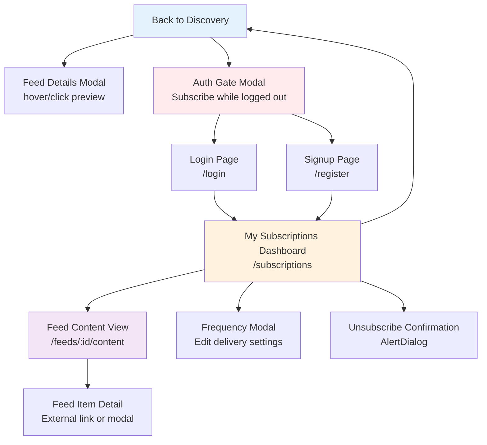
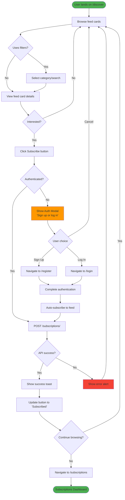
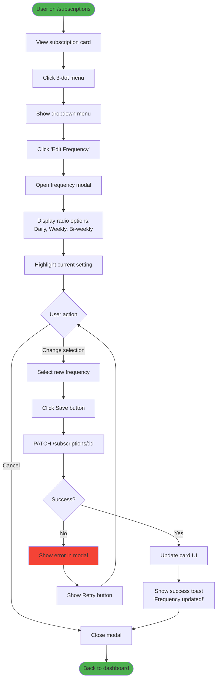
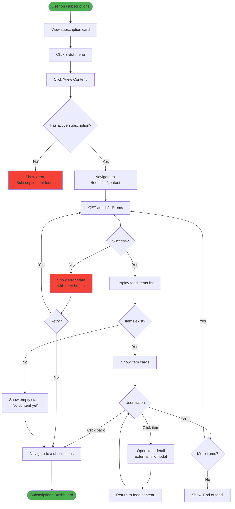

# smartfeed Subscriber Discovery & Experience - UI/UX Specification

**Version**: 1.0
**Last Updated**: 2025-10-29
**Story**: 1.6 - Frontend Subscriber Discovery & Experience
**Status**: Ready for Development

---

## Introduction

This document defines the user experience goals, information architecture, user flows, and visual design specifications for smartfeed's **Subscriber Discovery & Experience** interface. It serves as the foundation for visual design and frontend development, ensuring a cohesive and user-centered experience.

**Scope**: This specification covers the subscriber-facing features including:

- Public feed discovery (unauthenticated)
- Subscription management dashboard (authenticated)
- Feed content viewing (authenticated)
- Frequency preference customization

**Target Story**: Story 1.6 - Frontend Subscriber Discovery & Experience

**Key Principle**: **Zero friction to discovery and subscription** - Subscribers should be able to browse, preview, and subscribe to feeds with minimal steps, focusing on content quality over complex features.

### Design Philosophy

The subscriber experience is intentionally simplified compared to the creator side:

1. **Public-first approach**: Discovery page is completely unauthenticated - users can explore all feeds before committing to sign up
2. **Progressive disclosure**: Authentication only required at the point of subscription, not before
3. **Content-focused**: UI prioritizes feed content previews and creator information over decorative elements
4. **Mobile-first**: Given that content consumption often happens on mobile, the design starts with mobile constraints

---

## Overall UX Goals & Principles

### Target User Personas

**1. Curious Browser (Unauthenticated)**

- **Profile**: First-time visitor exploring what smartfeed offers
- **Goals**: Quickly assess feed quality without signing up; understand value proposition
- **Pain Points**: Doesn't want to create an account just to "look around"
- **Success Criteria**: Can browse all public feeds, preview content, understand creator value within 2 minutes

**2. Active Subscriber (Authenticated)**

- **Profile**: User who has subscribed to 1-5 feeds and wants to manage them easily
- **Goals**: Access feed content quickly; adjust delivery frequency; discover new feeds
- **Pain Points**: Overwhelmed by too many options; forgets which feeds they're subscribed to
- **Success Criteria**: Can access subscribed content in <3 taps; manage subscriptions without confusion

**3. Power Subscriber (Authenticated)**

- **Profile**: Enthusiast managing 10+ feed subscriptions
- **Goals**: Efficiently navigate between feeds; customize delivery preferences; curate personal content library
- **Pain Points**: Cluttered dashboard; difficulty finding specific feeds
- **Success Criteria**: Dashboard remains scannable even with many subscriptions; search/filter works well

---

### Usability Goals

1. **Instant Discovery** - Users can browse and preview feeds within 10 seconds of landing
2. **Zero-friction Subscribe** - From feed discovery to subscription completion in <30 seconds
3. **Clear Frequency Control** - Users understand and can modify delivery frequency in 1-2 taps
4. **Effortless Content Access** - Subscribed users reach feed content in maximum 2 taps from dashboard
5. **Mobile-optimized** - All core actions work seamlessly on mobile devices (touch targets, gestures)
6. **Forgiving Errors** - Clear confirmation for destructive actions (unsubscribe); easy to reverse mistakes

---

### Design Principles

1. **Content First, Chrome Last** - Prioritize feed information and content over decorative UI elements
2. **Progressive Trust Building** - Show value before asking for authentication; earn user commitment gradually
3. **Familiar Patterns** - Use established UI conventions (3-dot menus, card grids, modals) over novel interactions
4. **Immediate Feedback** - Every action (subscribe, frequency change, etc.) confirms success with toast notifications
5. **Respectful of Attention** - Minimal notifications; no dark patterns; clear unsubscribe paths

---

### Change Log

| Date       | Version | Description                         | Author            |
| ---------- | ------- | ----------------------------------- | ----------------- |
| 2025-10-29 | 1.0     | Initial specification for Story 1.6 | Sally (UX Expert) |

---

## Information Architecture (IA)

### Site Map / Screen Inventory



**Legend**:

- 🌐 Blue = Public (unauthenticated)
- 🔒 Orange = Protected (authenticated)
- 📄 Purple = Content viewing
- ⚠️ Red = Auth gates/warnings

---

### Navigation Structure

**Primary Navigation (Mobile & Desktop)**

**Unauthenticated Users**:

- **Mobile**: Fixed bottom bar with "Discover" (active) + "Sign In" button
- **Desktop**: Top header with logo (left) + "Discover" link + "Sign In" button (right)

**Authenticated Users**:

- **Mobile**: Fixed bottom bar with "Discover" + "My Subscriptions" + User Menu (3-dot)
- **Desktop**: Top header with logo + "Discover" + "My Subscriptions" + User Avatar dropdown

**Secondary Navigation**:

- **Discovery Page**: Category filter tabs (sticky on scroll)
- **Subscriptions Dashboard**: Optional filter/sort dropdown (if 5+ subscriptions)
- **Feed Content View**: Back button (sticky) + Feed title

**Breadcrumb Strategy**:

- Not used on mobile (space constraints)
- Desktop shows: "Discovery" → "Feed Name" on content pages
- Keep breadcrumbs minimal (max 2 levels) to avoid clutter

---

## User Flows

### Flow 1: Unauthenticated User Discovers and Subscribes to Feed

**User Goal**: Find interesting content feeds and subscribe

**Entry Points**:

- Direct landing on `/discover` (default homepage for subscribers)
- Shared feed link from creator
- Search engine result

**Success Criteria**: User completes subscription and lands on subscriptions dashboard

#### Flow Diagram



#### Edge Cases & Error Handling

- **No feeds available**: Show empty state with message "No feeds available yet. Check back soon!"
- **API timeout on subscribe**: Show retry button + error message "Connection issue. Please try again."
- **Already subscribed**: Button shows "Subscribed" state, clicking shows toast "You're already subscribed to this feed"
- **Auth modal closed without action**: User returns to discovery, can retry subscribe anytime
- **Session expires during flow**: Redirect to login with return URL preserved

**Notes**: Auth modal is critical UX decision - must feel lightweight, not like leaving the page. Consider using shadcn Dialog with blur background.

---

### Flow 2: Authenticated User Manages Subscription Frequency

**User Goal**: Change how often they receive feed updates

**Entry Points**:

- From subscription card 3-dot menu → "Edit Frequency"
- Proactive suggestion: "New to this feed? Customize your delivery frequency"

**Success Criteria**: Frequency updated successfully, user sees confirmation

#### Flow Diagram



#### Edge Cases & Error Handling

- **Modal opened while API call pending**: Disable Save button, show loading spinner
- **User closes modal without saving**: No changes persisted, card shows original frequency
- **API returns validation error**: Show error message in modal "Invalid frequency selected. Please try again."
- **User changes frequency multiple times rapidly**: Debounce API calls, show loading state
- **Frequency same as creator's default**: Show informational note "This matches the creator's recommended frequency"

**Notes**: Modal should be mobile-optimized (full-screen on small devices, centered on desktop). Use shadcn Dialog + RadioGroup components.

---

### Flow 3: Subscriber Views Feed Content

**User Goal**: Read/consume content from subscribed feeds

**Entry Points**:

- From subscription card 3-dot menu → "View Content"
- From email notification link (if implemented)
- Direct URL if feed ID known

**Success Criteria**: User views feed items, can navigate back to dashboard easily

#### Flow Diagram



#### Edge Cases & Error Handling

- **Subscription cancelled mid-view**: Redirect to discovery with message "Subscription no longer active"
- **Feed has no content yet**: Show encouraging empty state "The creator hasn't published content yet. Check back soon!"
- **External link fails to open**: Show error toast "Unable to open link. Please try again."
- **User navigates directly to /feeds/:id/content without subscription**: Redirect to discovery with message + Subscribe CTA
- **Infinite scroll reaches end**: Show clear "You've reached the end" message, suggest related feeds
- **Network offline**: Show cached content if available, otherwise show offline message with retry

**Notes**: Back button should be persistent (sticky header) on mobile. Consider adding "Mark as read" functionality in future iterations.

---

## Wireframes & Key Screen Layouts

### Design Files

**Primary Design Tools**: Figma (link TBD by design team)

**Prototype Links**:

- Mobile prototype: [Figma link TBD]
- Desktop prototype: [Figma link TBD]

---

### Key Screen 1: Public Feed Discovery Page (`/discover`)

**Purpose**: Allow unauthenticated and authenticated users to browse all available feeds, preview content quality, and subscribe

**Layout - Mobile (< 640px)**:

```
┌─────────────────────┐
│ [Logo]    [Sign In] │ ← Sticky header
├─────────────────────┤
│ 🔍 Search feeds...  │ ← Search bar
├─────────────────────┤
│ [All] [Tech] [News] │ ← Category tabs (horizontal scroll)
├─────────────────────┤
│ ┌─────────────────┐ │
│ │ Feed Card       │ │ ← 1 column grid
│ │ Tech Daily      │ │
│ │ by @creator     │ │
│ │ Daily • 1.2k 👥 │ │
│ │ [Subscribe]     │ │
│ └─────────────────┘ │
│                     │
│ ┌─────────────────┐ │
│ │ Feed Card       │ │
│ │ ...             │ │
│ └─────────────────┘ │
└─────────────────────┘
```

**Layout - Desktop (> 1024px)**:

```
┌─────────────────────────────────────────────┐
│ [Logo]  Discover     [Search]    [Sign In]  │ ← Header
├─────────────────────────────────────────────┤
│ [All] [Technology] [Business] [Lifestyle]   │ ← Category tabs
├─────────────────────────────────────────────┤
│ ┌────────┐  ┌────────┐  ┌────────┐          │
│ │ Feed 1 │  │ Feed 2 │  │ Feed 3 │          │ ← 3 column grid
│ │ Title  │  │ Title  │  │ Title  │          │
│ │ @name  │  │ @name  │  │ @name  │          │
│ │ Daily  │  │ Weekly │  │ Daily  │          │
│ │[Subscribe]│[Subscribe]│[Subscribe]│       │
│ └────────┘  └────────┘  └────────┘          │
│ ┌────────┐  ┌────────┐  ┌────────┐          │
│ │ ...    │  │ ...    │  │ ...    │          │
│ └────────┘  └────────┘  └────────┘          │
└─────────────────────────────────────────────┘
```

**Key Elements**:

- **Search bar**: shadcn Input with Search icon (left), clear button (right when focused)
- **Category filters**: shadcn Tabs component (horizontal scroll on mobile)
- **Feed cards**: shadcn Card with:
  - Feed name (H3, truncate after 2 lines)
  - Creator name with avatar (small)
  - Frequency badge + subscriber count (muted text)
  - Description (truncate after 3 lines, "...more" on hover)
  - Subscribe button (primary, full-width on mobile)
- **Loading state**: shadcn Skeleton cards (3-6 visible)
- **Empty state**: Central message with illustration + "Browse all feeds" CTA

**Interaction Notes**:

- **Card hover (desktop)**: Subtle elevation increase, "Preview" button appears
- **Subscribe click (unauthenticated)**: Show auth modal (shadcn Dialog)
- **Subscribe click (authenticated)**: API call, button → "Subscribed" with checkmark, toast notification
- **Category change**: Smooth scroll to top, show loading skeletons
- **Infinite scroll**: Load more feeds when user reaches bottom 200px

**Design File Reference**: [Figma Frame: Discovery Page - Mobile/Desktop]

---

### Key Screen 2: My Subscriptions Dashboard (`/subscriptions`)

**Purpose**: Authenticated users manage their active subscriptions, access feed content, and modify settings

**Layout - Mobile (< 640px)**:

```
┌─────────────────────┐
│ ← My Subscriptions  │ ← Back to Discovery
├─────────────────────┤
│ 📊 3 Active Feeds   │ ← Summary badge
├─────────────────────┤
│ ┌─────────────────┐ │
│ │ Tech Daily   ⋮  │ │ ← Subscription card with menu
│ │ @techcreator    │ │
│ │ 📅 Daily        │ │
│ │ ↻ Since Oct 25  │ │
│ └─────────────────┘ │
│                     │
│ ┌─────────────────┐ │
│ │ Business Weekly ⋮│ │
│ │ ...             │ │
│ └─────────────────┘ │
│                     │
│ [+ Browse Feeds]    │ ← CTA to discovery
└─────────────────────┘
```

**Layout - Desktop (> 1024px)**:

```
┌─────────────────────────────────────────────┐
│ My Subscriptions (3)         [+ Browse More]│ ← Header with CTA
├─────────────────────────────────────────────┤
│ ┌──────────────┐  ┌──────────────┐          │
│ │ Tech Daily ⋮ │  │ Biz Weekly ⋮ │          │ ← 2-3 column grid
│ │ @creator     │  │ @creator     │          │
│ │ 📅 Daily     │  │ 📅 Weekly    │          │
│ │ Since Oct 25 │  │ Since Oct 20 │          │
│ └──────────────┘  └──────────────┘          │
│ ┌──────────────┐                            │
│ │ ...          │                            │
│ └──────────────┘                            │
└─────────────────────────────────────────────┘
```

**Empty State**:

```
┌─────────────────────┐
│                     │
│       📭            │
│                     │
│ No subscriptions    │
│ yet                 │
│                     │
│ Discover feeds to   │
│ get started         │
│                     │
│ [Browse Feeds]      │
│                     │
└─────────────────────┘
```

**Key Elements**:

- **Page header**: Title + subscription count + "Browse More" button (secondary)
- **Subscription cards**: shadcn Card with:
  - Feed name (H3) + 3-dot menu (top-right)
  - Creator name with small avatar
  - Frequency badge (shadcn Badge with calendar icon)
  - Subscription date (muted text)
  - No Subscribe button (already subscribed)
- **3-dot menu**: shadcn DropdownMenu with:
  - "View Content" (primary action)
  - "Edit Frequency"
  - Separator
  - "Unsubscribe" (destructive color)
- **Empty state**: shadcn Alert variant with icon + CTA button

**Interaction Notes**:

- **3-dot menu hover**: Highlight menu button (subtle background)
- **View Content**: Navigate to `/feeds/:id/content`
- **Edit Frequency**: Open modal (shadcn Dialog)
- **Unsubscribe**: Show confirmation dialog (shadcn AlertDialog), then API call + remove card with animation
- **Card order**: Most recently subscribed first (or allow user to sort)

**Design File Reference**: [Figma Frame: Subscriptions Dashboard - Mobile/Desktop/Empty]

---

### Key Screen 3: Frequency Edit Modal

**Purpose**: Allow users to customize how often they receive feed updates

**Layout - Mobile & Desktop**:

```
┌─────────────────────────────────┐
│ Edit Delivery Frequency      [×]│ ← Dialog header with close
├─────────────────────────────────┤
│                                 │
│ Choose how often you receive    │
│ updates from Tech Daily         │
│                                 │
│ ○ Daily (recommended)           │ ← Radio options
│   Get updates every day         │
│                                 │
│ ● Weekly                        │ ← Current selection
│   Get updates every Monday      │
│                                 │
│ ○ Bi-weekly                     │
│   Get updates every other week  │
│                                 │
├─────────────────────────────────┤
│          [Cancel]    [Save]     │ ← Footer buttons
└─────────────────────────────────┘
```

**Key Elements**:

- **Modal**: shadcn Dialog (centered on desktop, full-screen on mobile)
- **Header**: Title + close button (X icon)
- **Description**: Explain what frequency controls
- **Radio group**: shadcn RadioGroup with:
  - Large tap targets (min 48px height)
  - Clear labels + descriptions
  - Current selection pre-selected
  - "Recommended" badge on creator's default frequency
- **Footer buttons**:
  - Cancel (variant="outline")
  - Save (variant="default", primary blue)

**Interaction Notes**:

- **Radio selection**: Immediate visual feedback (filled circle)
- **Save click**: API call (PATCH), show loading state on button, close modal on success
- **Cancel/Close**: Discard changes, return to dashboard
- **Loading state**: Disable buttons, show spinner on Save button
- **Error state**: Show error message below radio group, keep modal open

**Design File Reference**: [Figma Frame: Frequency Modal - Mobile/Desktop]

---

### Key Screen 4: Feed Content View (`/feeds/:id/content`)

**Purpose**: Display all content items from a subscribed feed in chronological order

**Layout - Mobile (< 640px)**:

```
┌─────────────────────┐
│ ← Tech Daily        │ ← Sticky header with back button
├─────────────────────┤
│ ┌─────────────────┐ │
│ │ Latest Post     │ │ ← Content item card
│ │ How AI is...    │ │
│ │ Oct 29, 2025    │ │
│ │ Lorem ipsum...  │ │
│ │ [Read More →]   │ │
│ └─────────────────┘ │
│                     │
│ ┌─────────────────┐ │
│ │ Second Post     │ │
│ │ ...             │ │
│ └─────────────────┘ │
│                     │
│ [Load More]         │ ← Pagination
└─────────────────────┘
```

**Layout - Desktop (> 1024px)**:

```
┌─────────────────────────────────────────────┐
│ ← Back to Subscriptions    Tech Daily       │ ← Breadcrumb + title
├─────────────────────────────────────────────┤
│ ┌─────────────────────────────────────────┐ │
│ │ How AI is Transforming Content Creation │ │ ← Content card
│ │ Published Oct 29, 2025                  │ │
│ │                                         │ │
│ │ Lorem ipsum dolor sit amet, consectetur │ │
│ │ adipiscing elit. Sed do eiusmod...     │ │
│ │                                         │ │
│ │ [Read Full Article →]                  │ │
│ └─────────────────────────────────────────┘ │
│                                             │
│ ┌─────────────────────────────────────────┐ │
│ │ Second Article Title                    │ │
│ │ ...                                     │ │
│ └─────────────────────────────────────────┘ │
└─────────────────────────────────────────────┘
```

**Empty State**:

```
┌─────────────────────┐
│ ← Tech Daily        │
├─────────────────────┤
│                     │
│       📰            │
│                     │
│ No content yet      │
│                     │
│ The creator hasn't  │
│ published anything  │
│ yet. Check back     │
│ soon!              │
│                     │
└─────────────────────┘
```

**Key Elements**:

- **Sticky header**:
  - Back button (← icon + "Back" text on desktop)
  - Feed name (truncate if long)
- **Content item cards**: shadcn Card with:
  - Article title (H3, max 2 lines)
  - Published date (muted, small text)
  - Summary/excerpt (truncate after 3-4 lines)
  - "Read More" button (link to external URL or modal)
- **Pagination**: "Load More" button or infinite scroll
- **Empty state**: Encouraging message with illustration

**Interaction Notes**:

- **Back button**: Navigate to `/subscriptions`
- **Read More click**: Open external link in new tab OR show modal with full content
- **Scroll behavior**: Load more items when reaching bottom (infinite scroll preferred)
- **Loading state**: Show skeleton cards while fetching
- **Error state**: Show retry button with error message

**Design File Reference**: [Figma Frame: Feed Content View - Mobile/Desktop/Empty]

---

### Key Screen 5: Auth Modal (Subscribe Gate)

**Purpose**: Prompt unauthenticated users to sign up or log in when they attempt to subscribe

**Layout - Mobile & Desktop**:

```
┌───────────────────────────────┐
│ Sign up or log in          [×]│ ← Blur background behind
├───────────────────────────────┤
│                               │
│      🎯                       │ ← Icon
│                               │
│ Subscribe to Tech Daily       │
│                               │
│ Create a free account or sign │
│ in to subscribe to this feed  │
│ and get updates delivered to  │
│ your dashboard.               │
│                               │
│ ┌───────────────────────────┐ │
│ │      Sign Up              │ │ ← Primary CTA
│ └───────────────────────────┘ │
│                               │
│ ┌───────────────────────────┐ │
│ │      Log In               │ │ ← Secondary CTA
│ └───────────────────────────┘ │
│                               │
│        or continue browsing   │ ← Dismiss option
│                               │
└───────────────────────────────┘
```

**Key Elements**:

- **Modal**: shadcn Dialog with backdrop blur
- **Header**: Contextual title ("Subscribe to [Feed Name]") + close button
- **Icon**: Relevant icon (target, bookmark, etc.)
- **Message**: Clear value proposition (what user gets)
- **Sign Up button**: Primary styling (variant="default")
- **Log In button**: Secondary styling (variant="outline")
- **Dismiss text**: Small, subtle link ("or continue browsing")

**Interaction Notes**:

- **Sign Up click**: Navigate to `/register` with return URL (`?redirect=/discover&feedId=123`)
- **Log In click**: Navigate to `/login` with return URL
- **Close/Dismiss**: Return to discovery page, modal dismissed
- **After auth**: Redirect back to discovery, auto-trigger subscribe API call
- **Mobile**: Consider full-screen modal on small devices

**Design File Reference**: [Figma Frame: Auth Modal - Mobile/Desktop]

---

## Component Library / Design System

### Design System Approach

**Foundation**: shadcn/ui components with smartfeed customizations

**Customization Strategy**:

1. **Start with shadcn blocks** - Use `login-02`, `dashboard-01` as structural templates
2. **Extend with variants** - Add smartfeed-specific variants (e.g., feed card, subscription card)
3. **Maintain accessibility** - Preserve shadcn's built-in ARIA attributes and keyboard navigation
4. **Color system**: Use only CSS variables from `globals.css` (see Branding section)

**Component Sources**:

- **Base components**: shadcn/ui (via MCP)
- **Custom compositions**: smartfeed-specific (documented below)
- **Icons**: Lucide React (bundled with shadcn)

---

### Core Components

#### Component: FeedCard

**Purpose**: Display feed information in discovery grid and search results

**Variants**:

- `default` - Standard card with Subscribe button
- `subscribed` - Shows "Subscribed" badge instead of button
- `compact` - Smaller card for dense layouts (future)

**States**:

- `idle` - Default state
- `hover` - Elevated shadow, "Preview" button appears (desktop only)
- `loading` - Skeleton loader
- `subscribed` - Subscribe button replaced with checkmark + "Subscribed" badge

**Usage Guidelines**:

- Use in 1-column grid on mobile, 2-3 columns on desktop
- Always include feed name, creator name, frequency, description
- Subscribe button should be prominent (primary color)
- Truncate description after 3 lines with ellipsis

**Technical Implementation**:

```tsx
// Based on shadcn Card + Button + Badge
<Card className="hover:shadow-lg transition-shadow">
  <CardHeader>
    <CardTitle>{feed.name}</CardTitle>
    <CardDescription>by {feed.creator_name}</CardDescription>
  </CardHeader>
  <CardContent>
    <Badge>{feed.frequency}</Badge>
    <Badge variant="secondary">{feed.subscriber_count} subscribers</Badge>
    <p className="line-clamp-3">{feed.description}</p>
  </CardContent>
  <CardFooter>
    <Button className="w-full">Subscribe</Button>
  </CardFooter>
</Card>
```

---

#### Component: SubscriptionCard

**Purpose**: Display subscribed feeds in dashboard with management actions

**Variants**:

- `default` - Standard subscription card
- `highlighted` - Recently subscribed (first 24 hours)

**States**:

- `idle` - Default state
- `hover` - 3-dot menu becomes more visible
- `menu-open` - Dropdown menu visible
- `loading` - Skeleton loader

**Usage Guidelines**:

- 3-dot menu should be subtle but discoverable
- Include frequency and subscription date for context
- Use in 1-column grid on mobile, 2-3 columns on desktop
- Cards should have consistent height (use min-height)

**Technical Implementation**:

```tsx
// Based on shadcn Card + DropdownMenu
<Card>
  <CardHeader className="flex-row justify-between">
    <div>
      <CardTitle>{subscription.feed_name}</CardTitle>
      <CardDescription>by {subscription.creator_name}</CardDescription>
    </div>
    <DropdownMenu>
      <DropdownMenuTrigger>
        <Button variant="ghost" size="icon">
          <MoreVertical />
        </Button>
      </DropdownMenuTrigger>
      <DropdownMenuContent>
        <DropdownMenuItem>View Content</DropdownMenuItem>
        <DropdownMenuItem>Edit Frequency</DropdownMenuItem>
        <DropdownMenuSeparator />
        <DropdownMenuItem className="text-destructive">Unsubscribe</DropdownMenuItem>
      </DropdownMenuContent>
    </DropdownMenu>
  </CardHeader>
  <CardContent>
    <Badge>{subscription.frequency}</Badge>
    <p className="text-sm text-muted-foreground">Since {subscription.subscribed_at}</p>
  </CardContent>
</Card>
```

---

#### Component: FrequencyModal

**Purpose**: Allow users to change subscription delivery frequency

**Variants**:

- `default` - Standard modal with radio options

**States**:

- `idle` - User viewing options
- `loading` - Saving changes (disabled buttons, spinner)
- `error` - Show error message, keep modal open
- `success` - Show success toast, close modal

**Usage Guidelines**:

- Always pre-select current frequency
- Mark creator's default with "(recommended)" badge
- Include helpful descriptions for each option
- Mobile: Use full-screen modal, Desktop: Use centered modal

**Technical Implementation**:

```tsx
// Based on shadcn Dialog + RadioGroup
<Dialog open={open} onOpenChange={onOpenChange}>
  <DialogContent>
    <DialogHeader>
      <DialogTitle>Edit Delivery Frequency</DialogTitle>
    </DialogHeader>
    <RadioGroup value={frequency} onValueChange={setFrequency}>
      <div className="flex items-center space-x-2">
        <RadioGroupItem value="daily" id="daily" />
        <Label htmlFor="daily">
          <span>Daily</span>
          <Badge variant="secondary">Recommended</Badge>
          <p className="text-sm text-muted-foreground">Get updates every day</p>
        </Label>
      </div>
      {/* Repeat for weekly, bi-weekly */}
    </RadioGroup>
    <DialogFooter>
      <Button variant="outline" onClick={onClose}>
        Cancel
      </Button>
      <Button onClick={handleSave} disabled={loading}>
        {loading ? <Spinner /> : "Save"}
      </Button>
    </DialogFooter>
  </DialogContent>
</Dialog>
```

---

#### Component: FeedItemCard

**Purpose**: Display individual content items in feed content view

**Variants**:

- `default` - Standard item card
- `featured` - Highlighted/pinned item (future)

**States**:

- `idle` - Default state
- `hover` - Subtle elevation increase
- `loading` - Skeleton loader

**Usage Guidelines**:

- Always show published date for context
- Truncate summary after 3-4 lines
- "Read More" should be clearly clickable
- Consider adding "Mark as read" functionality (future)

**Technical Implementation**:

```tsx
// Based on shadcn Card + Button
<Card className="hover:shadow-md transition-shadow">
  <CardHeader>
    <CardTitle className="line-clamp-2">{item.title}</CardTitle>
    <CardDescription>{formatDate(item.published_at)}</CardDescription>
  </CardHeader>
  <CardContent>
    <p className="line-clamp-4 text-muted-foreground">{item.summary}</p>
  </CardContent>
  <CardFooter>
    <Button variant="link" asChild>
      <a href={item.content_url} target="_blank" rel="noopener noreferrer">
        Read More →
      </a>
    </Button>
  </CardFooter>
</Card>
```

---

#### Component: EmptyState

**Purpose**: Provide encouraging feedback when lists are empty

**Variants**:

- `no-subscriptions` - Dashboard empty state
- `no-content` - Feed has no items yet
- `no-results` - Search/filter returned no results

**States**:

- `idle` - Default display

**Usage Guidelines**:

- Always include an action (CTA button or link)
- Use friendly, encouraging language
- Include relevant icon or illustration
- Keep message concise (1-2 sentences)

**Technical Implementation**:

```tsx
// Based on shadcn Alert + Button
<div className="flex flex-col items-center justify-center py-12 text-center">
  <div className="mb-4 text-5xl">📭</div>
  <h3 className="mb-2 text-lg font-semibold">No subscriptions yet</h3>
  <p className="mb-6 text-sm text-muted-foreground">Discover feeds to get started</p>
  <Button asChild>
    <Link href="/discover">Browse Feeds</Link>
  </Button>
</div>
```

---

#### Component: AuthModal

**Purpose**: Gate subscription action for unauthenticated users

**Variants**:

- `default` - Standard auth prompt

**States**:

- `idle` - Showing options
- `dismissed` - User closed without action

**Usage Guidelines**:

- Keep message focused on value (what user gets)
- Make Sign Up more prominent than Log In
- Allow dismissal without friction
- Preserve context (feed ID) for post-auth redirect

**Technical Implementation**:

```tsx
// Based on shadcn Dialog + Button
<Dialog open={showAuthModal} onOpenChange={setShowAuthModal}>
  <DialogContent className="sm:max-w-md">
    <DialogHeader>
      <DialogTitle>Subscribe to {feedName}</DialogTitle>
    </DialogHeader>
    <div className="flex flex-col space-y-4 py-4 text-center">
      <div className="text-4xl">🎯</div>
      <p className="text-sm text-muted-foreground">
        Create a free account or sign in to subscribe and get updates delivered to your dashboard.
      </p>
      <Button asChild>
        <Link href={`/register?redirect=/discover&feedId=${feedId}`}>Sign Up</Link>
      </Button>
      <Button variant="outline" asChild>
        <Link href={`/login?redirect=/discover&feedId=${feedId}`}>Log In</Link>
      </Button>
      <p className="text-xs text-muted-foreground">or continue browsing</p>
    </div>
  </DialogContent>
</Dialog>
```

---

## Branding & Style Guide

### Visual Identity

**Brand Guidelines**: smartfeed uses a clean, modern aesthetic with focus on content readability

**Design Language**:

- Minimalist with intentional use of color
- Generous white space
- Clear hierarchy through typography and spacing
- Subtle animations for feedback

---

### Color Palette

| Color Type             | CSS Variable               | Hex Equivalent      | Usage                                 |
| ---------------------- | -------------------------- | ------------------- | ------------------------------------- |
| **Primary**            | `--primary`                | #2196F3 (Blue)      | Primary actions, links, active states |
| Primary Foreground     | `--primary-foreground`     | #FFFFFF             | Text on primary backgrounds           |
| **Secondary**          | `--secondary`              | #FF9800 (Orange)    | Accents, badges, secondary actions    |
| Secondary Foreground   | `--secondary-foreground`   | #FFFFFF             | Text on secondary backgrounds         |
| **Background**         | `--background`             | #FFFFFF             | Page background                       |
| **Foreground**         | `--foreground`             | #424242 (Dark Grey) | Body text, headings                   |
| **Card**               | `--card`                   | #FFFFFF             | Card backgrounds                      |
| Card Foreground        | `--card-foreground`        | #424242             | Text on cards                         |
| **Muted**              | `--muted`                  | #BDBDBD (Grey)      | Disabled states, subtle elements      |
| Muted Foreground       | `--muted-foreground`       | #757575             | Secondary text, descriptions          |
| **Accent**             | `--accent`                 | #FF9800 (Orange)    | Highlights, hover states              |
| Accent Foreground      | `--accent-foreground`      | #FFFFFF             | Text on accent backgrounds            |
| **Destructive**        | `--destructive`            | #F44336 (Red)       | Delete, unsubscribe, errors           |
| Destructive Foreground | `--destructive-foreground` | #FFFFFF             | Text on destructive backgrounds       |
| **Border**             | `--border`                 | #E0E0E0             | Borders, dividers                     |
| **Input**              | `--input`                  | #E0E0E0             | Input borders                         |
| **Ring**               | `--ring`                   | #2196F3 (Blue)      | Focus rings                           |

**Color Usage Rules**:

- **NEVER hardcode colors** - Always use CSS variables (e.g., `bg-primary`, `text-foreground`)
- **Subscribe buttons**: Use `bg-primary text-primary-foreground`
- **Frequency badges**: Use `bg-secondary/10 text-secondary-foreground` (subtle background)
- **Destructive actions**: Use `text-destructive` or `bg-destructive text-destructive-foreground`
- **Dark mode**: Colors automatically adjust via CSS variables

---

### Typography

#### Font Families

- **Primary**: System font stack (`-apple-system, BlinkMacSystemFont, "Segoe UI", Roboto, sans-serif`)
- **Secondary**: Same as primary (consistency)
- **Monospace**: `"SF Mono", "Monaco", "Cascadia Code", monospace` (for code/data)

**Rationale**: System fonts provide optimal performance, native feel, and excellent readability across platforms

---

#### Type Scale

| Element        | Size            | Weight         | Line Height | Usage                      |
| -------------- | --------------- | -------------- | ----------- | -------------------------- |
| **H1**         | 2.5rem (40px)   | 700 (Bold)     | 1.2         | Page titles (desktop only) |
| **H2**         | 2rem (32px)     | 600 (Semibold) | 1.3         | Section headings           |
| **H3**         | 1.5rem (24px)   | 600 (Semibold) | 1.4         | Card titles, feed names    |
| **H4**         | 1.25rem (20px)  | 600 (Semibold) | 1.4         | Subsection headings        |
| **Body**       | 1rem (16px)     | 400 (Regular)  | 1.6         | Paragraphs, descriptions   |
| **Body Small** | 0.875rem (14px) | 400 (Regular)  | 1.5         | Secondary text, captions   |
| **Body Tiny**  | 0.75rem (12px)  | 400 (Regular)  | 1.4         | Timestamps, metadata       |
| **Button**     | 0.875rem (14px) | 500 (Medium)   | 1.4         | Button labels              |
| **Badge**      | 0.75rem (12px)  | 500 (Medium)   | 1.2         | Badges, tags               |

**Responsive Adjustments**:

- Mobile (< 640px): Reduce H1 to 1.875rem (30px), H2 to 1.5rem (24px)
- Desktop (> 1024px): Use full type scale

---

### Iconography

**Icon Library**: Lucide React (bundled with shadcn/ui)

**Icon Sizes**:

- Small: 16px (inline with text)
- Medium: 20px (buttons, inputs)
- Large: 24px (standalone icons, empty states)
- XL: 48px+ (empty state illustrations)

**Usage Guidelines**:

- Use icons to enhance recognition, not replace text labels
- Maintain 1:1 aspect ratio (square icons)
- Use `stroke-width: 2` for consistency
- Apply `text-muted-foreground` color for subtle icons

**Key Icons**:

- Search: `Search`
- Subscribe: `Bell` or `Plus`
- Subscribed: `CheckCircle` or `Bell`
- Menu: `MoreVertical` (3 dots)
- Frequency: `Calendar`
- Back: `ChevronLeft` or `ArrowLeft`
- External link: `ExternalLink`
- Close: `X`

---

### Spacing & Layout

**Grid System**:

- Container max-width: `1280px` (desktop)
- Gutters: `1rem` (mobile), `1.5rem` (tablet), `2rem` (desktop)
- Column count: 1 (mobile), 2 (tablet), 3 (desktop)

**Spacing Scale** (Tailwind):

```
0   = 0px       (none)
1   = 0.25rem   (4px)  - Tight internal spacing
2   = 0.5rem    (8px)  - Small gaps
3   = 0.75rem   (12px) - Default internal padding
4   = 1rem      (16px) - Standard spacing
6   = 1.5rem    (24px) - Section spacing
8   = 2rem      (32px) - Large gaps
12  = 3rem      (48px) - Major sections
16  = 4rem      (64px) - Page sections
```

**Spacing Usage**:

- **Card padding**: `p-4` (16px) on mobile, `p-6` (24px) on desktop
- **Card gaps**: `gap-4` (16px) in grids
- **Section spacing**: `space-y-8` (32px) between major sections
- **Component internal**: `space-y-3` (12px) between related elements

---

## Accessibility Requirements

### Compliance Target

**Standard**: WCAG 2.1 Level AA

**Target Users**:

- Screen reader users (blind, low vision)
- Keyboard-only users (motor disabilities)
- Users with cognitive disabilities (clear language, simple interactions)
- Users with color blindness (sufficient contrast)

---

### Key Requirements

**Visual**:

- **Color contrast ratios**:
  - Text: 4.5:1 minimum (body text on background)
  - Large text (18px+): 3:1 minimum
  - Interactive elements: 3:1 minimum (buttons, links, form controls)
- **Focus indicators**:
  - Visible focus ring on all interactive elements
  - Use `ring-2 ring-ring ring-offset-2` (shadcn default)
  - Never remove focus outlines (`:focus-visible` only if enhanced)
- **Text sizing**:
  - Base font minimum 16px
  - Allow zoom to 200% without loss of content or functionality
  - Use relative units (rem, em) not fixed pixels

**Interaction**:

- **Keyboard navigation**:
  - All interactive elements reachable via Tab key
  - Logical tab order (top to bottom, left to right)
  - Escape key closes modals/menus
  - Enter/Space activates buttons
  - Arrow keys navigate within components (radio groups, dropdowns)
- **Screen reader support**:
  - Semantic HTML (use `<button>`, `<nav>`, `<main>`, etc.)
  - ARIA labels where semantics insufficient (`aria-label`, `aria-describedby`)
  - Announce dynamic changes (`aria-live` regions for toasts)
  - Proper heading hierarchy (don't skip levels)
- **Touch targets**:
  - Minimum 44x44px tap targets on mobile
  - Adequate spacing between interactive elements (8px+)

**Content**:

- **Alternative text**:
  - Decorative icons: `aria-hidden="true"`
  - Functional icons: `aria-label="Action description"`
  - Images: Descriptive `alt` text
- **Heading structure**:
  - One `<h1>` per page
  - Hierarchical nesting (h1 → h2 → h3, don't skip)
  - Use headings for structure, not styling
- **Form labels**:
  - Every input has associated `<label>`
  - Error messages linked with `aria-describedby`
  - Required fields marked (asterisk + `aria-required`)

---

### Testing Strategy

**Manual Testing**:

1. **Keyboard navigation test**: Navigate entire app using only keyboard
2. **Screen reader test**: Use NVDA (Windows) or VoiceOver (Mac) to test key flows
3. **Color contrast test**: Use browser DevTools or WebAIM Contrast Checker
4. **Zoom test**: Zoom browser to 200%, verify layout doesn't break

**Automated Testing**:

1. **axe DevTools**: Run on every page during development
2. **Lighthouse**: Accessibility score must be 90+ before deployment
3. **Jest + jest-axe**: Unit tests for accessibility violations

**User Testing**:

1. Recruit users with disabilities for usability testing (at least quarterly)
2. Test with assistive technologies in real-world scenarios
3. Gather feedback on pain points and iterate

---

## Responsiveness Strategy

### Breakpoints

| Breakpoint  | Min Width | Max Width | Target Devices              | Usage                                              |
| ----------- | --------- | --------- | --------------------------- | -------------------------------------------------- |
| **Mobile**  | 320px     | 639px     | iPhone SE, Android phones   | 1-column layouts, bottom nav, full-width cards     |
| **Tablet**  | 640px     | 1023px    | iPad, Android tablets       | 2-column layouts, hybrid nav, larger touch targets |
| **Desktop** | 1024px    | 1439px    | Laptops, small monitors     | 3-column layouts, horizontal nav, hover states     |
| **Wide**    | 1440px    | -         | Large monitors, 4K displays | Max-width containers, additional whitespace        |

**Tailwind Prefixes**:

- Mobile: No prefix (mobile-first)
- Tablet: `sm:` (640px+)
- Desktop: `lg:` (1024px+)
- Wide: `xl:` (1280px+), `2xl:` (1536px+)

---

### Adaptation Patterns

**Layout Changes**:

- **Feed grid**: 1 col (mobile) → 2 cols (tablet) → 3 cols (desktop)
- **Subscription grid**: 1 col (mobile) → 2 cols (tablet) → 2-3 cols (desktop)
- **Feed content items**: Full-width (mobile) → Max 800px centered (desktop)
- **Modals**: Full-screen (mobile) → Centered with backdrop (desktop)

**Navigation Changes**:

- **Mobile**: Fixed bottom navigation bar (Discover / Subscriptions / Menu)
- **Tablet**: Top header with inline links + user menu
- **Desktop**: Top header with horizontal nav + user avatar dropdown

**Content Priority**:

- **Mobile-first stacking**: Most important content at top (feed name, Subscribe button)
- **Progressive enhancement**: Add preview/hover features on desktop
- **Truncation**: Show more text on desktop, truncate aggressively on mobile

**Interaction Changes**:

- **Touch targets**: 44px+ on mobile, can be smaller (32px) on desktop
- **Hover states**: Only on desktop (not on touch devices)
- **Gestures**: Consider swipe for navigation (future), pinch-zoom for images
- **Dropdowns**: Bottom sheet on mobile, standard dropdown on desktop

---

## Animation & Micro-interactions

### Motion Principles

1. **Purposeful Motion** - Animations should communicate state changes or guide attention
2. **Subtle & Fast** - Prefer 150-300ms durations, avoid flashy effects
3. **Respect Preferences** - Honor `prefers-reduced-motion` for users who need it
4. **Natural Easing** - Use ease-out for entrances, ease-in for exits, ease-in-out for position changes

**Performance**:

- Animate only `transform` and `opacity` (GPU-accelerated)
- Avoid animating `width`, `height`, `top`, `left` (causes reflow)
- Use `will-change` sparingly (memory cost)

---

### Key Animations

- **Card hover (desktop)**: `transform: translateY(-2px)`, shadow increase (Duration: 200ms, Easing: ease-out)
- **Button press**: `transform: scale(0.98)` (Duration: 100ms, Easing: ease-in-out)
- **Modal open**: Fade in backdrop + slide up content (Duration: 250ms, Easing: ease-out)
- **Modal close**: Fade out backdrop + slide down content (Duration: 200ms, Easing: ease-in)
- **Toast notification**: Slide in from top + auto-dismiss (Duration: 300ms in, 200ms out, Easing: ease-out)
- **Loading spinner**: Continuous rotation (Duration: 1s, Easing: linear, Loop: infinite)
- **Skeleton pulse**: Opacity fade (Duration: 1.5s, Easing: ease-in-out, Loop: infinite)
- **Success checkmark**: Scale up + fade in (Duration: 400ms, Easing: elastic-out)
- **Card removal (unsubscribe)**: Slide out + fade (Duration: 300ms, Easing: ease-in)
- **Frequency badge change**: Cross-fade old → new (Duration: 200ms, Easing: ease-in-out)

**Reduced Motion**:

```css
@media (prefers-reduced-motion: reduce) {
  * {
    animation-duration: 0.01ms !important;
    animation-iteration-count: 1 !important;
    transition-duration: 0.01ms !important;
  }
}
```

---

## Performance Considerations

### Performance Goals

- **Page Load (LCP)**: < 2.5 seconds (Good)
- **Interaction Response (INP)**: < 200ms (Good)
- **Layout Stability (CLS)**: < 0.1 (Good)
- **Time to Interactive (TTI)**: < 3.5 seconds
- **First Contentful Paint (FCP)**: < 1.8 seconds

**Measurement**: Use Lighthouse CI, Real User Monitoring (RUM)

---

### Design Strategies

**Image Optimization**:

- Use Next.js `<Image>` component for automatic optimization
- Lazy load images below the fold
- Serve WebP/AVIF with PNG fallback
- Use blur placeholders for perceived performance

**Font Loading**:

- System fonts (no web fonts = instant rendering)
- If custom fonts needed: `font-display: swap` to avoid FOIT

**Code Splitting**:

- Route-based code splitting (Next.js automatic)
- Lazy load modals and dialogs (don't load until opened)
- Split large components (e.g., feed content view)

**API Optimization**:

- Implement pagination (20 items per page)
- Use SWR or React Query for caching
- Prefetch next page on hover/scroll
- Debounce search input (300ms)

**Rendering Strategy**:

- **Discovery page**: SSR (public, SEO-important)
- **Subscriptions dashboard**: CSR (auth-required)
- **Feed content**: ISR or SSR (depends on update frequency)

**Skeleton Loaders**:

- Show immediately on navigation (perceived performance)
- Match layout of actual content
- Use subtle pulse animation

---

## Next Steps

### Immediate Actions

1. **Review & Approval**: Share this specification with product and engineering teams for feedback
2. **Design Tool Setup**: Create Figma file with component library and key screen designs
3. **Prototype**: Build interactive prototype for usability testing (optional but recommended)
4. **Component Audit**: Verify all needed shadcn components are installed and configured
5. **Color Validation**: Test color contrast ratios in Figma/DevTools
6. **Dev Handoff**: Schedule walkthrough with frontend developers to answer questions

---

### Design Handoff Checklist

- [x] All user flows documented
- [x] Component inventory complete
- [x] Accessibility requirements defined
- [x] Responsive strategy clear
- [x] Brand guidelines incorporated
- [x] Performance goals established
- [ ] Figma prototype created (pending)
- [ ] Design tokens exported (pending)
- [ ] Component specs shared with dev team (ready)
- [ ] Usability testing scheduled (optional)

---

## Appendix

### Related Documents

- **Story 1.6**: `docs/stories/1.6.frontend.subscriber-discovery.story.md`
- **Frontend README**: `docs/frontend/README.md`
- **Architecture**: `docs/architecture/` (sharded)
- **Color System**: `src/app/globals.css`

### Tools & Resources

- **Design**: Figma (link TBD)
- **Components**: shadcn/ui via MCP
- **Icons**: Lucide React
- **Testing**: Lighthouse, axe DevTools, jest-axe

### Assumptions & Open Questions

**Assumptions**:

- Users will understand 3-dot menu pattern (widely adopted)
- Frequency settings are important enough to warrant a modal
- Empty states need strong CTAs to drive discovery
- Mobile users prefer bottom navigation over hamburger menus

**Open Questions**:

1. Should we add "Mark as read" functionality for feed items? (Future iteration)
2. Do we need "Preview" functionality on feed cards before subscribing? (Could add hover modal)
3. Should unsubscribe require password confirmation? (Probably not - too much friction)
4. Do we need a "Recently viewed" section in dashboard? (Nice-to-have, not MVP)

---

**END OF SPECIFICATION**

---

_This specification was created by Sally (UX Expert) using the BMad Method and shadcn/ui design system. For questions or feedback, contact the product team._
