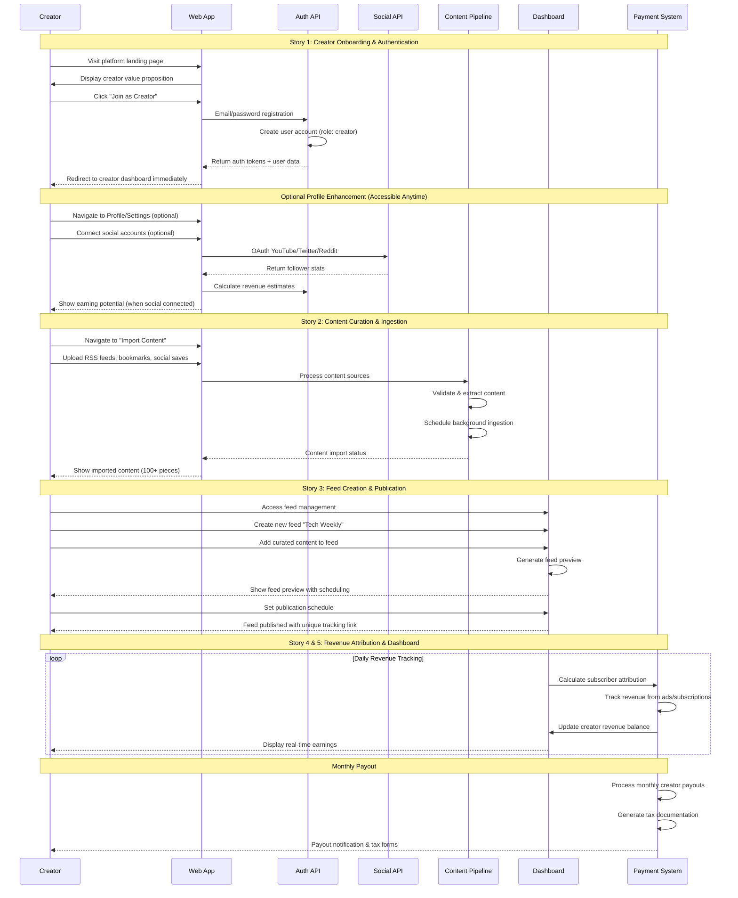
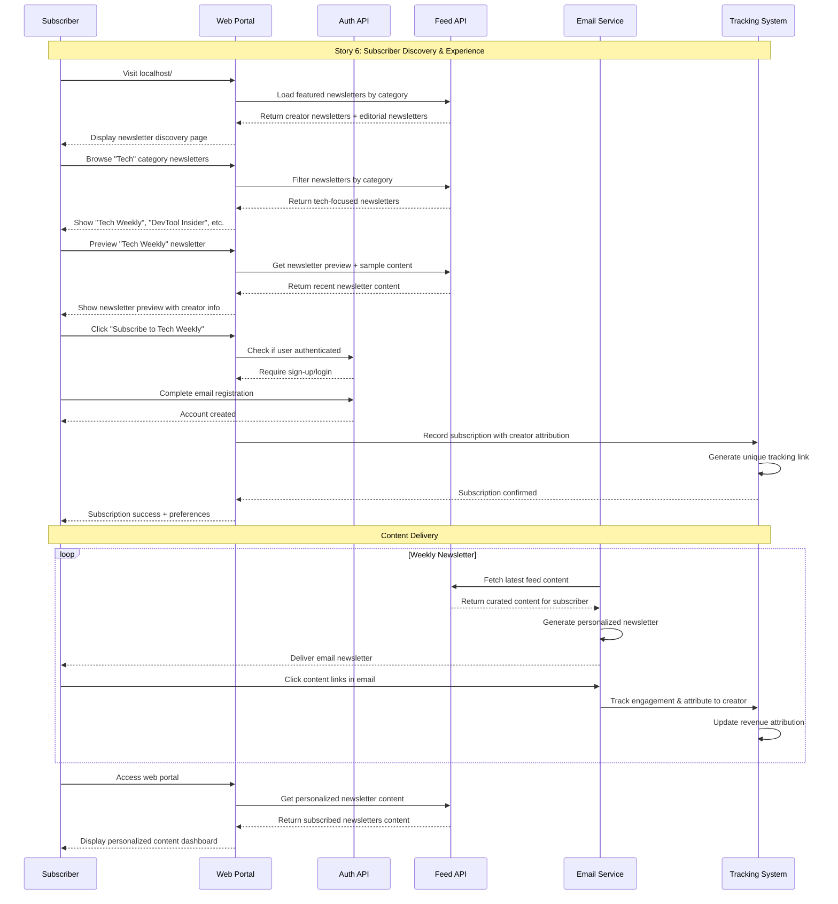
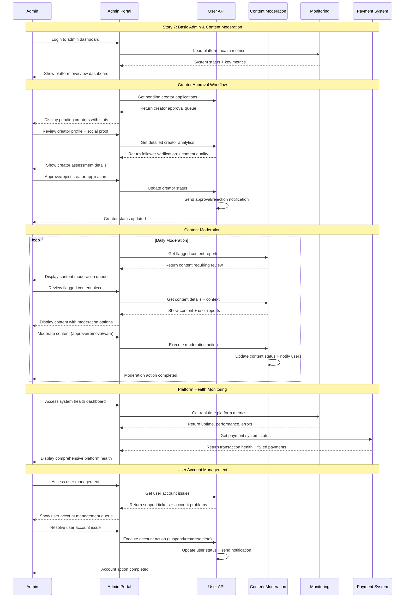
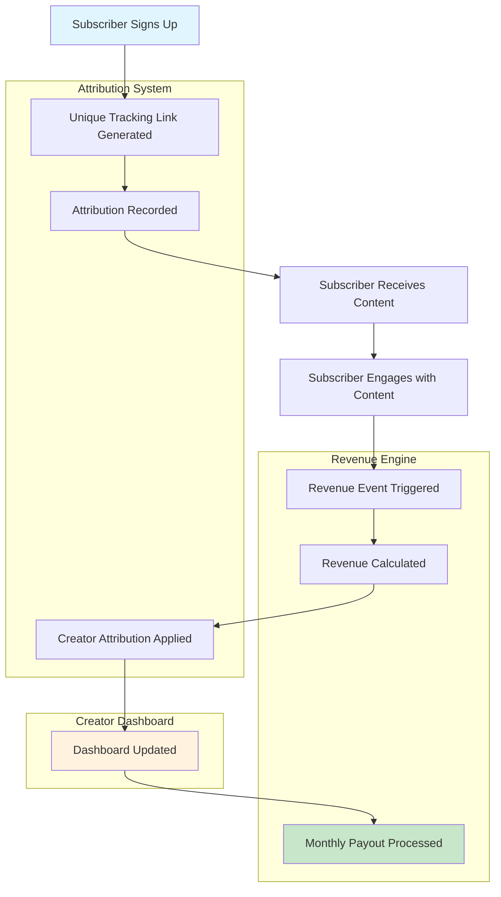
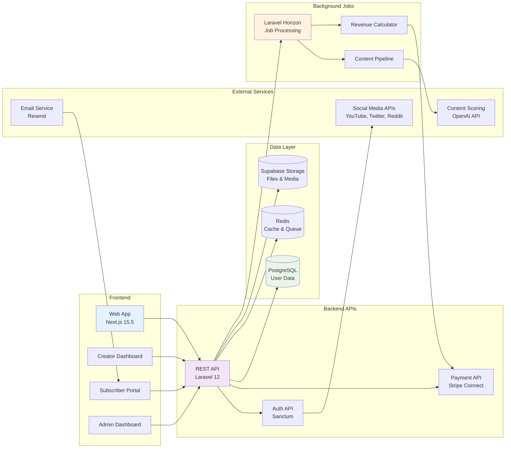

# SmartNews MVP Epic

## Epic Title

SmartNews Core Platform MVP - Creator-to-Subscriber Value Chain

## Epic Goal

Deliver the minimal viable platform that enables creators to onboard, curate content, create feeds, and generate revenue while providing subscribers with discoverable, high-quality content feeds via web and email delivery.

### Existing System Context

**Project Type:** Greenfield development
**Technology Stack:** Next.js + Tailwind + Shadcn/ui

### Enhancement Details

**What's being built:**
The core SmartNews platform that establishes the complete creator-to-subscriber value chain. This MVP focuses on the essential P0 features that validate the business model: creators can monetize content curation while subscribers receive valuable, personalized content feeds.

**How it integrates:**

- **Frontend:** Next.js web application with responsive design for creators, subscribers, and basic admin functions
- **Backend:** Using FastAPI (https://localhost:8000/openapi.json)
- **External Services:** Stripe Connect for revenue processing, email service for content delivery
- **Data Flow:** Content ingestion → Feed creation → Subscriber delivery → Revenue attribution → Creator payouts

**Success Criteria:**

1. **Creator Activation:** 50+ creators successfully onboard and create their first feed within 30 days
2. **Content Pipeline:** System processes 1000+ content pieces daily from diverse sources (RSS, social, manual)
3. **Subscriber Engagement:** 500+ active subscribers with 60%+ email open rates
4. **Revenue Flow:** End-to-end revenue attribution working with first creator payouts processed
5. **Platform Stability:** 99%+ uptime with <3 second dashboard load times

## Stories

### 1. Creator Onboarding & Authentication System

**Goal:** Enable creators to easily join the platform and start curating content immediately

- Creator registration with email/password or social authentication
- Direct access to dashboard for immediate content curation
- Optional profile completion accessible from dashboard/settings
- **Acceptance Criteria:** Creator can register and access content curation tools in <2 minutes without mandatory onboarding steps

### 2. Content Curation & Ingestion Pipeline

**Goal:** Allow creators to import and manage content from multiple sources

- Support for RSS feeds, social media imports, bookmark uploads, and manual URL entry
- Batch processing and content validation
- Content scheduling and preview capabilities
- **Acceptance Criteria:** Creator can import 100+ content pieces from 5+ different source types in single session

### 3. Feed Creation & Publication System

**Goal:** Enable creators to organize content into publishable feeds with scheduling

- Named feed creation with descriptions and categories
- Content organization and curation tools
- Publication scheduling and preview functionality
- **Acceptance Criteria:** Creator can create, preview, and schedule a feed with 20+ curated content pieces

### 4. Revenue Attribution & Tracking Engine

**Goal:** Implement transparent revenue tracking from subscriber attribution to creator payouts

- Unique tracking links for subscriber attribution
- Real-time revenue calculations with audit trails
- Stripe Connect integration for automated payouts
- **Acceptance Criteria:** Complete revenue flow from subscriber sign-up through creator payout with full transparency

### 5. Creator Dashboard & Analytics

**Goal:** Provide creators with real-time visibility into performance and earnings

- Live subscriber counts and growth metrics
- Revenue tracking with transparent calculation breakdowns
- Content performance analytics
- **Acceptance Criteria:** Dashboard loads in <3 seconds showing real-time subscriber and revenue data

### 6. Subscriber Discovery & Experience

**Goal:** Enable subscribers to find relevant newsletters and consume content via multiple channels

- Newsletter discovery by category and popularity
- Subscription management and preference settings
- Multi-channel delivery (web portal and email newsletters)
- **Acceptance Criteria:** Subscriber can discover, subscribe to, and receive content from 3+ newsletters within first session

### 7. Basic Admin & Content Moderation

**Goal:** Provide essential platform management and quality control tools

- Creator approval and suspension workflows
- Basic content moderation and spam prevention
- User account management and platform health monitoring
- **Acceptance Criteria:** Admin can approve/suspend creators and moderate content with audit trail

## User Journey Diagrams

### Creator Journey Flow

### Subscriber Journey Flow

### Admin Journey Flow

### Revenue Attribution Flow

### System Integration Overview

## Compatibility Requirements

- [x] Frontend components built with accessibility standards (WCAG 2.1)
- [x] Email templates responsive across all major email clients

## Definition of Done

### Technical Completion

- [x] All 7 epic stories completed with acceptance criteria met
- [x] Frontend responsive across desktop, tablet, and mobile viewports

### Business Validation

- [x] End-to-end creator journey tested: onboarding → content import → feed creation → revenue tracking
- [x] End-to-end subscriber journey tested: discovery → subscription → content delivery → engagement
- [x] Revenue attribution verified: subscriber sign-up → content engagement → creator payout
- [x] Admin workflows validated: creator approval → content moderation → platform monitoring

### Quality Assurance

- [x] Frontend components tested with Vitest + Testing Library
- [x] E2E critical paths tested with Playwright
- [x] Performance benchmarks met: <3s dashboard load, 99%+ uptime
- [x] Security audit passed: authentication, authorization, payment processing

## Success Metrics (30 Days Post-Launch)

**Creator Metrics:**

- 50+ active creators with completed onboarding
- 200+ feeds created and published
- 80%+ creator satisfaction score (onboarding survey)

**Subscriber Metrics:**

- 500+ active subscribers across all feeds
- 60%+ email newsletter open rate
- 25%+ click-through rate on curated content

**Platform Metrics:**

- 99%+ platform uptime
- <3 second average dashboard load time
- 1000+ content pieces processed daily

**Revenue Metrics:**

- First creator payouts successfully processed
- $1000+ total platform revenue (proof of monetization model)
- 95%+ revenue attribution accuracy (audit verified)

---

**Epic Priority:** P0 (Launch Blocker)  
**Estimated Timeline:** 8-12 weeks  
**Team Dependencies:** Frontend, DevOps, QA  
**External Dependencies:** Stripe Connect approval

## UPDATES

- Updated to frontend project by Wev (2025-09-25)
- **Terminology Change (2025-11-12)**: Implemented product-wide terminology strategy:
  - **Core Model**: "Feed" (for creator's curated publications)
  - **Subscriber-facing**: "Feed" → "Newsletter" (for public subscriptions)
  - **Content Sources**: Retained "Feed Source" (RSS feeds, YouTube feeds, etc.)
  - **Rationale**: Clearer distinction between content sources (feed sources) and curated publications (feeds/newsletters). Backend API already distinguishes `Feed` (internal model), `FeedSource` (content sources), and `Newsletter` (subscriber deliveries).
  - **Implementation**: Frontend-only terminology mapping. Zero backend API changes.
  - **See**: Sprint Change Proposal SCP-2025-003 for full analysis and migration plan.
