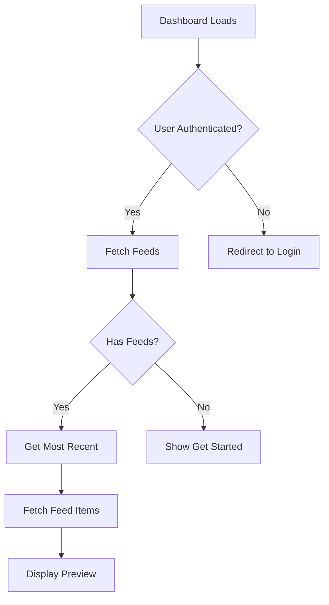

# Story 1.1.1: Dashboard Enhancements - Recent Feed Display

## Story Status: Done ✅

## Parent Story

[Story 1.1: Frontend - Creator Onboarding & Authentication System](./1.1.frontend.story.md)

## Overview

Enhanced creator dashboard to dynamically display the most recent feed with preview of feed items when available, replacing the static "Get Started" section for users who have already created feeds. Improves post-onboarding experience by showing relevant, contextual content.

---

## Problem Statement

**Before**: Dashboard always showed "Get Started" section, even for creators with existing feeds
**After**: Dashboard intelligently shows "Most Recent Feed" preview when feeds exist, "Get Started" for new users

**User Impact**:

- New creators: See onboarding steps
- Existing creators: See their latest published content immediately
- Better engagement with recent content

---

## Changes Implemented

### 1. Dashboard Page Updates

**File**: `src/app/(creator)/dashboard/page.tsx`

**New Queries**:

```typescript
// Fetch creator's published feeds
const { data: feedsData } = useQuery({
  queryKey: ["creator-feeds-dashboard", useSampleData],
  queryFn: () => fetchCreatorFeeds({ limit: 10, is_published: true }),
});

// Get most recent feed
const mostRecentFeed = feedsData?.feeds?.[0];

// Fetch items for that feed
const { data: recentFeedItems } = useQuery({
  queryKey: ["recent-feed-items", mostRecentFeed?.id, useSampleData],
  queryFn: () => feedItemsService.getAll({ status: "published", per_page: 5 }),
});
```

**Conditional Rendering**:

```jsx
{
  mostRecentFeed ? (
    <MostRecentFeedCard feed={mostRecentFeed} items={recentFeedItems} />
  ) : (
    <GetStartedCard />
  );
}
```

### 2. Most Recent Feed Card UI

**Layout**:

```
┌──────────────────────────────────────────┐
│ Most Recent Feed              [→]       │
│ Technology Weekly Digest                │
├──────────────────────────────────────────┤
│ ┌────────────────────────────────────┐  │
│ │ OpenAI Launches GPT-5...      [img]│  │
│ │ RSS • 2 hours ago                  │  │
│ └────────────────────────────────────┘  │
│ ┌────────────────────────────────────┐  │
│ │ Google's Gemini Ultra...      [img]│  │
│ │ RSS • 5 hours ago                  │  │
│ └────────────────────────────────────┘  │
│ ...                                     │
│ [View Full Feed →]                      │
└──────────────────────────────────────────┘
```

**Features Displayed**:

- Feed name in header
- Up to 5 most recent feed items
- Each item shows:
  - Title (truncated to 1 line)
  - Description (truncated to 2 lines)
  - Source badge (RSS, YouTube, etc.)
  - Published date (relative time)
  - Thumbnail image (if available)
- "View Full Feed" button
- Arrow icon to navigate to feed detail

### 3. Empty States

**Loading State**:

```jsx
{
  isLoadingFeedItems ? (
    <div className="spinner" />
  ) : items.length > 0 ? (
    <FeedItemsList />
  ) : (
    <EmptyState />
  );
}
```

**Empty Feed State**:

```
No content in this feed yet.
[Add Content Sources]
```

### 4. FloatingQuickAdd Updates

**File**: `src/components/dashboard/FloatingQuickAdd.tsx`

**Terminology Fixes**:

- Placeholder: "Paste URL to add content or a new source..."
- Button text: "Add Source" (mobile)
- Source types updated:
  - "YouTube Channel" (was "YouTube Video")
  - "X Account Feed" (was "X Post")
  - "Reddit Feed" (was "Reddit Post")
- Success toast: "Source added successfully! Added to your source library. Use it to create feeds."

**UI/UX Improvements**:

- **Layout Refinement**: Changed padding from `p-4` to `px-4 pb-3` for better visual balance
- **Control Visibility**: Replaced opacity transitions with conditional rendering for cleaner state management
  ```jsx
  // Before: opacity-0 w-0 overflow-hidden
  // After: Conditional rendering with clean transitions
  {
    showControls && <SelectControl />;
  }
  ```
- **Improved Responsiveness**: Controls now properly show/hide without layout artifacts
- **Focus State**: Better handling of expanded/collapsed states when input gains/loses focus

---

## UI/UX Improvements

### Responsive Design

**Desktop** (full card with images):

```
Item: [Title________________] [Image]
      [Description________]   [80x80]
      [Badge] [Time]
```

**Mobile** (stacked layout):

```
Item: [Title______________]
      [Description_______]
      [Image 100%]
      [Badge] [Time]
```

### Visual Hierarchy

**Typography**:

- Feed name: `text-lg font-medium`
- Item title: `text-sm font-medium line-clamp-1`
- Description: `text-xs text-muted-foreground line-clamp-2`
- Time: `text-xs text-muted-foreground`

**Spacing**:

- Card padding: `p-6`
- Item spacing: `space-y-3`
- Internal item padding: `p-3`

**Interactive States**:

- Hover: `hover:bg-accent/50 transition-colors`
- Focus: Keyboard accessible with focus rings
- Click: Navigates to feed detail page

---

## Data Flow

### Fetch Sequence



### Query Dependencies

```typescript
// Query 1: Fetch feeds (independent)
enabled: !!user;

// Query 2: Fetch feed items (depends on Query 1)
enabled: !!mostRecentFeed;
```

**React Query** automatically handles:

- Loading states
- Error states
- Cache management
- Refetch on window focus

---

## Integration with Dev Mode

### Sample Data Fallback

```typescript
try {
  const result = await fetchCreatorFeeds({...});

  // If empty and dev mode with toggle enabled
  if (useSampleData && result.feeds.length === 0) {
    return { feeds: generateSampleFeeds(3) };
  }

  return result;
} catch (error) {
  if (useSampleData) {
    return { feeds: generateSampleFeeds(3) };
  }
  throw error;
}
```

**Benefits**:

- UI testable without backend
- Realistic preview of production behavior
- Toggle control via "Use Real Data" button

---

## Edge Cases Handled

### 1. No Feeds Yet

**Display**: "Get Started" card with onboarding actions

### 2. Feed Exists, No Items

**Display**: Most Recent Feed card with empty state

```
No content in this feed yet.
[Add Content Sources]
```

### 3. Feed Exists, Items Loading

**Display**: Loading spinner in card content area

### 4. Multiple Feeds

**Behavior**: Show only most recent (index 0)
**Sorting**: Backend returns feeds sorted by `created_at DESC`

### 5. Unpublished Feeds

**Behavior**: Query filters for `is_published: true` only
**Result**: Draft feeds don't appear in dashboard preview

---

## Performance Considerations

### Optimizations

**1. Limited Query Scope**:

- Only fetch 10 feeds (limit: 10)
- Only fetch 5 feed items (per_page: 5)
- Filter at API level (is_published: true)

**2. Conditional Fetching**:

```typescript
enabled: !!mostRecentFeed; // Don't fetch items if no feed
```

**3. React Query Caching**:

- Feeds cached for 5 minutes
- Feed items cached per feed ID
- Automatic background refetch

**4. Image Optimization**:

```jsx

```

- Fixed dimensions prevent layout shift
- object-cover maintains aspect ratio

---

## Testing Coverage

### Manual Testing Completed

- ✅ New user sees "Get Started"
- ✅ Existing user sees "Most Recent Feed"
- ✅ Feed items display with thumbnails
- ✅ Source badges show correct type
- ✅ Relative time displays correctly
- ✅ "View Full Feed" button navigates
- ✅ Empty state shows when no items
- ✅ Loading states display properly
- ✅ Sample data toggle works
- ✅ Real data mode shows empty correctly

### Scenarios Tested

**Scenario 1: First-time User**

1. User registers and lands on dashboard
2. Sees "Get Started" card
3. Options: Create feed, manage content, etc.

**Scenario 2: User Creates First Feed**

1. User completes feed creation
2. Redirected to dashboard
3. Sees "Most Recent Feed" with no items
4. Can add sources from card

**Scenario 3: User with Content**

1. User has published feed with items
2. Dashboard shows preview of 5 items
3. Can click items or "View Full Feed"

**Scenario 4: Dev Mode Testing**

1. Toggle "Sample Data" on
2. See 5 mock feeds with items
3. Toggle "Use Real Data" off
4. See actual state (empty or real)

---

## Related Documentation

- **Parent**: [Story 1.1: Creator Onboarding & Authentication](./1.1.frontend.story.md)
- **Related**: [Story 1.3.1: Source-Based Workflow](./1.3.1.source-based-workflow.md)
- **Related**: [Story 1.2.1: Dev Mode Testing](./1.2.1.dev-mode-testing.md)

---

## Future Enhancements

### 1. Feed Stats in Preview

```
Technology Weekly Digest
📊 245 subscribers • 12,850 opens • 8.3% CTR
```

### 2. Quick Actions

```
[📊 Analytics] [✏️ Edit] [🔗 Share]
```

### 3. Multiple Feeds Carousel

```
< Technology Weekly | Business Daily | Design Monthly >
```

### 4. Item Interactions

- Click item to view full content
- Save/bookmark items
- Share individual items

### 5. Performance Metrics

```
+12.5% subscribers this month
Your best feed: Technology Weekly
```

---

## Changelog

**2025-10-08**: Implementation completed

- Dashboard query logic added
- Conditional rendering implemented
- Most Recent Feed card created
- FloatingQuickAdd terminology updated
- Sample data integration added
- Testing completed across scenarios
